# Non-planar slicing

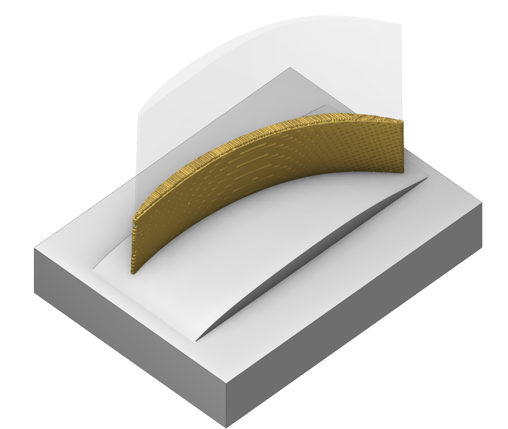

## Application area:

This operation allows you to print models on arbitrary substrates. It uses a non-planar slicer engine and generates a non-planar additive printing path. But also it's possible to generate a classic planar printing path with some extra parameters.

### Setup:

The <strong>Setup</strong> tab is used to configure the primary parameters of theconfigure the primary parameters of the project. This can involve the positioning of the part on the equipment, the coordinate system of the part, and more. [Details](1022.md)

### Job assignment:

<strong>Non-planar substrate</strong>. Substrate for printing (for "Offset" strategy only)

<strong>Feature.</strong> Desired model, that should be printed

<strong>Properties.</strong> Disabled

<strong>Delete.</strong> Removes an item from the list

### Strategy:

#### Slicing strategy.

Defines the slicing strategy.

Click here to expand..

##### Strategy types

<strong>Planar.</strong> This strategy performs classic planar slicing, but supports different slicing directions and allows changing the toolpath normals.

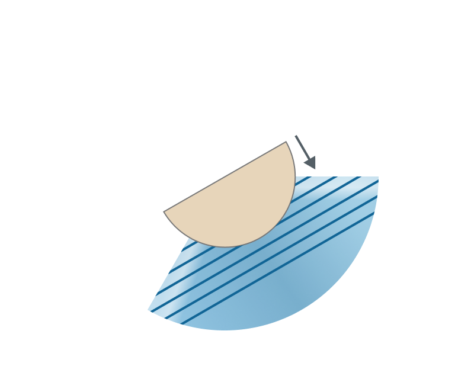

<strong>Offset.</strong> This strategy performs slicing by offset method from the substrate, which allows to maintain a constant layer height between each layer.

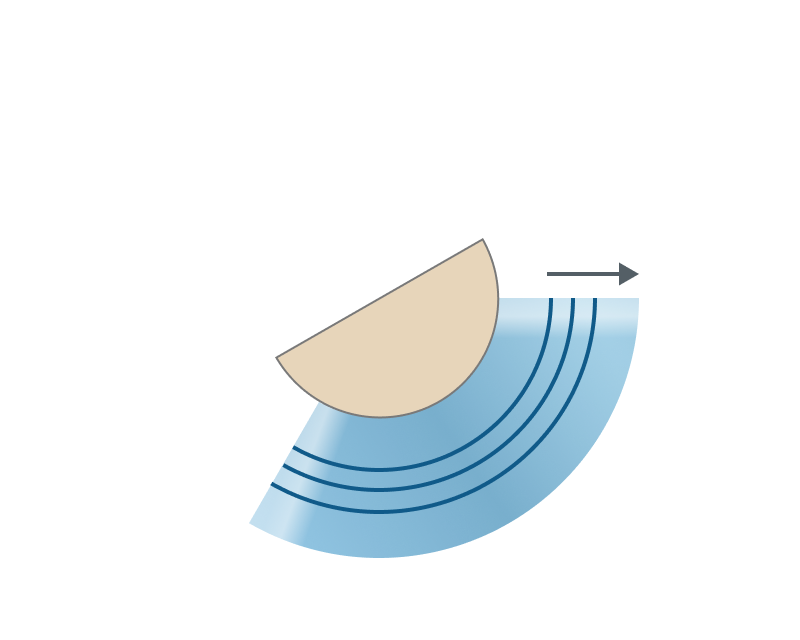

<strong>Radial.</strong> This strategy performs slicing by cylindrical surfaces around a specified rotary axis, which allows printing around the rotary axis with a constant radial step between layers.

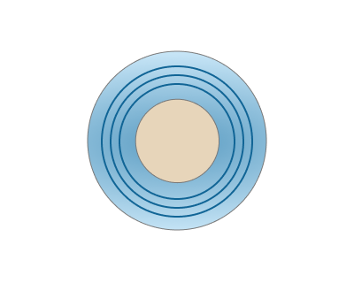

##### Common parameters

<strong>Layer height.</strong> Height of each layer in mm. By default corresponds to the working length (WL) of the tool.

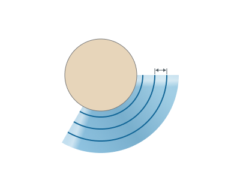

<strong>Line width.</strong> Width of a single line. By default corresponds to the diameter of the tool

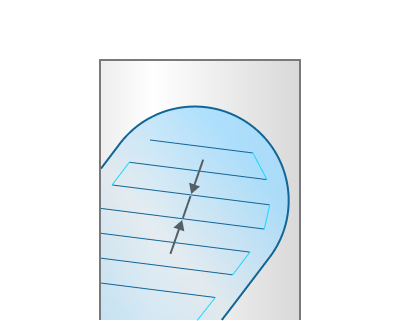

<strong>Gap to prevent overlapping.</strong> Leaves a gap at the start/end junction of closed contours to prevent material overlap.

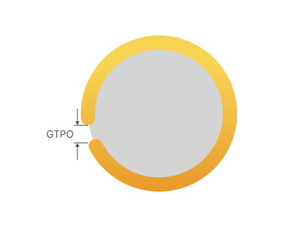

<strong>GTPO</strong> - Gap to prevent overlapping.

##### Planar slicer parameters

<strong>Slicing direction</strong>. Specifies the slicing direction for the Planar slicing strategy — a global coordinate axis (X / Y / Z) or a custom direction vector.

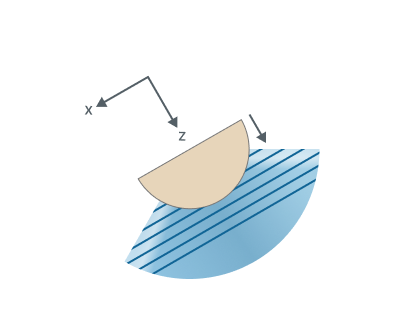

<strong>Top level</strong>. Upper bound of the planar slicing range, measured along the slicing direction — the topmost layer is placed at this level. In Auto mode it is taken from the upper extent of the feature.

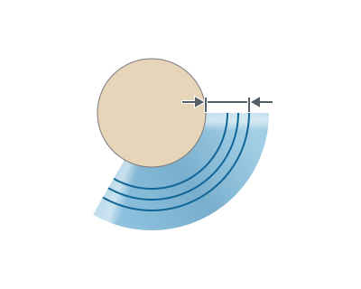

<strong>Bottom level</strong>. Lower bound of the planar slicing range, measured along the slicing direction — the first layer is placed at this level. In Auto mode it is taken from the lower extent of the feature.

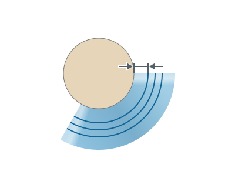

##### Offset slicer parameters

<strong>Surface resolution level.</strong> Represents the resolution level of the offset surfaces that will be constructed to split the model. Lower values produce faster result, but in lower resolution. Higher values produce slower result, but in higher resolution.

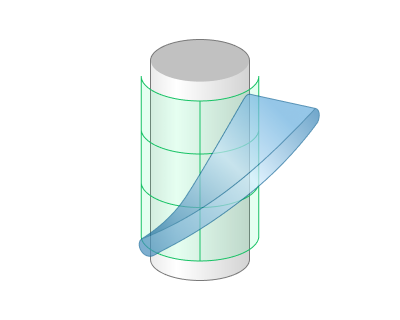 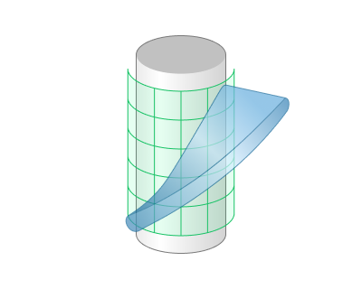 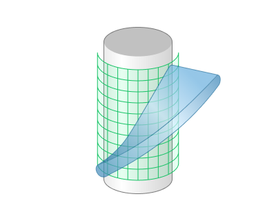 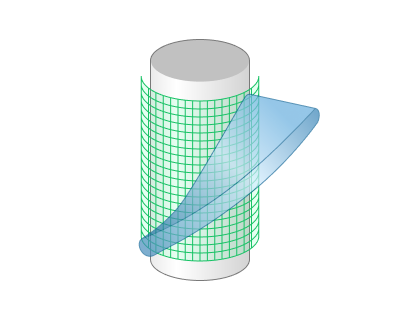 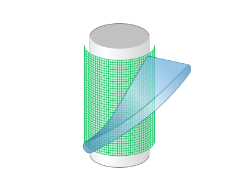

<strong>Top offset.</strong> The offset value from the substrate, which represents the finishing boundary of the printing process. However, it may stop earlier depending on the layer height parameter. In Auto mode it is taken as the maximum distance from the feature to the substrate.

<strong>Bottom offset.</strong> The offset value from the substrate, where the printing process will start. In Auto mode it is taken as the minimum distance from the feature to the substrate.

##### Radial slicer parameters

<strong>Rotary axis.</strong> Direction of the rotary axis around which the part is wrapped and sliced. Choose a global coordinate axis (X / Y / Z) or Custom to specify an arbitrary direction vector.

<strong>Top radius.</strong> Outer cylindrical limit of the slicing zone, measured radially from the rotary axis — layers above this radius are skipped. In Auto mode it is taken as the maximum distance from the feature to the rotary axis.

<strong>Bottom radius.</strong> Inner cylindrical limit of the slicing zone, measured radially from the rotary axis — slicing starts at this radius. In Auto mode it is taken as the minimum distance from the feature to the rotary axis.

#### Print inner volume.

Offsets the tool path into the model by half of the line width value

Click here to expand..

.png) .png)

#### Infill.

A group of parameters to generate an infill for the model.

Click here to expand..

<strong>Infill pattern.</strong> Defines the infill pattern.

<strong>Lines.</strong> This infill pattern is created by intersecting non-planar layers with simple vertical planes

<strong><strong>Grid.</strong></strong> This infill pattern is created by intersecting non-planar layers with vertical planes in such a way that it forms a grid

.png)

<strong>Triangles.</strong> This infill pattern is created by intersecting non-planar layers with vertical planes in such a way that it forms equilateral triangles

.png)

<strong>Zig Zag.</strong> This infill pattern divides each non-planar layer into regions and fills each region with a continuous zigzag toolpath. A separate zigzag toolpath is generated for each region.

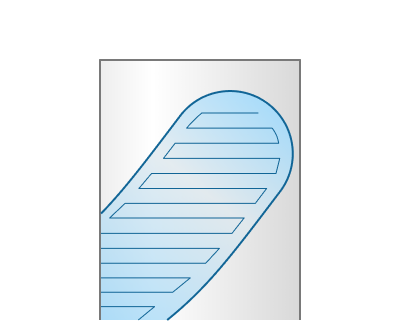

<strong>Infill orientation.</strong> Determines the orientation of the infill in 3D space.

<strong>Direction.</strong> Direction along which the cutting planes are oriented. These planes intersect each layer to produce the infill lines.

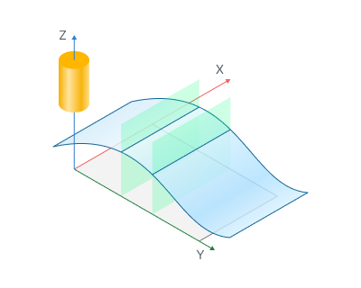

<strong>Tool orientation</strong> <strong>vector.</strong> Cutting planes are aligned along the tool orientation vector. Default for the offset strategy. Tool orientation can be set on a Setup page. [Details](260.md)

<strong>Slicing direction vector.</strong> Cutting planes are aligned along the slicing direction. Default for the planar strategy.

<strong>Across rotary axis</strong>. Cutting planes are aligned across the rotary axis, so infill lines wrap around the cylinder. Default for the radial strategy.

<strong>Custom</strong>. Allows you to manually set the normal vector and rotation angle for the infill.

<strong>Infill density.</strong> Adjusts the density of the infill as a percentage.

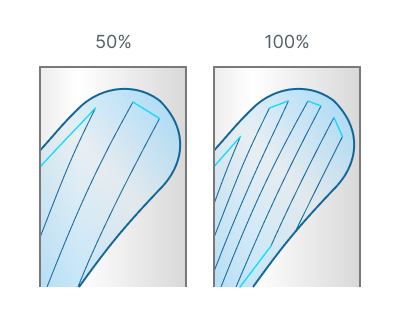

<strong>Alternate lines direction.</strong> Alternates the direction of lines on each layer.

<strong>By angle.</strong> Rotation angle applied to each subsequent infill layer.

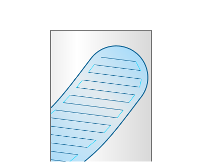 .png)

> Important note
>
> Note: In general, an angle of 0 degrees means that lines will be parallel to the X-axis. But if "Normal vector" of "Infill orientation" parameter is set to "Custom" and "Rotation angle" is not zero, in this case lines will be additionally rotated by the same rotation angle.
>
> Example: 45° means layer 1 = 0°, layer 2 = 45°, layer 3 = 90°, layer 4 = 135° and so on.

<strong>By sequence of angles.</strong> Custom angle sequence for infill direction, repeated cyclically per layer. Can be set as list of angles separated with any symbol and with parentheses around it.

> Important note
>
> Example: (0,90,45) means layer 1 = 0°, layer 2 = 90°, layer 3 = 45°, layer 4 = 0° and so on.

<strong>Mirror infill.</strong> <em>Available only for the Radial strategy.</em> When enabled, the infill is computed for one half-cylinder and mirrored across the rotary axis — both halves share an identical, symmetric pattern. When disabled, the infill is generated continuously around the full cylinder, allowing spiral/helical patterns with alternating layer angles.

#### Double walls.

Adds an additional inner wall.

Click here to expand..

.png) .png)

#### Sorting.

Toolpath sorting and linking parameters.

Click here to expand..

##### Sort by.

Allows to set printing order of layers and features.

<strong>Layers</strong>. Allows to print all features layer by layer.

<strong>Features</strong>. Allows to print all features one by one (<em><strong>Note</strong>: To use this option correctly, you must configure your features as separate elements on the <strong>Job Assignment</strong> page</em>).

##### Split by layers.

This parameter allows you to split your features into a desired number of layers. It is available only when the <strong>Sort by</strong> parameter is set to <strong>Features</strong> option.

<em>Note:</em> <em>This parameter is useful when printing feature by feature is not possible due to collisions with previously printed features. It also helps to achieve more even heat distribution across the printed elements and to reduce residual stress.</em>

##### Start points.

Allows to set custom rules for deciding starting point on print layers.

Click here to expand..

<strong>Auto.</strong> The start point is chosen automatically

_(Auto).png)

<strong>Custom for first layers.</strong> Allows to manually choose the start point for the first layer of features. Start points for subsequent layers are determined by the closest distance to the start point of the previous layer. You can set them on the <strong>Job assignment</strong> page.

_(Custom_for_first_layers).png)

<strong>Custom for all layers.</strong> Allows to set start points for all layers by setting a curve. In this case, the start points are calculated based on the nearest distance to a specified curve. You can set them on the <strong>Job assignment</strong> page.

_(Custom_for_all_layers).png)

##### Printing order.

Determines the order of walls and infill when printing.

Click here to expand..

<strong>Inside to outside.</strong> Infill will be printed first, after that inner walls and outer wall.

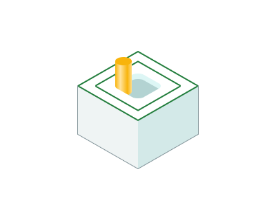

<strong>Outside to inside.</strong> Outer wall will be printed first, after that inner walls and infill.

<strong>Alternate directions.</strong> The printing order will alternate layer by layer, starting from "Inside to outside" order.

#### Tool orientation.

This parameter allows you to set different tool orientation (normal) without changing the original toolpath. There are five options avalaible for users: "Normal to surface", "Fixed", "To rotary axis", "Through point" and "Through curve".

Click here to expand..

<strong>Normal to surface</strong>.

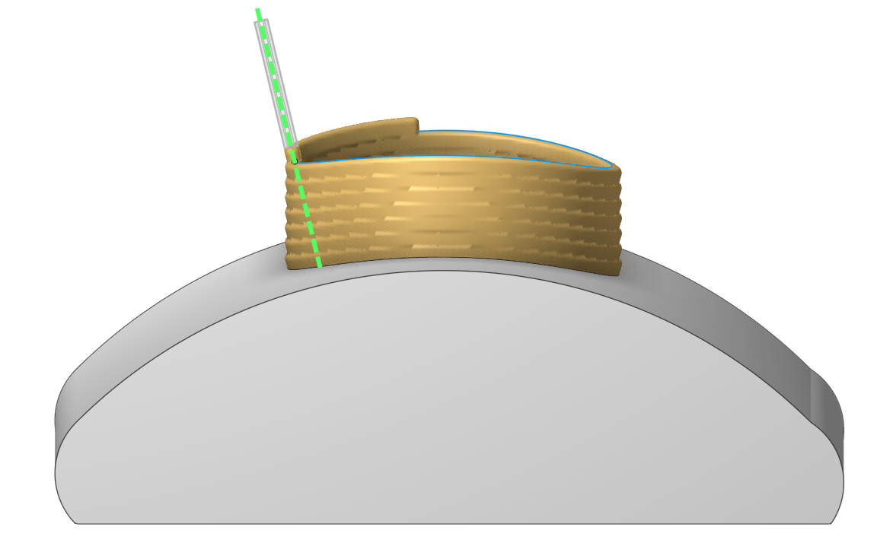

<strong>Fixed</strong>

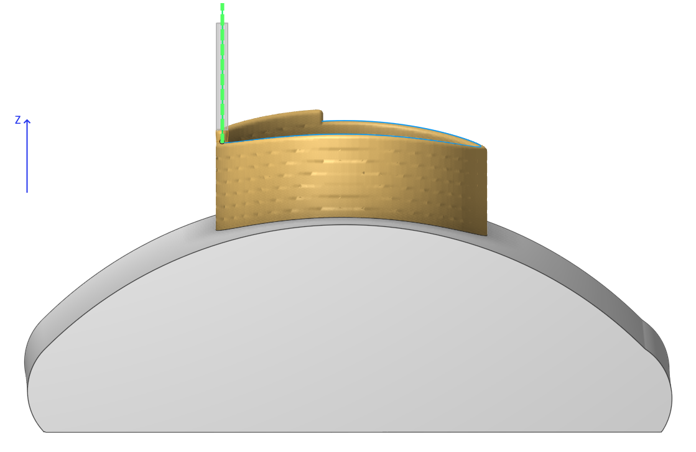

<strong>To rotary axis</strong>.

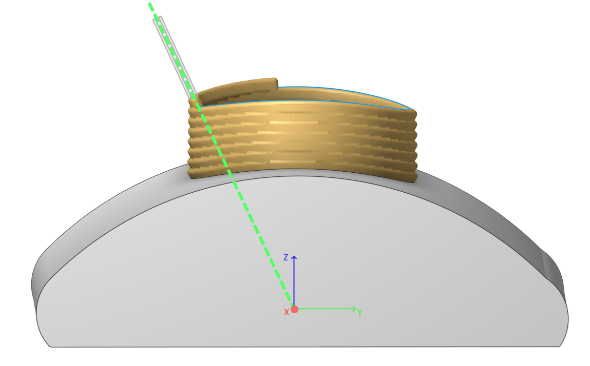

<strong>Through point</strong>.

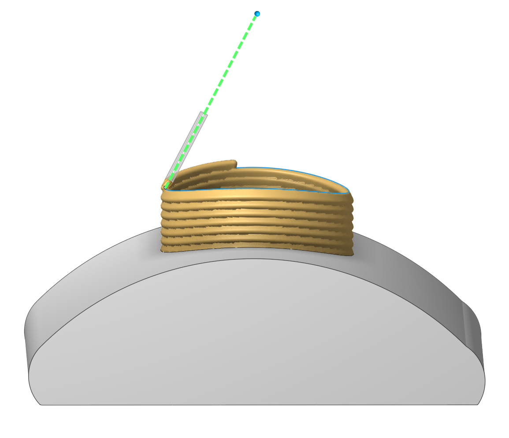

<strong>Through curve</strong>.

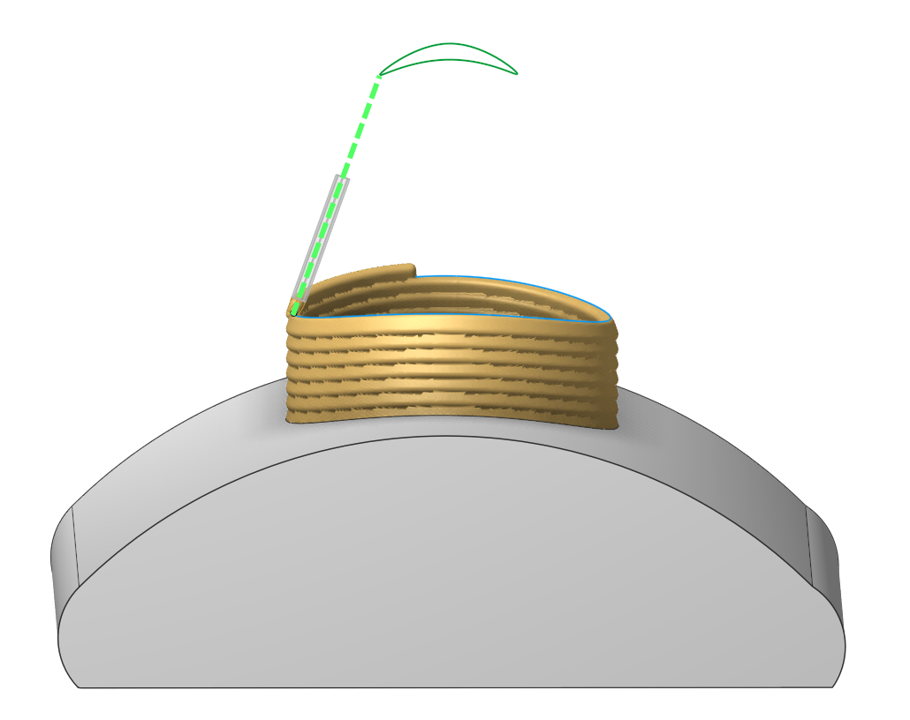

More information about the <strong>Tool orientation</strong> parameter can be found in the description of the <strong>5D Surfacing</strong> operation. [Details.](10135.md)

#### Limit rotation angles.

When the flag is set, it specifies the limit values of the tool's angular position relative to the specified axis. This parameter group works similarly to the <strong>5D Surfacing</strong> operation. [Details.](10135.md)

### Parameters:

This tab contains the main parameters for controlling the part, workpiece, fixture and other items, which allow you to change the trajectory. [Details](100112.md)

### Links/Leads:

In the Links/Leads tab, you define the parameters for rapid movements. These movements include tool approach from the tool change position, engage to the start of the working stroke, retraction after the final cutting motion, transitions between working passes, and return to the tool change point. You can configure the sequence of movements along the coordinates, the trajectory of these motions, and the magnitude of displacements

Click here to expand..

<strong>Сonsists of:</strong>

<strong>Approach/Return.</strong> This group of parameters manages the tool movements from the tool change position to the start of the engage toolpathes, and back. [Details](100116.md).

<strong><strong>Links.</strong></strong> Defines the rules governing Entry/Exit links and links between work moves. [Details](100130.md).

<strong><strong>Leads.</strong></strong> Allows you to add additional engage and retract to the working moves using their feed. [Details](100136.md).

<strong>Safe motions.</strong> Defines the type of <strong>Safety Surface</strong> and the distance from the workpiece to it. This surface facilitates transitions between the processed surfaces or tool paths, and the first stage of approach or return occurs toward it. [Details](100117.md).

<strong>Advanced links settings.</strong> This group of parameters specifies the features of trajectory formation for primarily five-axis operations, considering optimal movements of rotational axes. [Details](100118.md).

<strong>Distances.</strong> Distances used in Links rules [Details](100140.md).

### Feeds/Speeds:

Using this dialogue the user can define the rapid feed value and the feed values for different areas of the toolpath. Also it's possible to apply "Corner control" parameters on this page. [Details](100142.md)

### Transformations:

Parameter's kit of operation, which allow to execute converting of coordinates for calculated within operation the trajectory of the tool. [Details](10168.md)

> Important note
>
> The <strong>Multiply scheme</strong> parameter in this operation <strong>behaves differently</strong> compared to other operations.
>
> Normally, this parameter duplicates the entire toolpath of the operation - including the slicing results and the links/leads between layers.
>
> However, in this operation, it only duplicates the <strong>slicing result</strong> <strong>before</strong> the linking stage.
>
> This allows to multiply features and apply settings like <strong>Links/Leads</strong> or <strong>Split by Layers</strong>, which would not be possible using the standard multiplying method.

### Part:

A Part in additive manufacturing is a desired geometry to be manufactured by the printing process. [Details](330.md)

### Workpiece:

A Workpiece in additive manufacturing is t he pre-existing material or substrate that serves as the foundation for printing (can be empty). [Details](738.md)

### Fixtures:

As the Fixtures the fixing aids such as chucks, grips, clamps, etc., and the restriction areas of any other nature are usually specified. [Details](10283.md)
