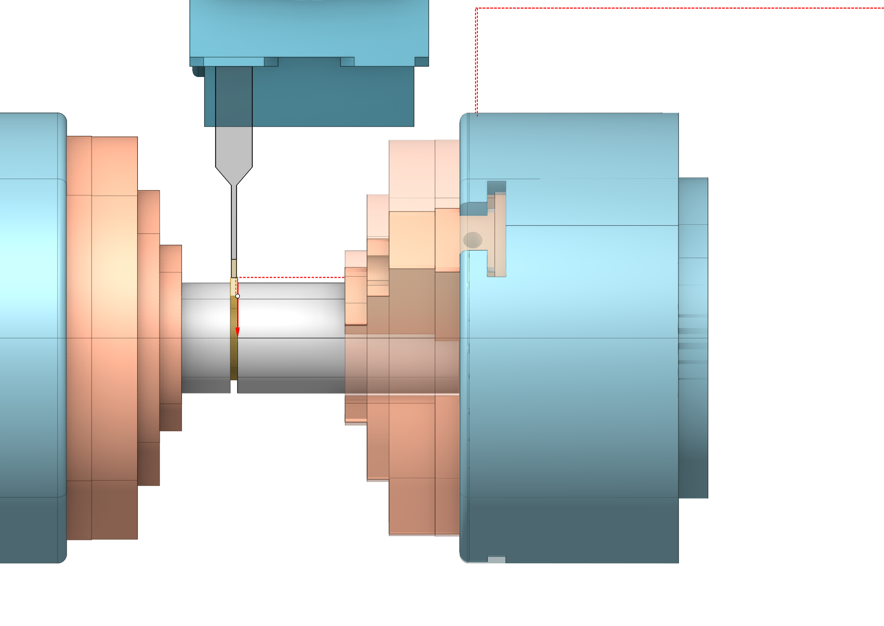
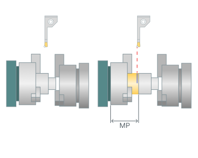
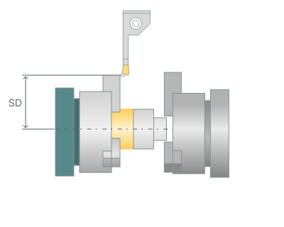
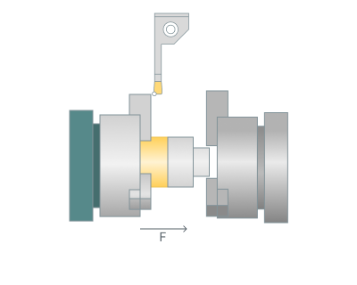

# Part-off with takeover

## Application area:

The purpose of this operation is to cut off the processed part from the leftover workpiece material, while simultaneously forming the back end of the part, including creating a chamfer or radius on it. One can prepare the workpiece before parting off, for example, by machining a groove. Differs from <strong>Lathe part-off operation</strong> in that at the end of the operation the workpiece is moved to another spindle.

### Setup:

The <strong>Setup</strong> tab is used to configure the primary parameters of the project. This can involve the positioning of the part on the equipment, the coordinate system of the part, and more. [Details](1022.md)

### Job assignment:

<strong>Part-off</strong><strong>.</strong> Executes the cut off the processed part from the leftover material of the workpiece, while also machining the back face of the part<strong>.</strong> The system generates the working cycle's contour as a vertical line connecting the outer and inner diameters of the workpiece on the part's right or left side.

<strong>Profile.</strong> The system forms a single pass, the toolpath of which is identical to the geometric contour of the part. User can add engage/retract; shifting by stock values; tool unreachable gray zones excluding; tool radius compensating to the toolpath. [Details](10189.md)

<strong>Grooving cycle.</strong> The system outputs the part-off operation into the NC program as either an ISO G75 or ISO G74 cycle.

<strong>Slotting.</strong> This cycle efficiently machines simple rectangular grooves with a minimum number of actions. [Details](10196.md)

<strong>Grooves</strong><strong>.</strong> This cycle is similar to Roughing, but it outputs the machining process to NC program as a cycle similar to ISO G71/ G72. [Details](10195.md)

<strong>Zigzag.</strong> <strong>The tool removes the rough stock</strong> layer by layer. In each layer, it plunges downwards to the cutting depth and performs horizontal movement. Thus, horizontal passes with alternating directions remove the entire rough stock, layer by layer. [Details](10201.md)

<strong>Properties.</strong> Displays the properties of the selected element. You can additionally add allowance. You can call the Properties menu by double-clicking on the selected element.

<strong>Delete.</strong> Removes an item from the list.

<strong>Restrictions.</strong> It allows you to restrict areas that should not be machined. [Details](101231.md)

### CycleParams:

Some parameter group works similarly to the <strong>Lathe part-off operation</strong> operations. [Details](313.md)

### Strategy:

Click here to expand..

<strong>Takeover.</strong> Pick and place options

<strong>Move part.</strong> Allows pulling the part up to its cut-off point

<strong>MP</strong> - Move part

<strong>Safe Diameter.</strong> Determines the X-coordinate of the cutter prior to counter-spindle movement

<strong>SD</strong> - Safe Diameter

<strong>Feed.</strong> Feed rate at which the part is pulled out

<strong>F</strong>- Feed

<strong>Some parameter group works similarly to the Turn take over operations</strong>. [Details](10406.md)

### Feeds/Speeds:

Using this dialogue the user can define the spindle rotation speed; the rapid feed value and the feed values for different areas of the toolpath. Spindle rotation speed can be defined as either the rotations per minute or the cutting speed. The defining value will be underlined. The second value will be recalculated relative to the defining value, with regard to the tool diameter. [Details](100142.md)

### Transformations:

Parameter's kit of operation, which allow to execute converting of coordinates for calculated within operation the trajectory of the tool. [Details](10168.md)

### Part:

A Part is a group of geometrical elements that defines the space to check for gouges. [Details](330.md)

### Workpiece:

A workpiece model of an operation defines the material to be machined. [Details](738.md)

### Fixtures:

As the Fixtures the fixing aids such as chucks, grips, clamps, etc., and the restriction areas of any other nature are usually specified. [Details](10283.md)
