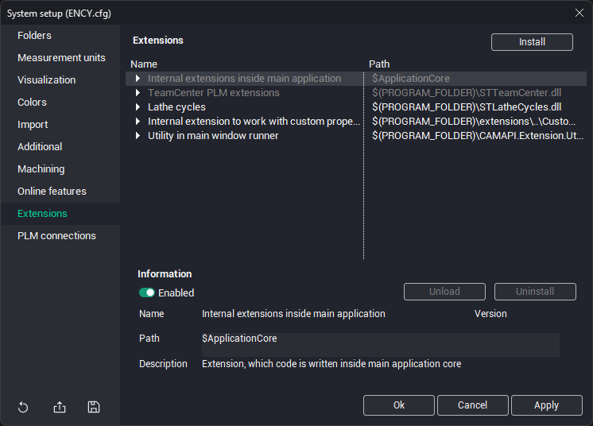
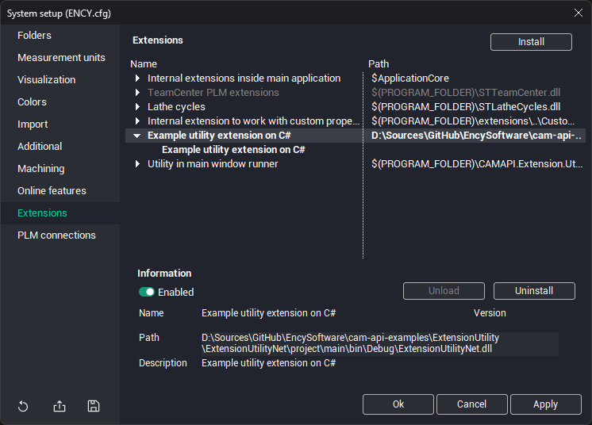

# Installing extensions using the System Setup window

To install extensions through the [System Setup window](90.md), follow these steps:

- Open the System Setup window and switch to the Extensions tab.

- Click the "Install" button and in the file selection dialog that opens, select either the extension description text file *.json or the extension package file *.dext (a zip archive containing all the files required for the extension to work);

- An item corresponding to the selected extension library will be added to the list in the Extensions panel

The top level of this window displays elements corresponding to extension libraries. Within these, elements corresponding to individual extensions are nested. A single library can implement multiple extensions simultaneously.

Libraries installed manually by the user are shown in bold in the list. If a library was installed by the system, it is shown in normal font.

When you select a library or extension from the top list, information about the selected element is displayed at the bottom of the window: name, description, version number, and file system location.

To delete an extension library, select it in the list and click the "Uninstall" button. Some extensions may not be user-removable. In this case, the uninstall button is disabled.

If an extension library is loaded into memory, you can forcefully stop its execution and unload it from memory by clicking the "Unload" button.

You can also disable the use of an extension without deleting it. To do this, simply turn off the Enabled toggle. Disabled extensions are shown in gray in the window.

Note – Depending on the extension type, a restart of the CAM system may be required for the changes to take effect.
