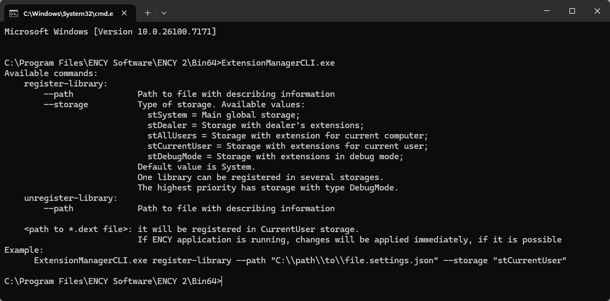
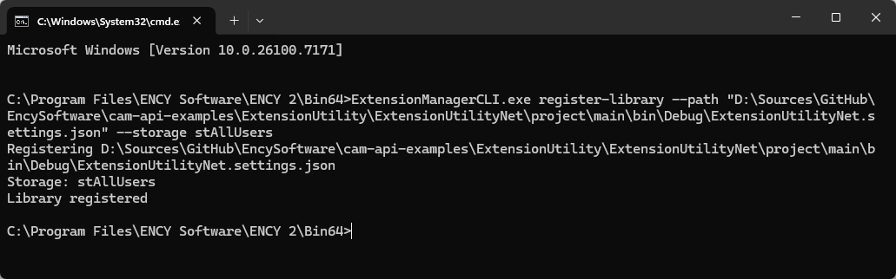

# Installing extensions using the command line

Extensions can be installed using a command line utility. This is convenient for batch installations, when you need to quickly repeat the process on multiple computers.

To install extensions using the command line, follow these steps:

- Find the ExtensionManagerCLI.exe utility in the CAM system installation folder.

Note: The ExtensionManagerCLI.exe utility is used to register and remove CAM system extensions from the command line.

- Run the command line from the CAM system installation folder. Running the utility without parameters will do nothing, it will simply display help information on valid command line arguments.

- Run the command:

ExtensionManagerCLI.exe register-library --path "ExtensionFolder\ExtensionSettings.json" --storage stAllUsers

Instead of "ExtensionFolder\ExtensionSettings.json", specify the path to the extension's JSON file.

Instead of the --path parameter, you can also specify the path to the extension's dext file.

Using the --storage parameter (possible values: stAllUsers, stCurrentUser), you can specify whether the extension will be available to all users or only the current user.

Below is an example of the command execution.

Note: Depending on the extension type, changes may only be applied after restarting the CAM system.
