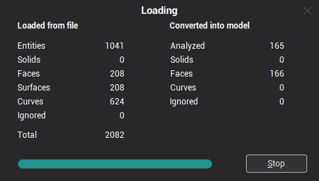

# Geometrical objects import

Import of models from external CAD files is performed by clicking the  button or by simply dragging the model file into the application's window. Function available also from [main menu](51.md) File –> Import, and by pressing hotkey [ Ctrl+I ].

In the file selection window, it is possible to specify file extension filters. The set of supported file formats depends on the configuration of CAM system and installed [addins](10039.md).

During the import process of external CAD files, the current information concerning the progress of the file reading process and creation of geometrical objects is displayed in the window. A process indicator reflects the percentage of import function completed. When importing from files with a simple structure, the system uses a one-pass algorithm i.e. reading the file and the formation of the geometrical model is performed simultaneously. When importing from files with a complex data structure the system uses a double-pass algorithm. In the first stage, the system reads the file and analysis the model structure, and in the second, creates the geometrical model.

The **Loaded from file** panel shows statistical data about reading the file:

- **Entities** – loaded entities counter;
- **Solids** – loaded solids counter;
- **Faces** – loaded faces (bounded surfaces) counter;
- **Surfaces** – loaded surfaces counter;
- **Curves** – loaded curves counter;
- **Ignored** – ignored (insignificant, incorrect or not supported) entities counter;
- **Total** – loaded entities total number.

The **Converted into model** panel displays statistical data on conversion of the read data into the inner model:

- **Analyzed** – the converted entities counter;
- **Solids** – the converted solids counter;
- **Faces** – the converted faces counter;
- **Curves** – the converted curves counter;
- **Ignored** – the ignored entities counter.

All topological references between objects are analyzed exactly at the stage of creation of the inner model, also, out of a huge number of components, the complex objects are formed (Solids, Faces). All simple objects (curves/points etc.) within the more complex ones are additionally duplicated in the form of independent objects. Therefore, the total number of loaded from file objects is actually more than those converted into a model.

For example, a face consists of an unlimited surface and several restricting curves. When reading the file, the face and all its contents are counted in the appropriate fields of the counter. Moreover, when creating the inner model all these elements are counted as one face.

Clicking the **Stop** button during import will stop the loading process.

During the import process, the system analysis the imported model and if errors or any inappropriate records or unsupported data types occur, a corresponding report message is created. Error messages are displayed in an auxiliary window, which opens when clicking the **Errors** button. The button becomes available only if there were errors during the import process. Should fatal errors occur, file loading terminates. If errors occur, it is advised to study more closely the particular import features of this file format, and comply with recommendations on how to avoid such errors.

If the box marked **Close the window automatically** is ticked, then if there are no errors, the window will automatically close after the completion of the import process. If the checkmark is switched off, or there were errors during the import, then the system awaits pressing the **Ok** button to proceed.

*Note: Only those types of objects will be imported, which are defined in the [system settings](90.md) window on the [Import](264.md) tab. Elements of other types are ignored.*

<em>Note: If it is necessary to transform types of curves, the maximum deviation during approximation will be less than the value defined in the **Curves approximation tolerance** field in the same window.</em>
