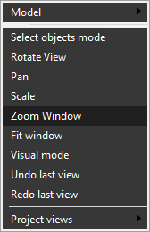
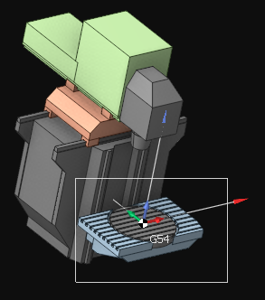

# Window zoom

Zooms to display an area defined by two opposite corners of a rectangular window. Select the <strong>Zoom Window</strong> item from the pop-up menu of the graphic window to activate the window zoom mode.

Specify the first corner of the window, hold the left mouse button, and specify the second corner. After releasing the mouse button, the area within the rectangle will be magnified to fit the viewport, and the mode will be canceled.

You can also use <strong>[Alt] + [Right Mouse Button]</strong> or <strong>the Left and Right Mouse Buttons simultaneously</strong> to achieve the same result without changing the mode.
