# Check Holder (Avoid collisions)

.png)

## Application area:

With the <strong>Check Holder</strong> function, this feature detects segments of the toolpath where the tool holder collides with the part and modifies those segments according with the specified strategy.

<strong>Methods of Avoiding Collisions:</strong>

<strong>Trim Toolpath.</strong> The collided segments (red) are excluded from the toolpath.

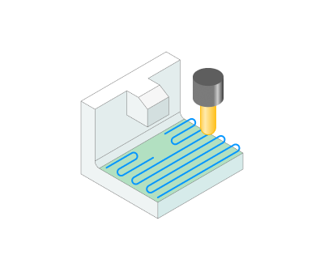

<strong>Frontal Tilting.</strong> The tool tilts away from the collision in the frontal plane (in a plane of tool pass).

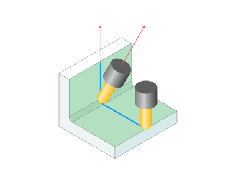

<strong>Side Tilting.</strong> The tool tilts away from the collision sideways (in a plane perpendicular to the toolpath).

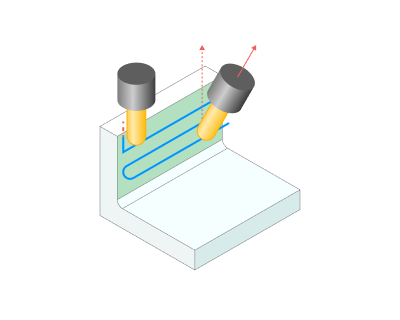

<strong>Tilt to Rotary Axis.</strong> T he tool deviates from the initial orientation by specified <strong>Tilt Angles,</strong> in the plane formed by the <strong>Rotary Axis</strong> and the tool contact point. Works <strong>only with 5-axis</strong> machines that have a rotary axis around the axis of rotation. For example, the rotary axis on table C.

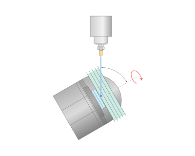

<strong>Tilt Around Rotary Axis.</strong> T he tool deviates from the initial orientation by specified <strong>Tilt Angles,</strong> in the plane perpendicular to <strong>Rotary Axis</strong>. Works only with machines that <strong>do not have a rotary axis around the axis of rotation</strong>.

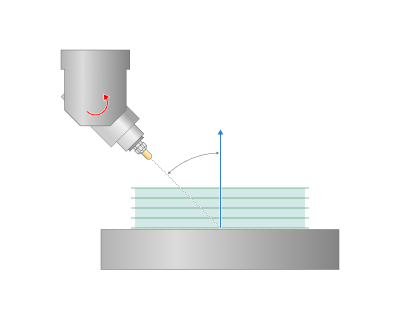

<strong>Adaptive tilting.</strong> This feature enables simultaneous angular deviation along two axes.

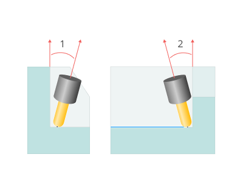

<strong>1 -</strong> First corner from the wall.

<strong>2</strong> - Second corner from the second wall.

<strong>Offset Along Tool</strong>. Th e toolpath shifts along the tool axis within a specified distance to avoid tool holder and workpiece collision. The toolpath remains continuous in this case.

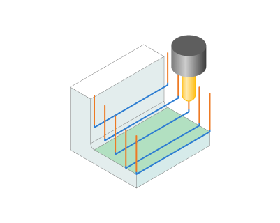

<strong>Parameters of Avoiding Collisions.</strong>

<strong>Tool Working Length.</strong> Specify the value of the tool's cutting length along its axis (Usable length LU by ISO 13399).

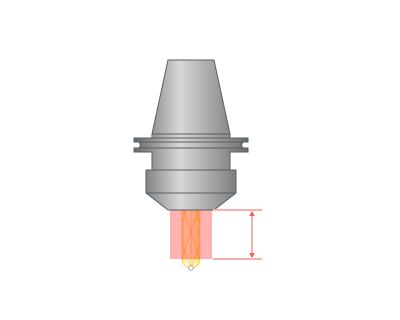

<strong>Tool Radial Clearance</strong>. Specify the minimum safe distance between the tool's non-working part and the workpiece in the direction perpendicular to the tool axis.

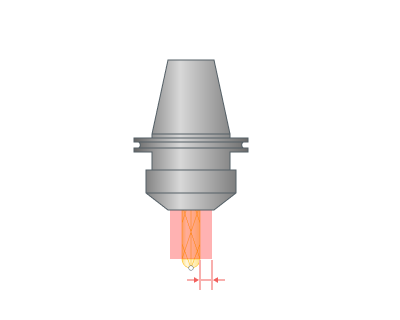

<strong>Tool Angular Clearance.</strong> The safety zone around the non-working part of the tool is a truncated cone with a radius at the apex equal to the tool radis plus <strong>Tool Radial Clearance</strong> and with an angle equal to the <strong>Tool Angular Clearance</strong>.

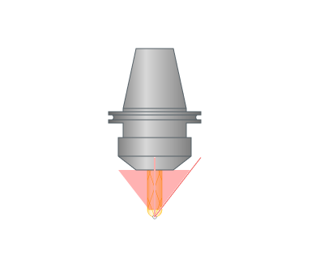

<strong>Holder Radial Clearance.</strong> Specify the minimum safe distance between the holder and the workpiece in the direction perpendicular to the tool axis.

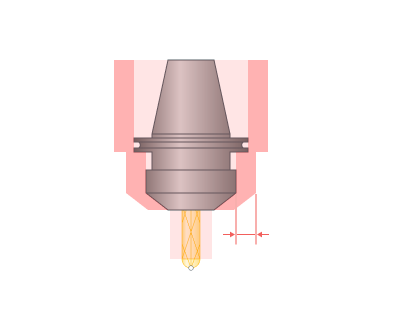

<strong>Holder Axial Clearance.</strong> Specify the minimum safe distance between the holder and the workpiece along the tool axis. Hac - Holder Axial Clearance.

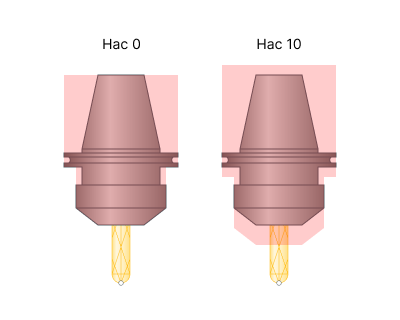

<strong>Fixed Lead Direction.</strong> Fixes the movement of the tool at the selected angle (taking into account the specified gaps in the Check Holder) when approaching an obstacle relative to the selected global coordinate system.

.png) .png)

<strong>Additional Tilt Angle.</strong> Additional clearance angle in <strong>Avoid Collisions</strong> tilting strategies to guarantee a safe collision-free toolpath.

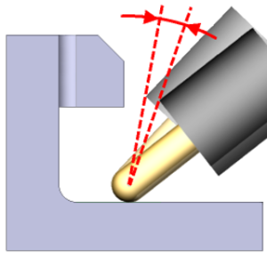

<strong>Max. tilt angle.</strong> The maximum allowed tilting angle.

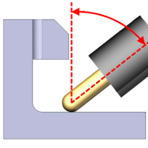

<strong>Inertia</strong>. The greater the value, the smoother the tool axis tilting is. 0 means no smoothing.

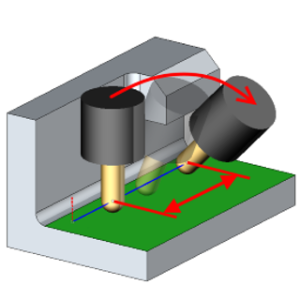

<strong>Normal blend distance.</strong> The distance between two points of the toolpath used for the calculation of the current tool tilting direction. Use greater values when machining irregular shapes to eliminate unnecessary tool axis oscillations. Use values greater than the holder radius when machining inner corners.

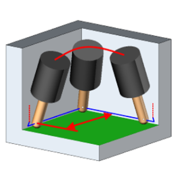

<strong>Additional Distance.</strong> The displacement of the toolpath along the tool axis to avoid tool holder and workpiece collision.

<strong>Max. Distance.</strong> The maximal allowed <strong>Additional Distance</strong>.

<strong>Check Spindle</strong>. Parameters controlling collision avoidance between the workpiece and the machine's spindle unit.

<strong>Auto</strong>. This mode uses 3D models of the machine's scheme to perform collision calculations.

<strong>Manual</strong>. In this mode, the system monitors collisions between the workpiece and a safety zone comprising a truncated cone and a cylinder. The top <strong>Radius</strong>, the <strong>Angle</strong>, and the <strong>Max Radius</strong> define the cone. The <strong>Max Radius</strong> define the cylinder.

<strong>Spindle Radial Clearance</strong>. Specify the minimum safe distance between the spindle node and the workpiece in the direction perpendicular to the tool axis.

<strong>Spindle Axial Clearance</strong>. Specify the minimum safe distance between the spindle node and the workpiece along the tool axis.

<strong>Max Radius</strong>. In the <strong>Auto</strong> mode it is the radius of a cylinder encompassing spindle-adjacent components (such as the spindle head) that might collide with the workpiece during machining. In the <strong>Manual</strong> mode it is the maximal radius of the safe zone.

<strong>Radius</strong>. It is the envelope radius of the spindle node.

<strong>Angle</strong>. The safety zone around the spindle node is a truncated cone with a radius at the apex equal to the <strong>Radius</strong> plus <strong><strong>Spindle Radial Clearance</strong></strong> and with an angle equal to the <strong>Angle</strong>.

<strong>Check links.</strong> Function that enables controlled angular deviation of the tool in two directions during transitions between machining passes to prevent collisions with the workpiece.

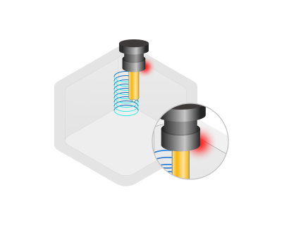 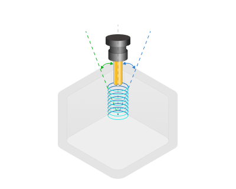
