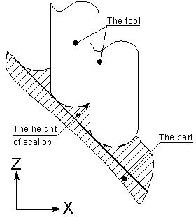
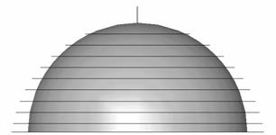
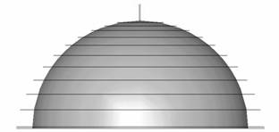
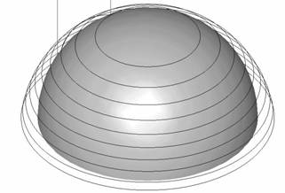
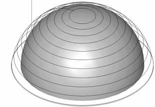

# Adaptive Step (Selection step by scallop height)

When machining surfaces, whose radius of curvature does not coincide with the profile radius of the [tool](37.md), then there appears a scallop of residual material between the neighboring passes. Its height depends on the surface shape of the model being machined, the type and size of the [tool](37.md) and the distance between the neighboring passes of the mill.

In operations it is possible to assign the step by the maximum height of the scallop. With this, the distance between the neighboring tool passes will be automatically selected so that the height of the scallop does not exceed the defined.

The step value is calculated for every work pass such that the set height of the scallop is never exceeded, even in the worst case.

It is not hard to see that the step value in the vertical direction will decrease on surfaces that are close to the horizontal, and increase with increasing slopes of the surfaces. On vertical surfaces the step value approaches infinity. In order to avoid excessively large steps, it is necessary to assign the maximum vertical step value. If the calculated value exceeds the maximum, then the maximum allowed step value will be selected.

| Machining with permanent step | Step is chosen by scallop height |
|---|---|
|  |  |
|  |  |

The step value in the horizontal direction increases on flat surfaces and decreases on close to vertical. In order to avoid too many passes on areas close to the vertical, it is necessary to assign a minimum step value. If the calculated step is less than the minimum, then the minimum value will be used.

The maximum height of the scallop can be assigned by a positive value only. It is not advised to set the height of the scallop less than the machining tolerance.

The scallop value at step in the vertical direction can be assigned in the **Parameters** page, and in the horizontal – on the **Strategy** page.
