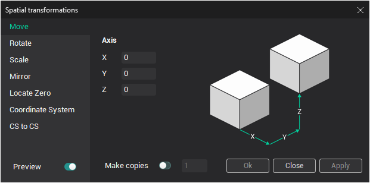
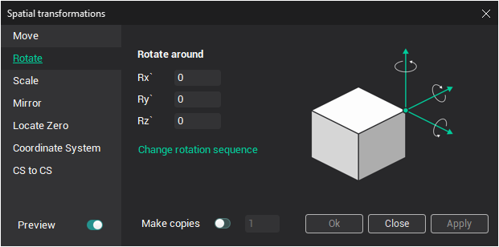
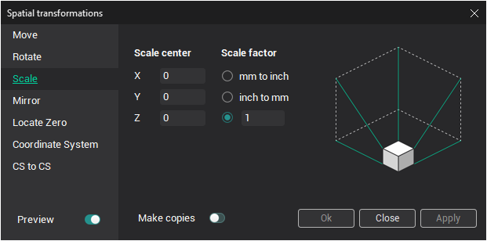
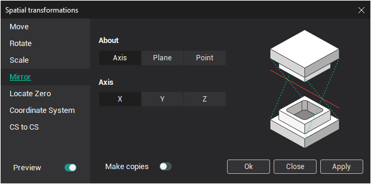
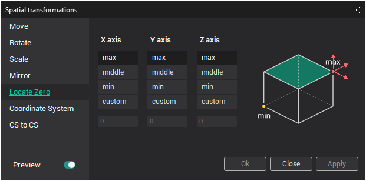
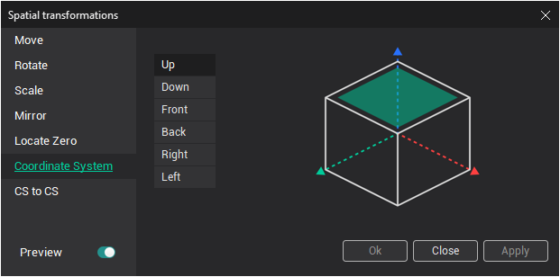
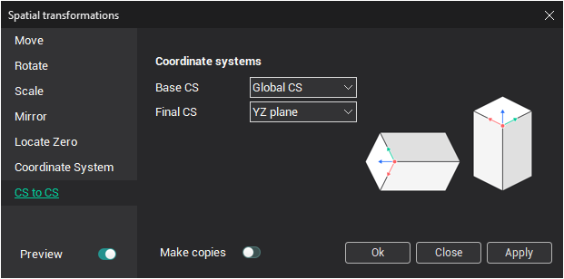

# Spatial transformations

A wider range of transformation methods of selected geometrical objects is available in the **Spatial transformations** window. The window opens when the  button is pressed.

- On the **Move** page, the user can define the parallel transition of an object. In fields **X**, **Y**, **Z** setting shift values by axes. If there is no checkmark in the field **Make copies**, then the selected object will be transferred by the defined distance along each of respective axes. If the checkmark in that field is set on, then the selected object will be copied to the defined place. It is possible to assign a number of copies. For instance, if the number of copies is set as two, then the second copy will be created at the transition distance from the first one.

- On the **Rotate** page the user can rotate selected objects round the selected axis to the defined angle. The angle is assigned in degrees. Working with copies is incremental, that is, every subsequent copy is obtained by rotation of the previous one around the defined axis to the defined angle.

- On the **Scale** page the user can enlarge or decrease selected objects. In the field **Scale center**, the coordinates of the center point of scaling are defined. **Scale factor** can be one of two default: **mm to inch** or **inch to mm**, or arbitrary value: **Other**. When assigning a coefficient of scaling of more than one, then objects will be enlarged. If a coefficient of scaling is less than one, then objects decrease in size accordingly.

- On the **Mirror** page the user can obtain an object symmetrical to the selected one relative to an axis, plane or point.

- On the **Locate Zero** page the user can perform a parallel transition of an object according to its spatial dimensions. The selected geometrical object will be shifted for such values along axes to have the transformed object relatively the current [coordinate system](753.md) according to the defined parameters.

- On the **Coordinate System** page the user can turn an object, so that the selected edges are on the top. Also the model can be transformed by the way that constructed plane will be combined with XY plane of global coordinate system.

- On the **CS to CS** page the user can transform an object located in one **Base CS** coordinate system into another **Final CS** coordinate system.

Upon pressing the **OK** button, the selected transformation will be applied and the window closes automatically. Upon pressing the **Cancel** button, the window closes without applying the transformations made. Upon pressing the **Apply** button, all transformations will be applied to the selected objects, but the window will remain active.
