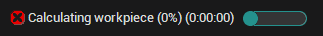

# Executing operation

Having created an operation the system automatically assigns the values of all its parameters with regard to the machining method; model dimensions, selected [tool](37.md) etc., or it copies the parameter values from an earlier created operation. Thus, the operation is ready to be executed as soon as it has been created.

It is very easy for the user to alter, if necessary, any of the parameter values for the current operation. To edit the parameters for the current operation (highlighted) the **Parameters** button is used. One should note that altering the operation parameters might cause alteration of the toolpath and the order of machining commands. As a result, after modification of the parameter values for a calculated operation, the computation results will be reset and to obtain the new toolpath, the operation needs to be recalculated.

To perform the operation calculation, press the run  button. Calculation of the toolpath for complex models that have a large number of complex surfaces may take considerable time.

The [process indicator](35.md) at the bottom of the main window

displays how far the current operation calculation has progressed. Clicking within the process indicator area will interrupt execution of the operation. The system will request confirmation of process interruption. If **Yes** is selected, the calculation will be cancelled, if **No**, the calculation will continue.

During the calculation process all visualization control buttons are enabled.
