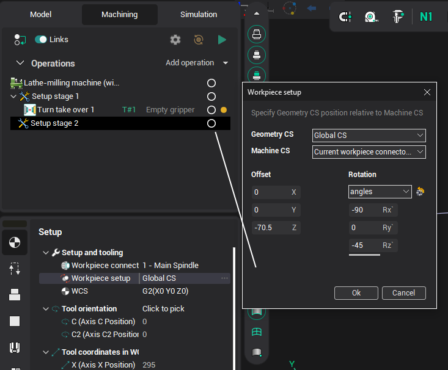
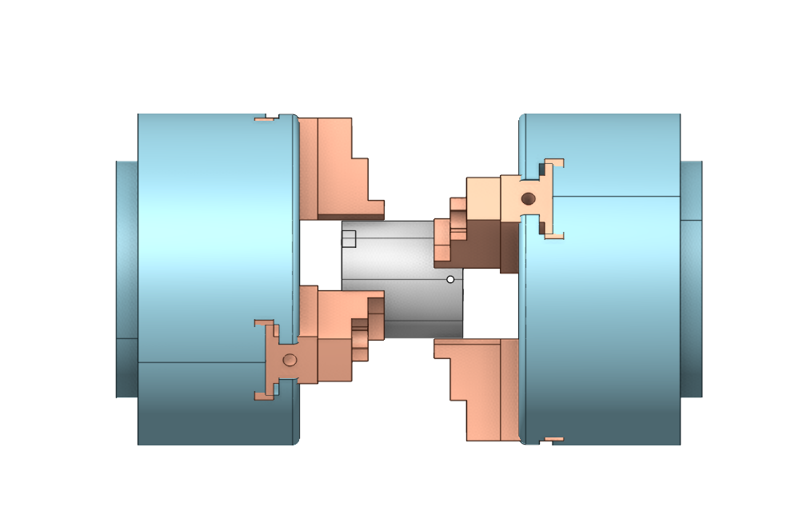
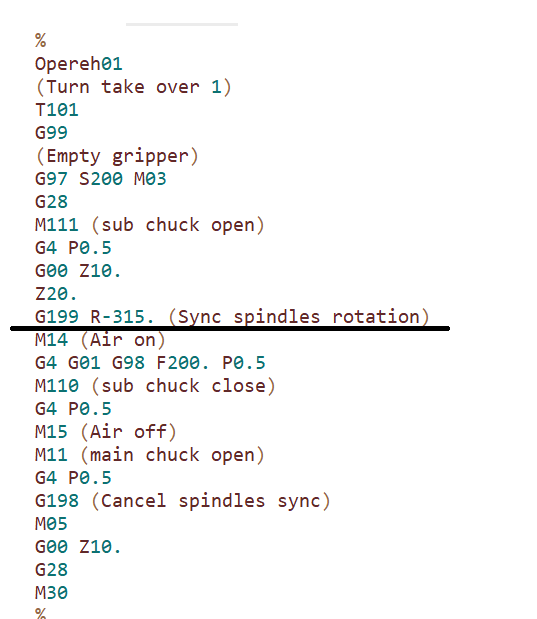

# Phase synchronization in Turn take over

## Application area:

It is necessary to perform interception of parts with different phases by synchronizing the spindles.

## The peculiarities of working:

To establish different phases (angles) of the spindle, it is necessary to indicate a phase different from the initial one in the subsequent position of the part (installation/part).

For example, in the figure below the angle is 45 degrees.

