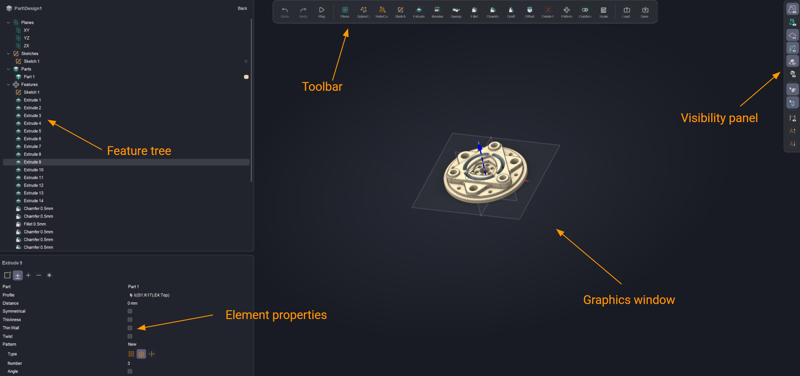
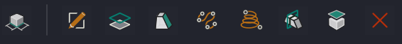
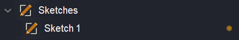
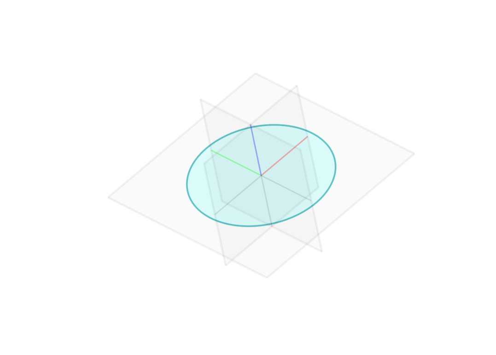
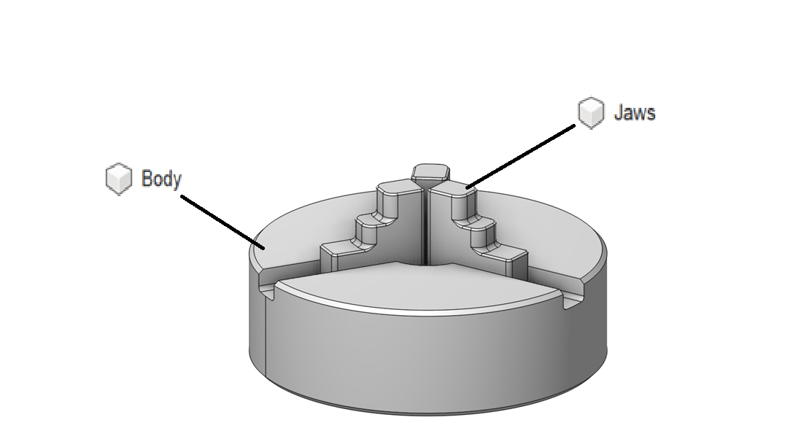
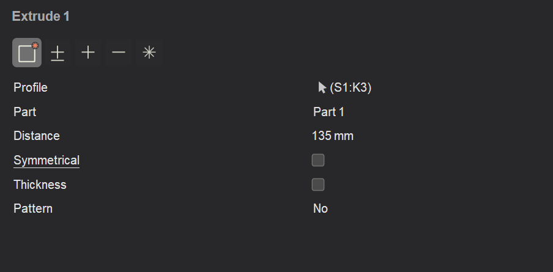
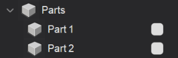
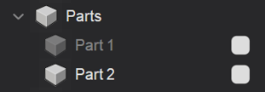
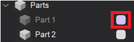
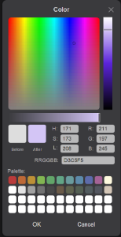

# Main window

## Application area:

<strong>The content of the main window's elements depends on the 2D or 3D working mode.</strong>

The main window consists of a feature tree, a toolbar, element properties, and a visibility panel.

### Feature tree.

The feature tree displays the chronological sequence of operations performed to create the 3D model. It is important to note that the feature tree is strictly sequential. Therefore, it is not possible to create two non-intersecting extrusions within a single body. The system will require the creation of a new body.

The tree consists of 3 base planes, sketches, parts and features.

<strong>Sketches.</strong> Defines a drawing in the construction tree

Click here to expand..

Planes are created using a pop-up menu (by clicking the right or left mouse button on a surface or plane). Its content changes depending on the selected element.

Then you need to click on the drawing button.

The methods for defining a plane are described in another chapter. [Details](12451.md)

Next to each sketch in the tree, there is a visibility toggle that allows you to show or hide it in 3D mode.

If the contour is closed, the system highlights it, indicating that a boolean operation can be performed.

<strong>If the contour is not highlighted for extrusion, check the sketch visibility and ensure that the contour is closed.</strong>

<strong>Curves.</strong> They represent spatial curves (<strong>Helix, Spline</strong>). [Details](12451.md)

<strong>Parts.</strong> The Design can consist of multiple parts (one by default). This allows for the creation of assemblies from individual parts. This is necessary for creating assemblies (for example, a jaw chuck consists of jaws and a base). [Details](10283.md)

Click here to expand..

The <strong>Create Part</strong> button is located in the Element Properties panel when performing the Extrude command.

To have two parts appear in the tree, you need to create at least two sketches and perform the <strong>Extrude</strong> operation on each.

The visibility of a part is controlled by clicking its icon.

You can also change the color of the model.

 

<strong>Features.</strong> It contains various elements (sketches, extrudes, etc.).

### Toolbar.

This is the toolbar for 2D ([Details](12452.md)) or 3D ([Details](12451.md)) mode. The toolbar's contents change depending on the selected mode.

### Element properties.

This panel allows you to change the properties of <strong>Features</strong>.

### Visibility panel.

This panel allows you to control the visibility of various elements (such as the machine, planes, sketches, etc.).

Click here to expand..

<strong>Show 3D model.</strong> Determines the visibility of 3D models not involved in the model design.

<strong>Show machine.</strong> Determines the visibility of the equipment model

<strong>Planes.</strong> Determines the visibility of all planes

<strong>Sketches.</strong> Determines the visibility of all sketches

<strong>Ground plane.</strong> Determines the visibility of the floor

<strong>Section plane.</strong> Enables (or disables) a special mode for displaying the internal structure of an object. [Details](333.md)

<strong>Edges.</strong> Allows selecting model edges

<strong>Features.</strong> Allows selecting model features

<strong>Dimensions.</strong> Determines the visibility of all dimensions.

<strong>Increase PMI Font.</strong> Increases the dimension size

<strong>Decrease PMI Font.</strong> Decrease the dimension size

### Graphics window.

This is the main window where the drawing, model, or assembly is displayed.
