# Design in 2D mode

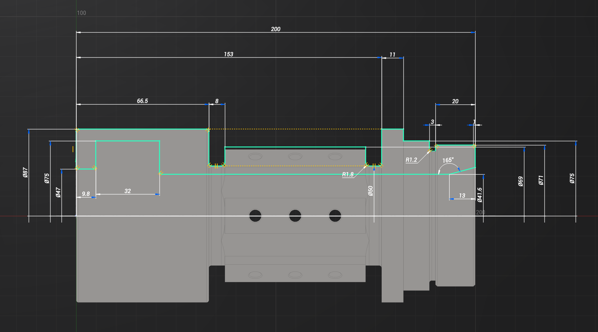

## Application area:

This mode allows you to create drawings.

Defining planes for drawing creation was covered in the next chapter. [Details](12451.md)

### Toolbar/Element properties.

Click here to expand..

<strong>Undo.</strong> Reverses the last action.

<strong>Redo.</strong> Reapplies the last undone action.

<strong>Sketch.</strong> Allows you to exit a drawing or create a drawing

<strong>Point.</strong> Add points to the sketch

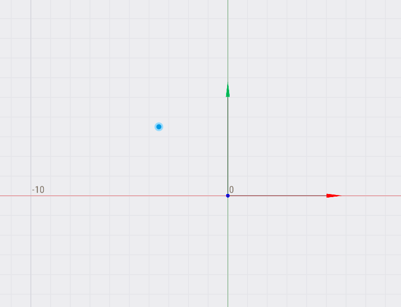

<strong>Coordinates:</strong> Enter the coordinates of the point separated with [space].

<strong>Split Contour.</strong> Allows you to split a curve into two

<strong>Hot keys:</strong>

<em><strong>RMB</strong></em>: Exit.

<strong>Contour.</strong> Draw a contour with lines and arcs Click to add the next line or tangent arc.

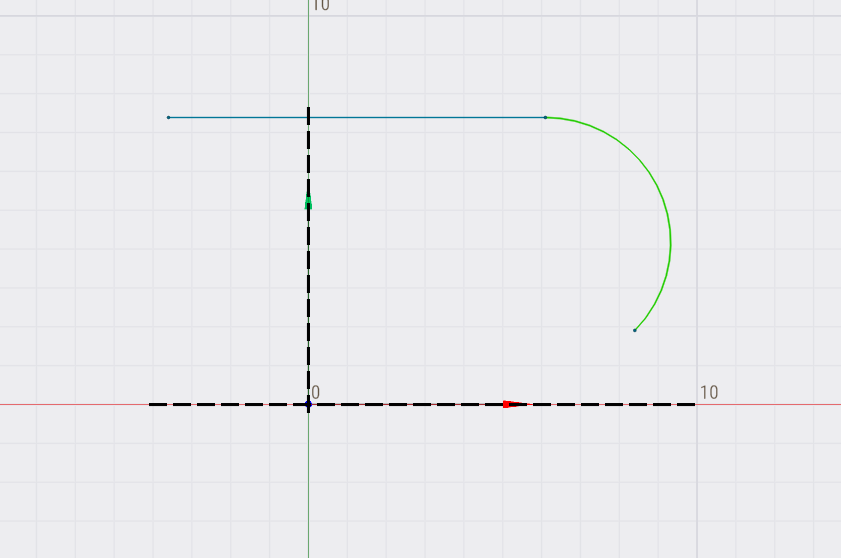

<strong>Coordinates:</strong> Enter the coordinates of the point separated with [space].

Click here to expand..

You can use a star as an example.

1.You need to copy this table to the clipboard 2. Enter the data in the appropriate field 3.Press enter

| 0 | 20 |
|---|---|
| 5,87 | 6,47 |
| 19,02 | 6,47 |
| 9,51 | -3,09 |
| 11,75 | -19,02 |
| 0 | -9,51 |
| -11,75 | -19,02 |
| -9,51 | -3,09 |
| -19,02 | 6,47 |
| -5,87 | 6,47 |

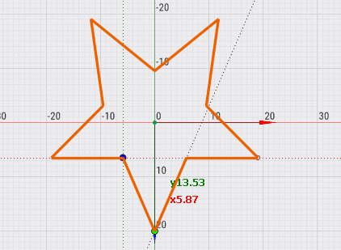

<strong>Hot keys:</strong>

<strong><em>Space:</em></strong> Hit Space to switch between drawing lines and arcs.

<strong><em>Shift</em></strong>: Hold Shift and click on an arc or a circle to make the line tangent to it.

<strong><em>Trim a contour</em></strong> Hold and drag the left mouse button to trim out a piece of a contour.

<em><strong>RMB</strong></em>: Exit.

<strong>Arc by two points.</strong> Draw an arc connecting two points.

1. Click the first point of the arc.

2. Click the second point of the arc.

3. Either click the third point on the arc or enter the radius of the arc in the Radius field.

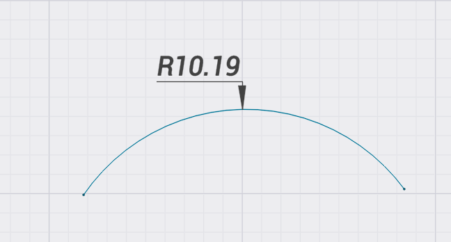

<strong>Radius.</strong> Predict the radius between two points.

<strong>Start point.</strong> Allows you to specify point by coordinates.

<strong>End point.</strong> Allows you to specify point by coordinates.

<strong>Hot keys:</strong>

<strong>Shift</strong>: Hold Shift and click on an arc or a line to make the arc tangent to it.

<strong>RMB</strong>: Exit.

<strong>Arc from center.</strong> Draw an arc starting with the center point

1. Click the center point of the arc. 2. Click the first point of the arc. 3. Click the second point of the arc.

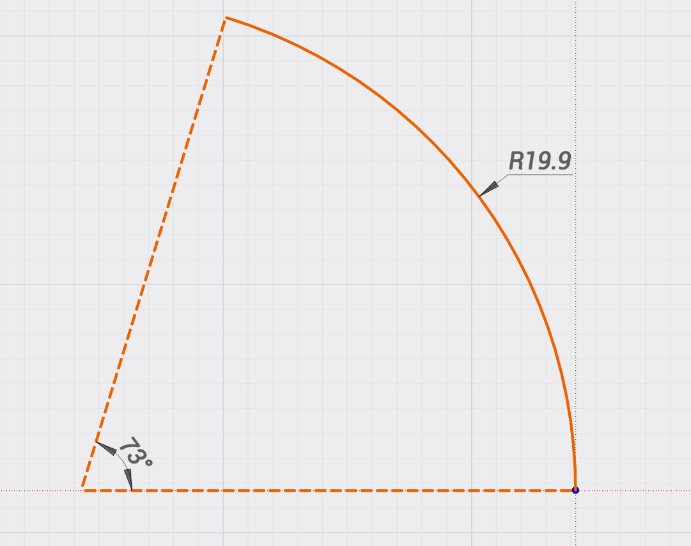

<strong>Hot keys:</strong>

<strong>RMB:</strong> Exit.

<strong>Rectangle by 2 points.</strong> Draw a rectangle between two diagonal points

1. Click the first corner point of the rectangle. 2. Either Click the second corner point or enter the dimensions of the rectangle in the field above.

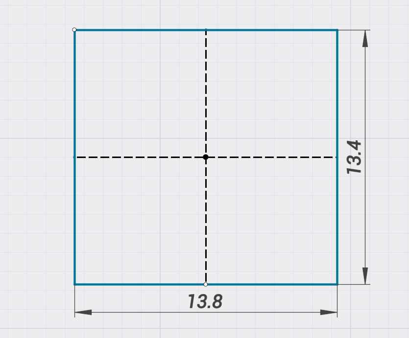

<strong>Dimension.</strong> Enter only one dimension to make it a square. (Example 67.5 67)

<strong>Start point.</strong> Allows you to specify point by coordinates.

<strong>Hot keys:</strong>

<strong>RMB</strong>: Exit.

<strong>Rectangle from center.</strong> Draw a rectangle from the center point.

1. Click the center point of the rectangle. 2. Either click the corner point or enter the dimensions of the rectangle in the field above.

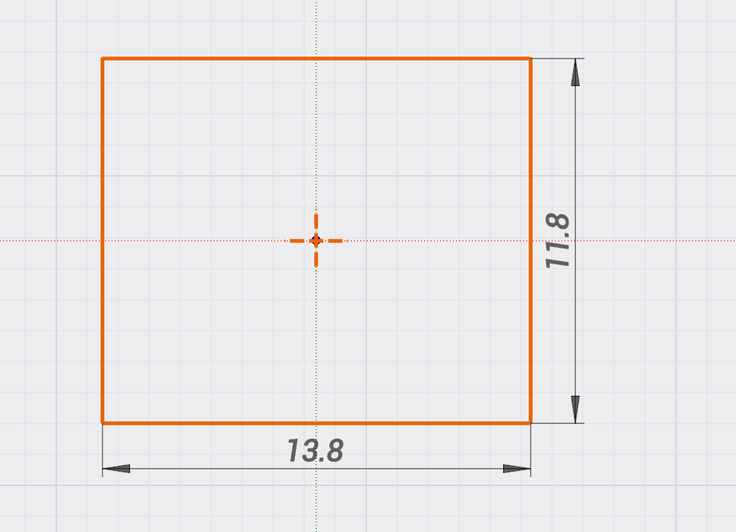

<strong>Dimension.</strong> Enter only one dimension to make it a square. (Example 67.5 67)

<strong>Center point.</strong> Allows you to specify point by coordinates.

<strong>Hot keys:</strong>

<strong>RMB</strong>: Exit.

<strong>Circle.</strong> Draw a circle starting from the center

1. Click the center point of the circle.

2. Click a point on the circle, or enter the size of the circle in the field above.

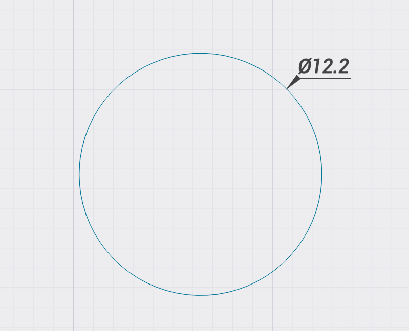

<strong>Diameter.</strong> Determines the diameter of a circle.

<strong>Center point.</strong> Allows you to specify point by coordinates.

<strong>Hot keys:</strong>

<strong>Hold Shift and click</strong> on a segment to make the circle tangent to the segment.

<strong>Hold Ctrl</strong> to create multiple circles with the same diameter.

Draw a circle tangent to another geometry

<strong>Hold Shift and click</strong> on lines, arcs, circles or points to draw a circle tangent to those entities.

Enter the size of the circle in the field above when needed.

<strong>RMB</strong>: Exit.

<strong>Slot linear.</strong> Draw a straight slot between two points

1. Click the first point of the slot.

2. Click the second point of the slot.

3. Click the periferal point of the slot to define the slot width.

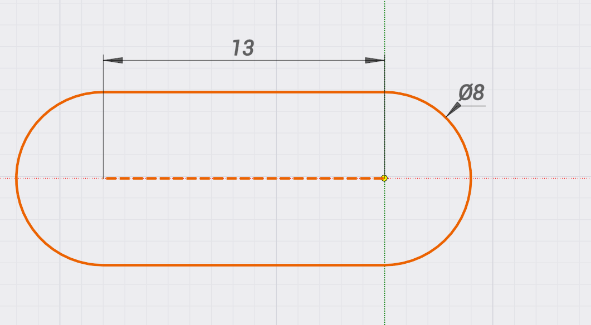

<strong>Hot keys:</strong>

<strong>RMB</strong>: Exit.

<strong>Slot circular.</strong> Draw a circular slot from the center point

1. Click the center point of the slot arc.

2. Click the first point of the slot arc.

3. Click the second point of the slot arc.

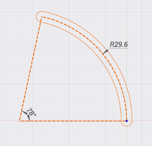

<strong>Hot keys:</strong>

<strong>RMB</strong>: Exit.

<strong>Offset.</strong> Allows you to set the offset of the selected element.

<strong>Left.</strong> Allows you to set an offset to the left of the contour

<strong>Right.</strong> Allows you to set an offset to the right of the contour

<strong>Both sides.</strong> Allows you to set an offset to the left and right of the contour

<strong>Distance.</strong> The distance by which the contour must be shifted

<strong>Roll Corners.</strong> Allows you to round off the corners of an offset contour

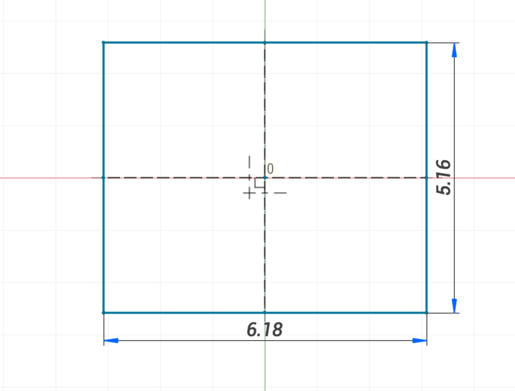 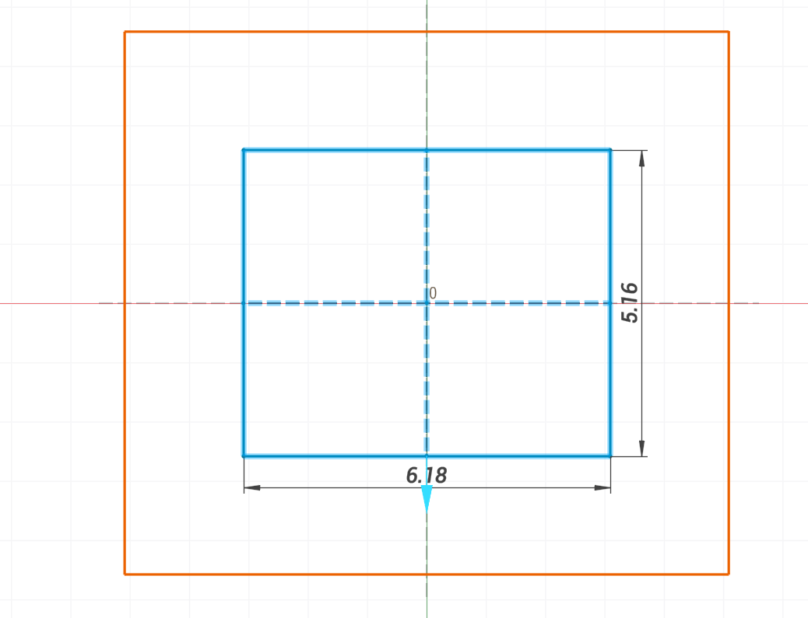

<strong>Hot keys:</strong>

<strong>Select the contour and press Ctrl</strong> to drag in the desired direction.

<strong>RMB</strong>: Exit.

<strong>Polygon.</strong> Draw a polygon starting with the center point

1. Specify the number of sides of the polygon in the field above.

2. Click the center point of the polygon.

3. Click the peripheral point of the polygon.

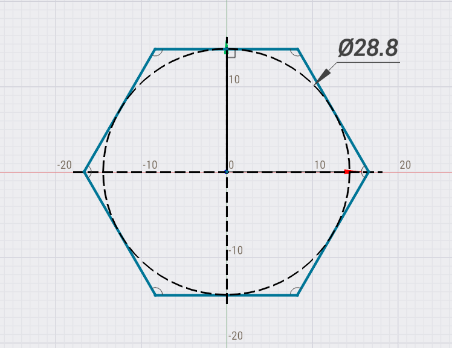

<strong>Second point on the side.</strong> The second point is located on the side

<strong>Second point in the corner.</strong> The second point is located in the corner

<strong>Number of sides.</strong> Defines the number of sides

<strong>Hot keys:</strong>

<strong>RMB</strong>: Exit.

<strong>Rounding/Chamfer.</strong> Create sketch roundings and chamfers.

Hover the mouse over the sketch entities where you want to insert the feature and click.

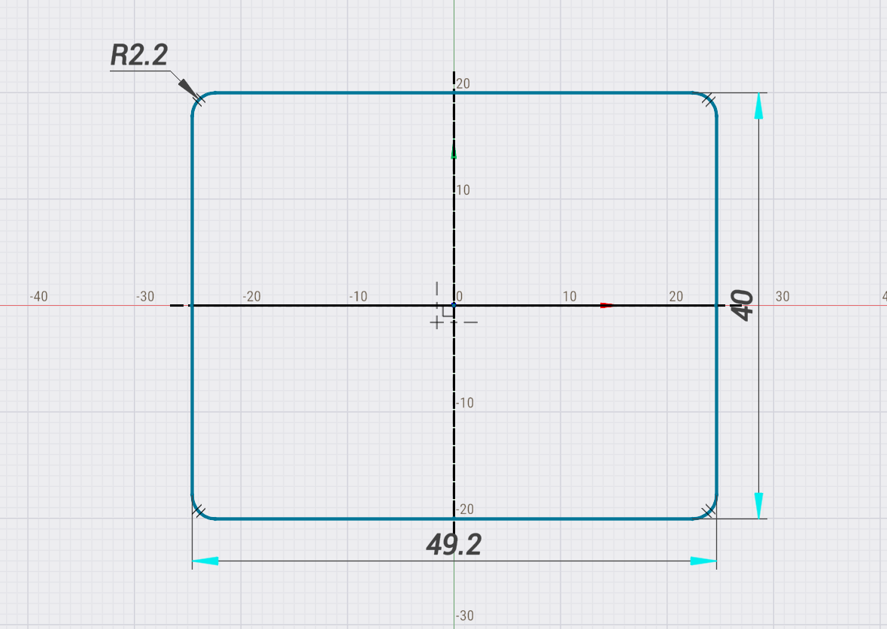 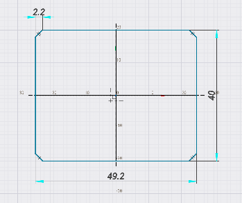

<strong>Radius/Size.</strong> Defines the size of an element

<strong>Hot keys:</strong>

Press <strong>Space</strong> to toggle between rounding and chamfering.

Rotate the mouse wheel while holding [Ctrl] to increase/decrease the feature size.

<strong>RMB</strong>: Exit.

<strong>Import object.</strong> Import reference geometry into the sketch

Click on a face, curve or an edge to project it into the sketch. The imported entities are marked with color.

Remove reference geometry from the sketch Click on the imported entity to remove it from the sketch.

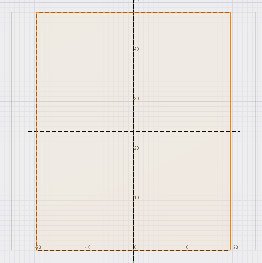 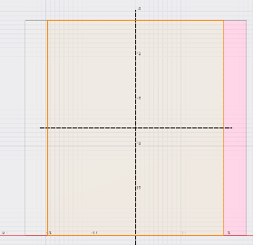

<strong>Hot keys:</strong>

<strong>RMB</strong>: Exit.

<strong>Trim.</strong> Trim out a piece of a contour.

Hover the mouse over the entities you want to trim and click. The entities to be removed will be highlighted.

Note: The tool is used to trim entities that intersect with other entities. If you want to delete noninteresecting entities use [Del] instead.

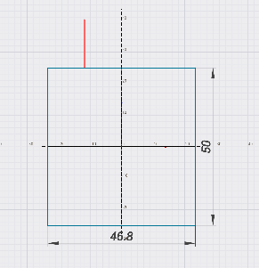 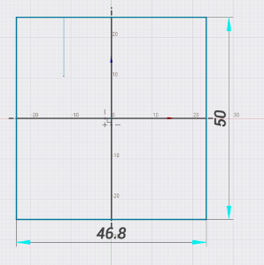

<strong>Hot keys:</strong>

<strong>RMB</strong>: Exit.

<strong>Dimension.</strong> Add dimensions to the sketch.

Select one or two geometry entities with the mouse to add a dimension. The type of the dimension will be determined automatically based on the type of the selected entities.

You can add linear, radial, diametral or angular dimensions this way.

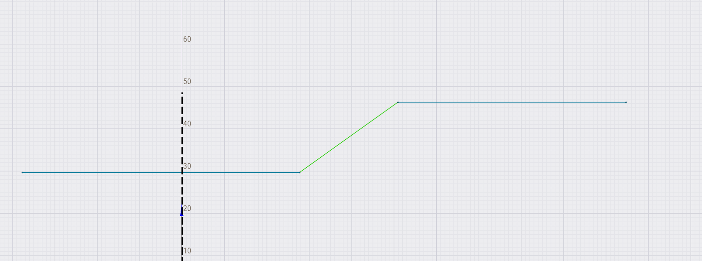 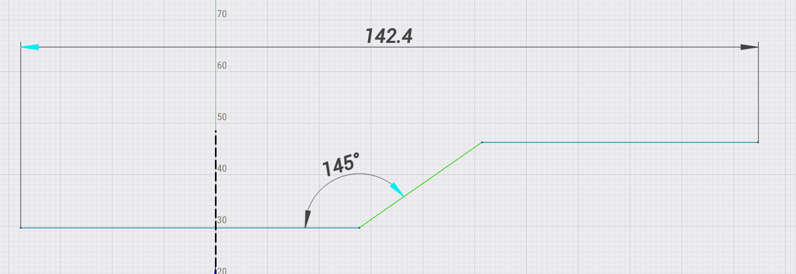

<strong>Hot keys:</strong>

<strong>RMB</strong>: Exit.

<strong>Mirror.</strong> Mirror selected sketch entities.

Select a line of the sketch with mouse as the symmetry axis.

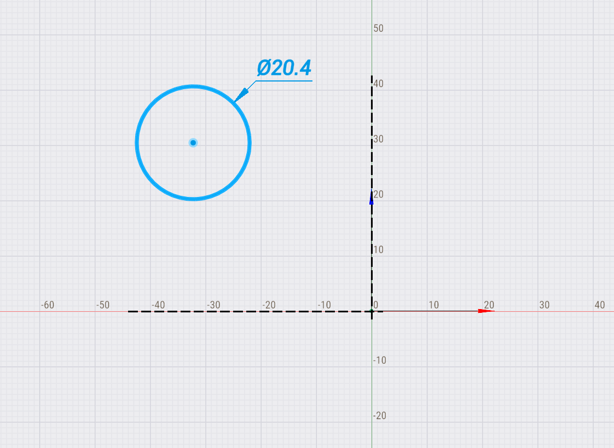 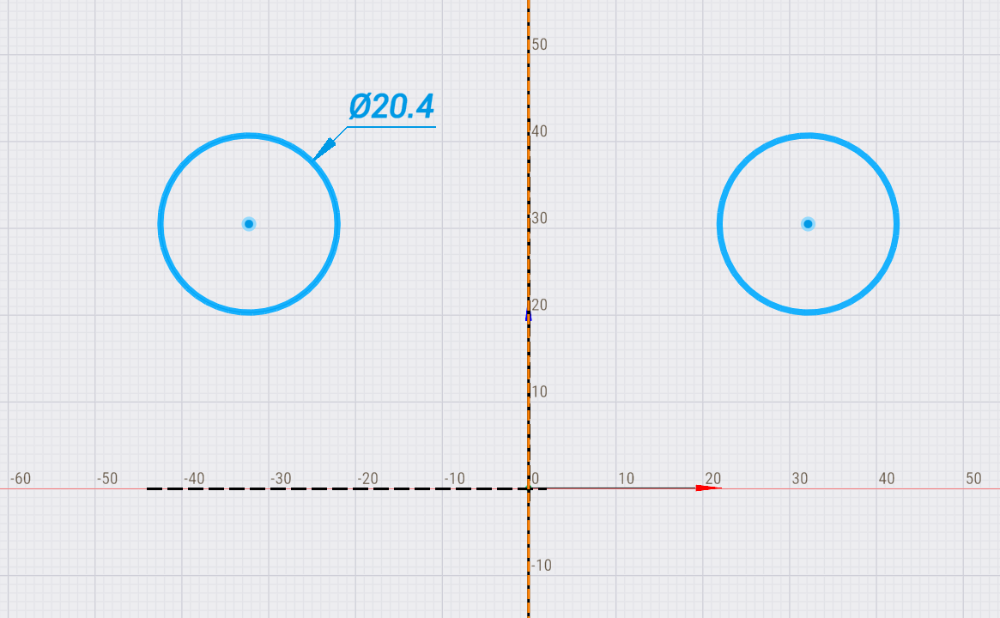

<strong>Hot keys:</strong>

<strong>RMB</strong>: Exit.

<strong>Circular pattern.</strong> Create a circular pattern of the selected entities

1. Enter the number of copies in the field above.

2. Select a point of the sketch to define the center point of the pattern.

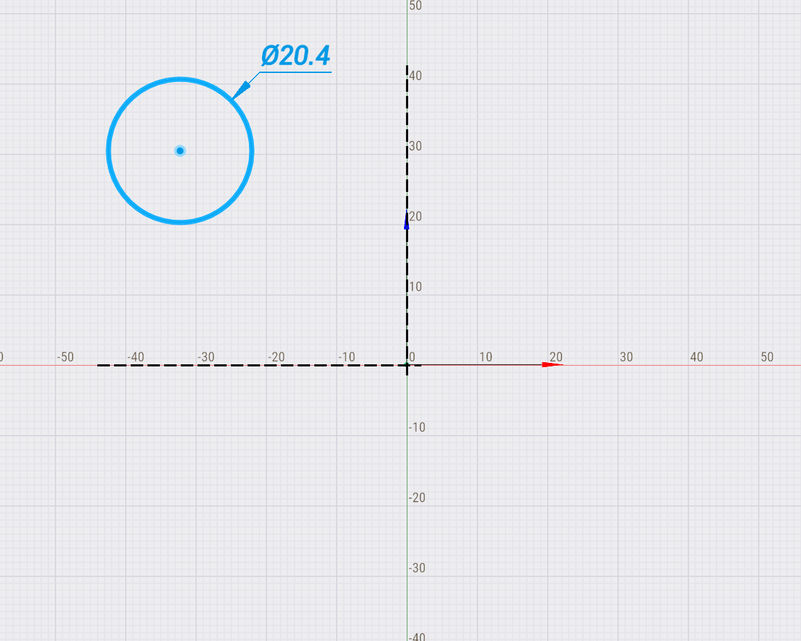 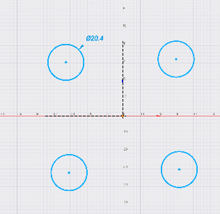

<strong>Number of copies.</strong> Specifies the number of elements to copy.

<strong>Hot keys:</strong>

<strong>RMB</strong>: Exit.

<strong>Text.</strong> Allows you to create custom text.

<strong>Helixal gear.</strong> Allows you to build a gear profile

<strong>Helic angle.</strong> Angle setting for choosing between a spur or helical gear in the 3D model.

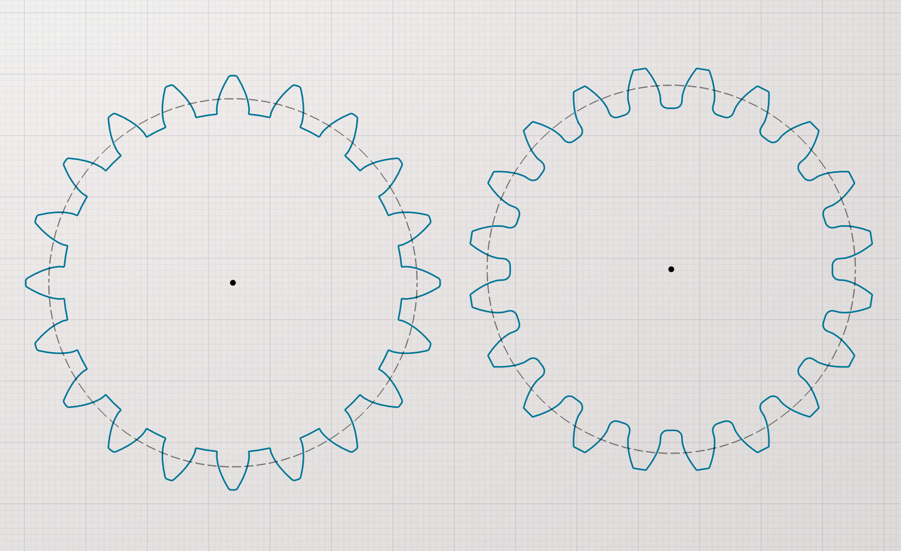

<strong>Mill profile.</strong> Allows you to build a cutter profile

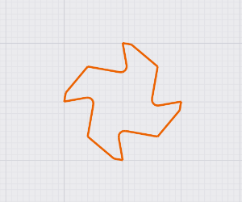

<strong>Insert decal image.</strong> Allows you to insert an image to outline it

<strong>Load.</strong> Allows you to download a drawing in <strong>*.gsf</strong> format

<strong>Save.</strong> Allows you to save the drawing in <strong>*.gsf</strong> format

### Features of working with drawings.

Click here to expand..

<strong>When working in the drawing mode and selecting curves (Left or right mouse button), various settings are possible (changing the line type, restrictions, etc.)</strong>

In drawing mode, you can select 3 main lines:

- <strong>Main</strong> - Used for drawing a part and its visible sides.

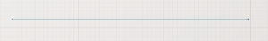

- <strong>Construction</strong> - Image of invisible outlines of an object

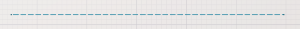

- <strong>Center line</strong> - Designation of axial lines and center lines of circles

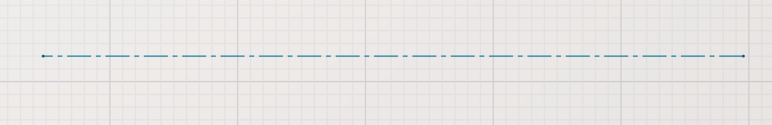

<strong>Lock position.</strong> Allows you to enter restrictions (angle, size, etc.) The object does not move in space

<strong>Lock agle</strong>. Allows you to limit the angle of an element

<strong>Make horizontal.</strong> Allows you to make the curve horizontal. The curve can be part of the contour

<strong>Center lines.</strong> Allows you to set the centerlines of a circle/radius

<strong>Dimension.</strong> Allows you to set the dimensions. As a rule, the size is set from the 0 point of the drawing to the element.

<strong>Defeature.</strong> Allows you to exclude an element (for compound figures, contours, etc.)

<strong>When selecting multiple elements (for example 2 segments), the following restrictions are available:</strong>

<strong>The restriction can be removed by selecting the restriction sign and pressing the DEL key.</strong>

<strong>Equal.</strong> Introduces a length limit (two segments become equal). They are denoted by the <strong>equal sign</strong>. T

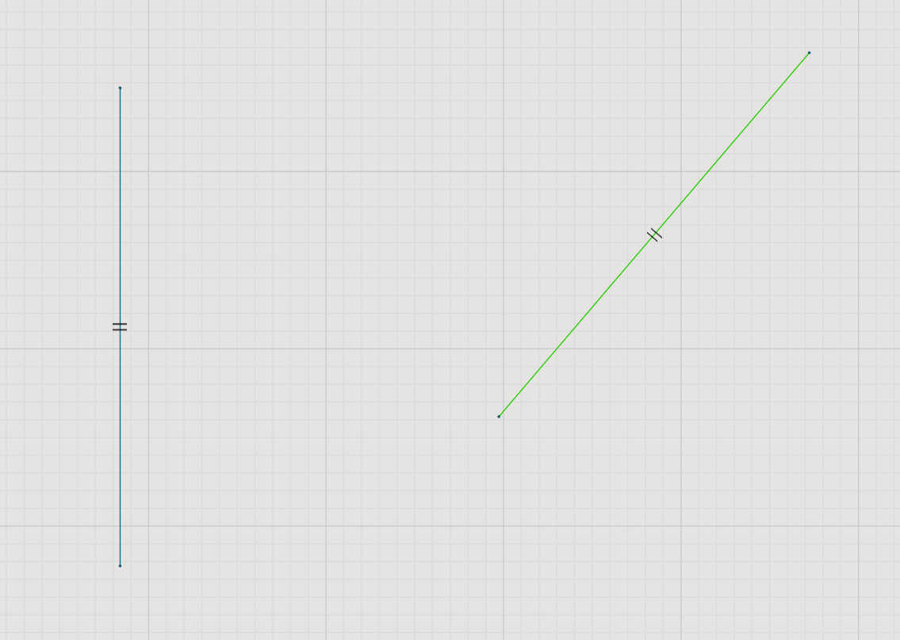

<strong>Parallel.</strong> Makes two elements parallel to each other. The limit sign is visible when one of the elements is selected.

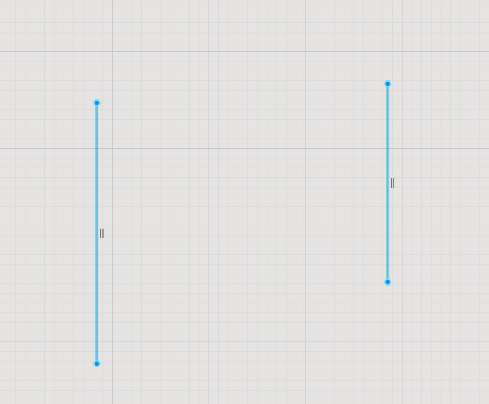

<strong>Perpendicular.</strong> Makes two elements perpendicular to each other.

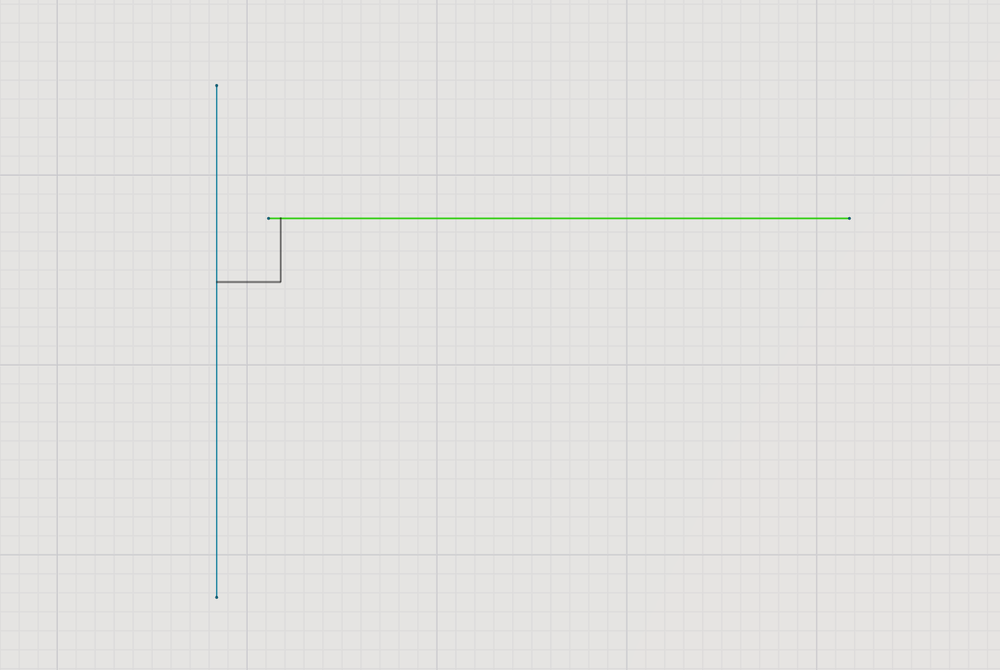

<strong>Colinear.</strong> Allows you to set 2 curves on 1 line.

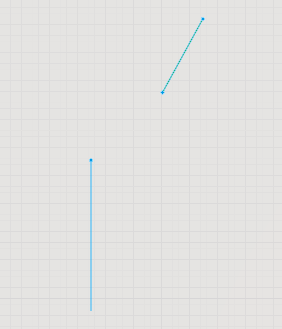 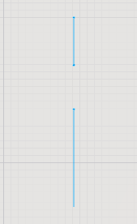

<strong>The drawing also actively uses the different keys.</strong>

- To move, select an element, hold down Shift and drag to the side

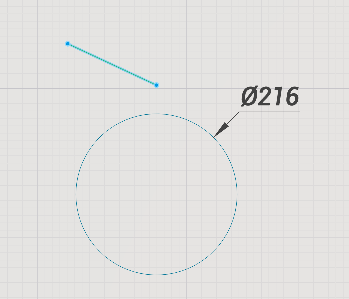 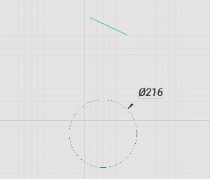

To create a copy, select the element. Grab the point and use the Ctrl key

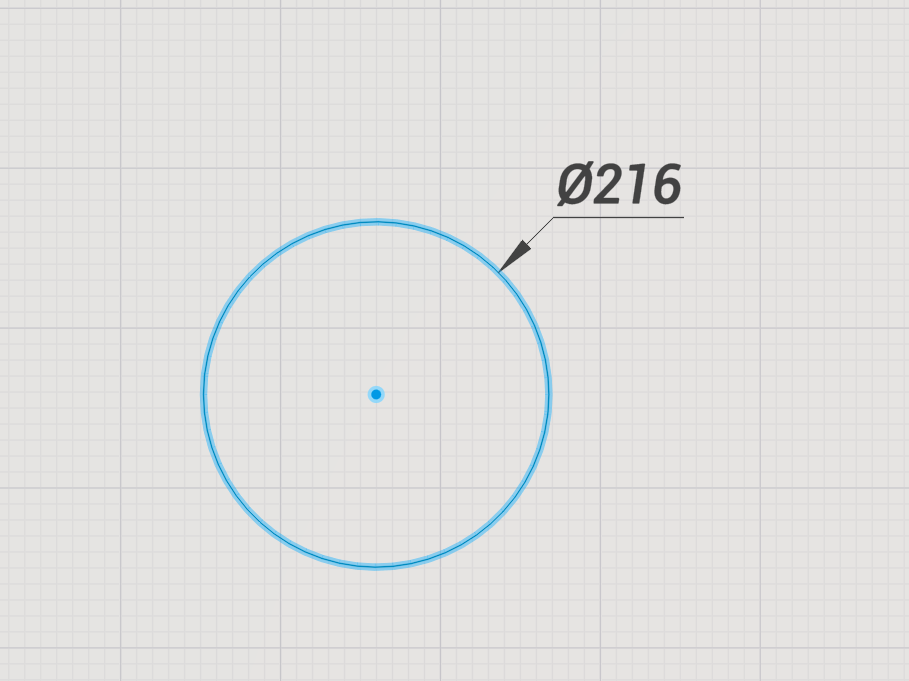 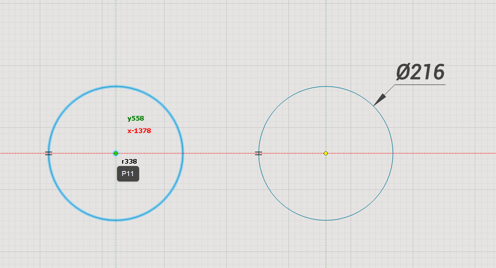

To move, grab the element and press the Ctrl key.

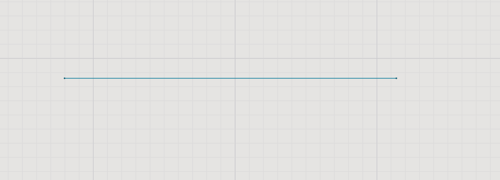 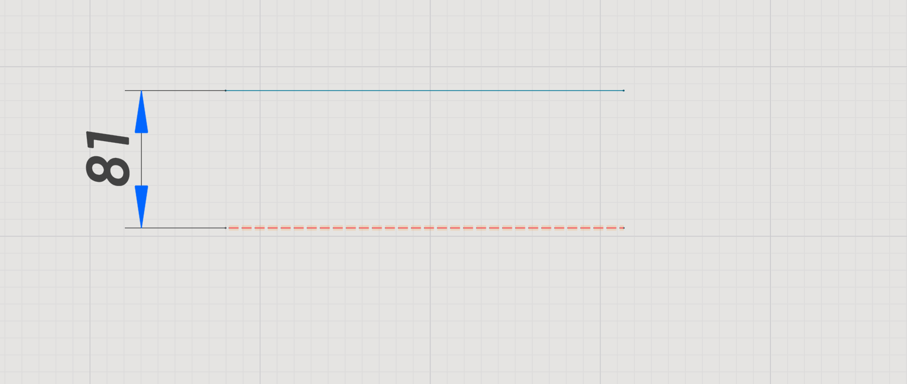

