# Direct Modeling

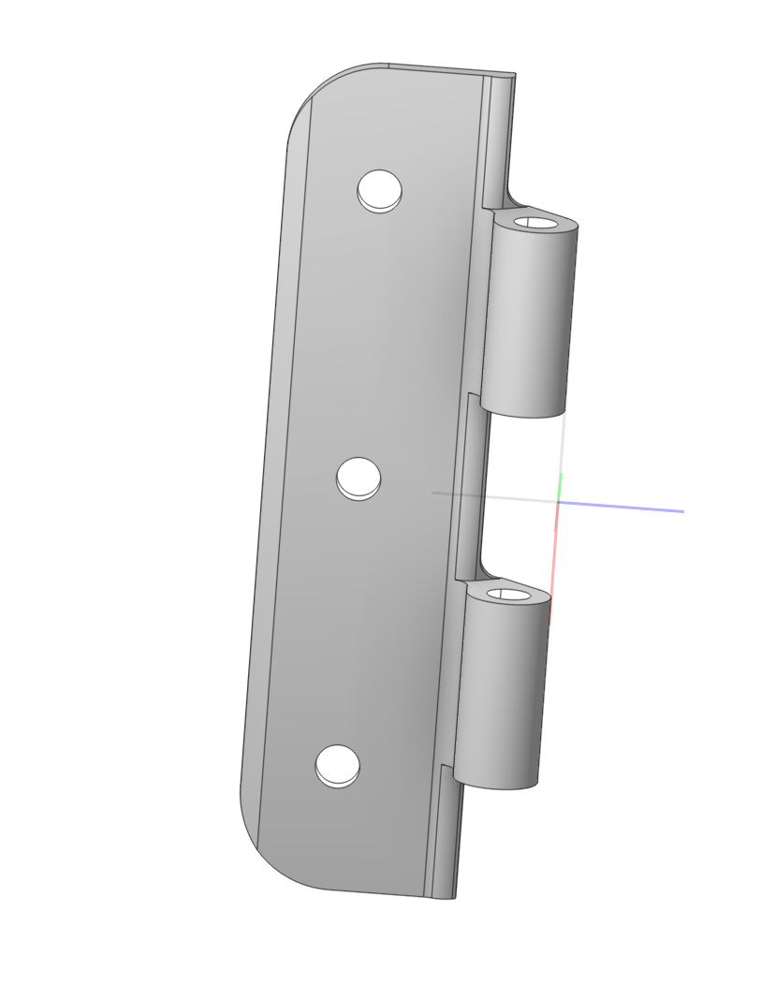 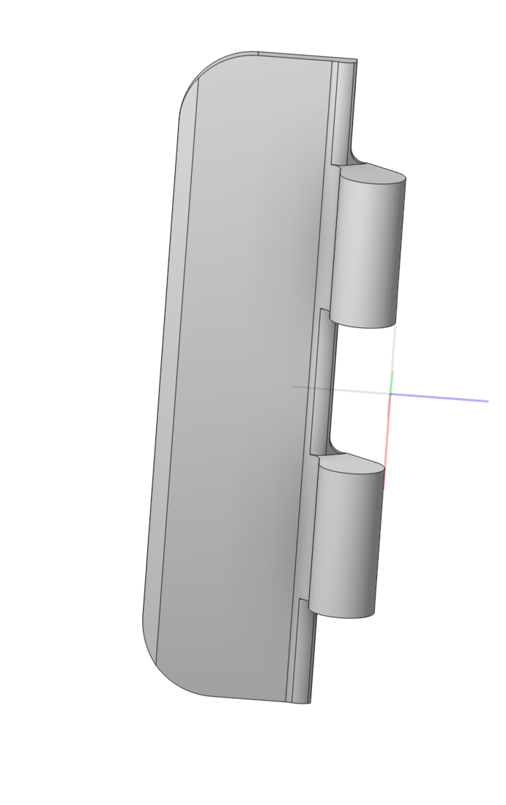

## Application area:

Editing a CAD model directly (<strong>moving</strong>, <strong>deleting</strong> faces) without considering the design history or parametric dependencies.

<strong>Example:</strong> creating a stock blank from an external file for subsequent machining

1. Converting the 3D Model to a CAM System Format. This requires right-clicking the model in the model tree and choosing <strong>Convert to design</strong>.

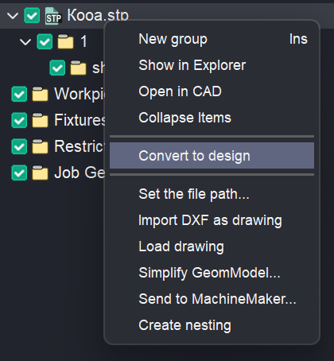 

2. After the model opens in <strong>Design</strong> mode, right-click on the model in the construction tree and select <strong>Recognize</strong>.

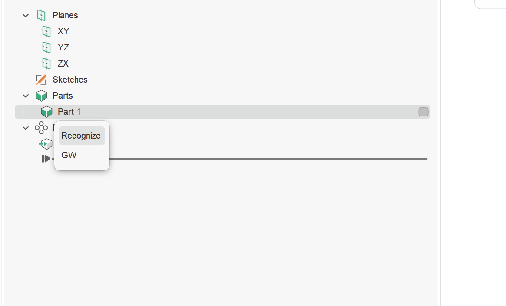

3. After this, typical features such as holes, pockets, and others will be highlighted in the construction tree.

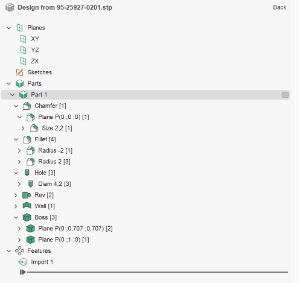

4.Using the <strong>delete</strong> or <strong>offset</strong> tools, you can create a blank according to your criteria.

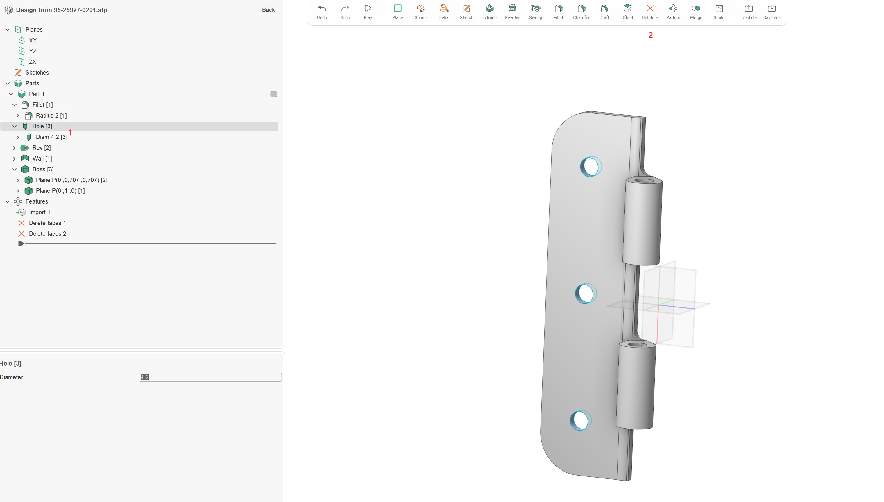 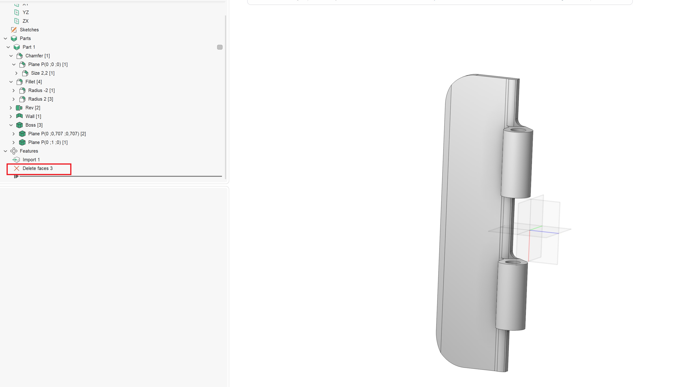

You can also select a separate surface to simplify it. Use the <strong>remove surface</strong> functionality.

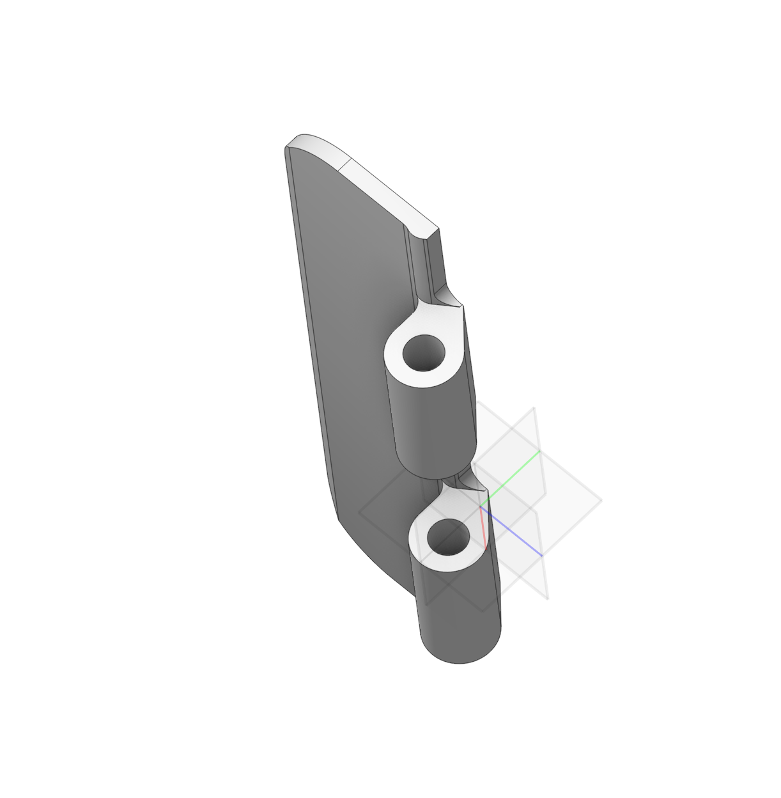 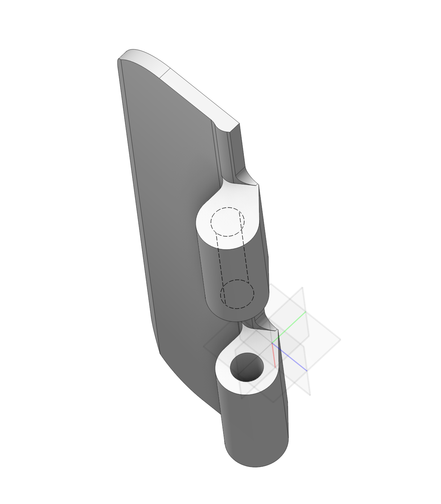

If you also need to offset the surface, use the <strong>offset</strong> function.

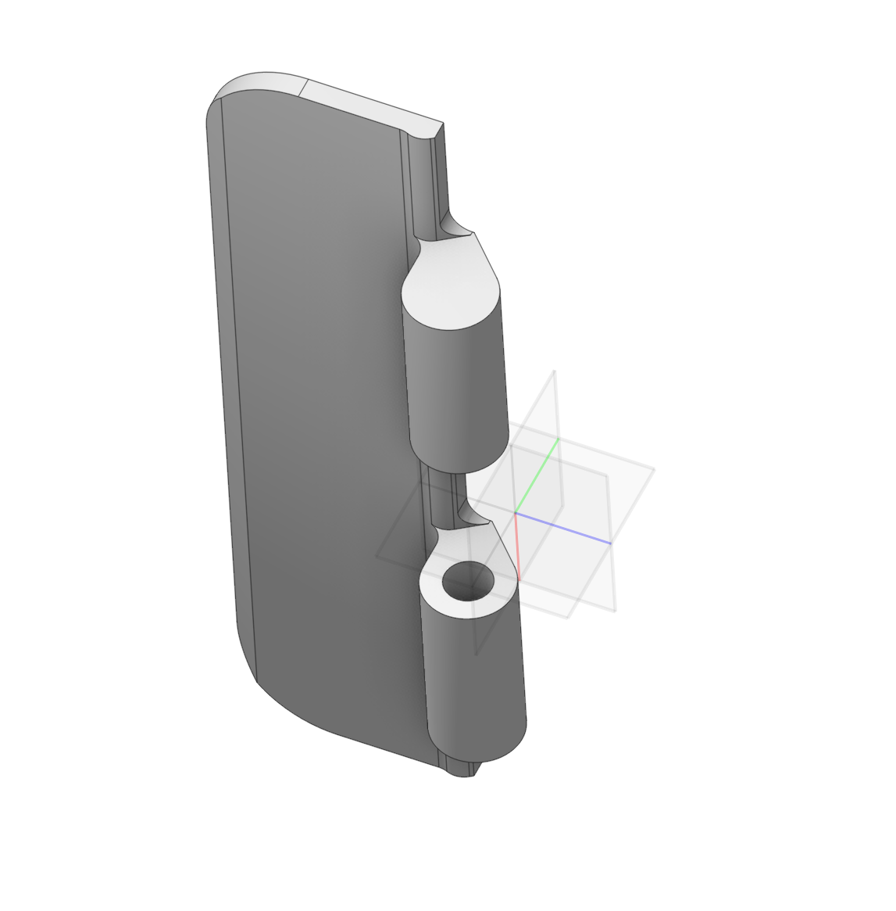 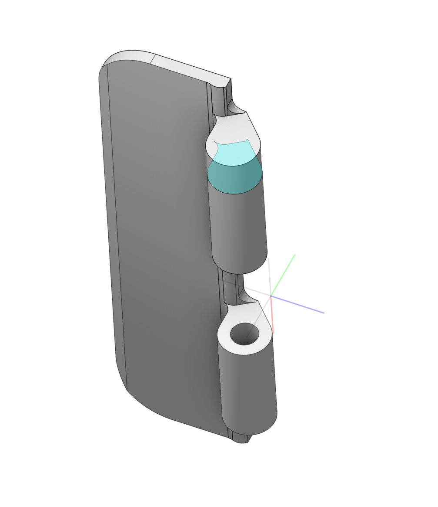 
