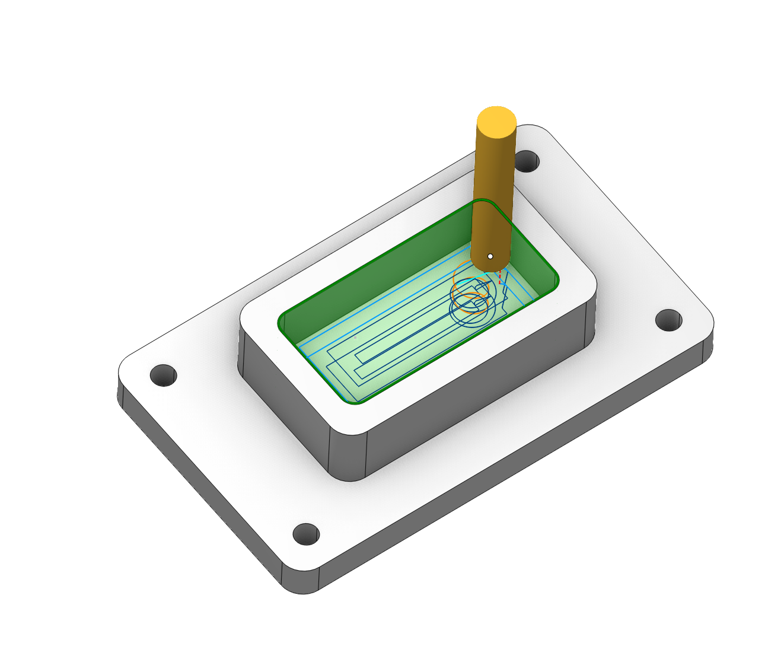
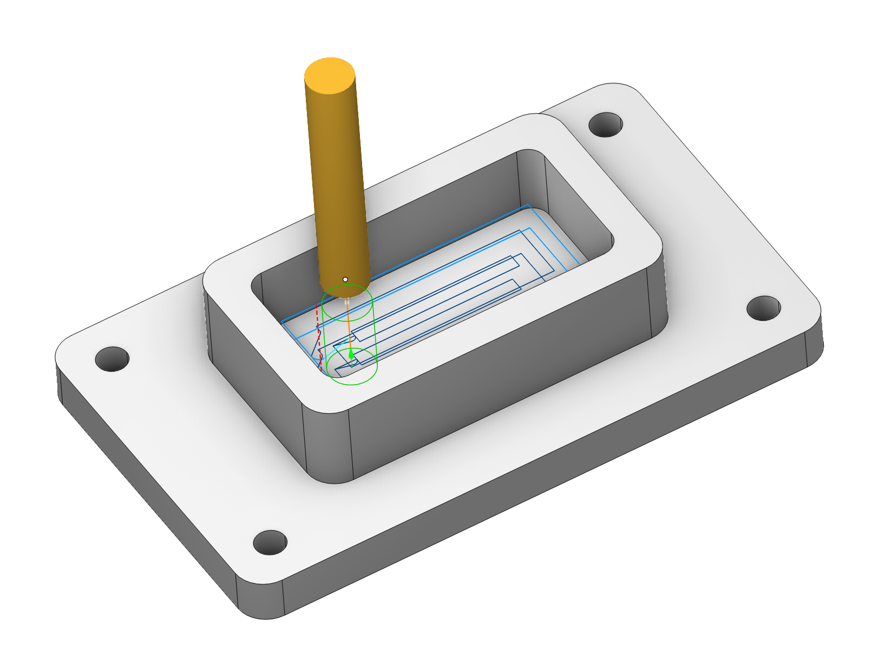
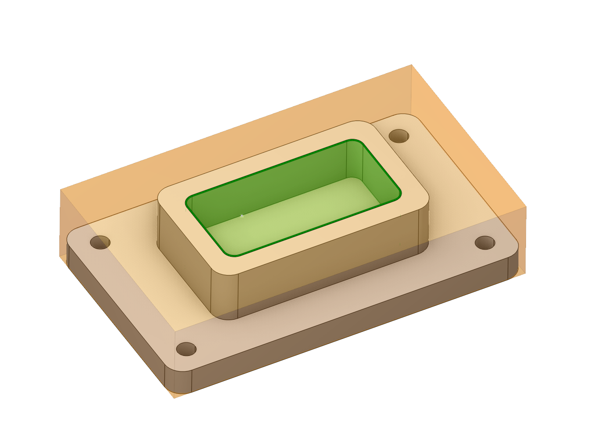
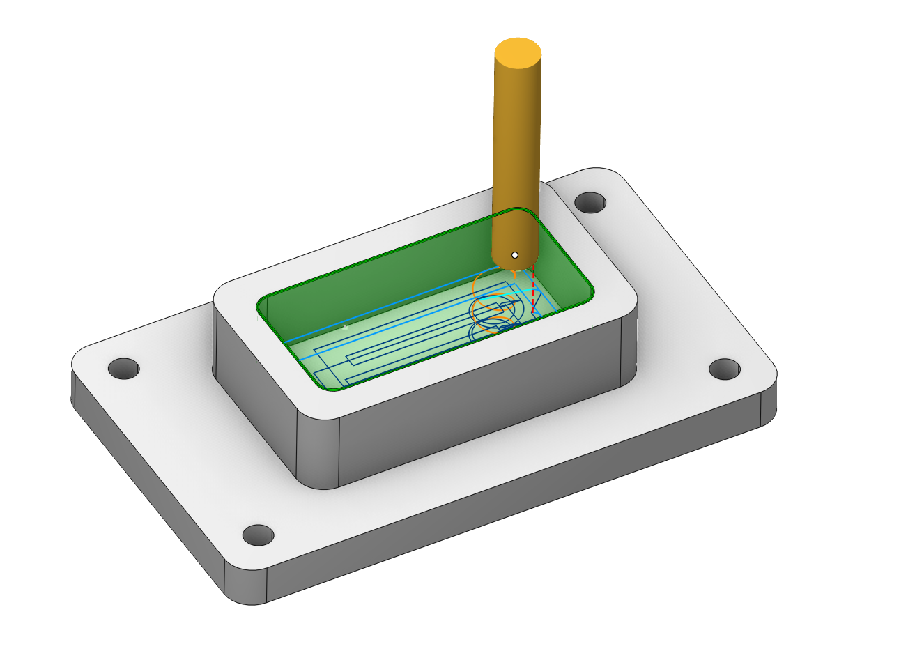
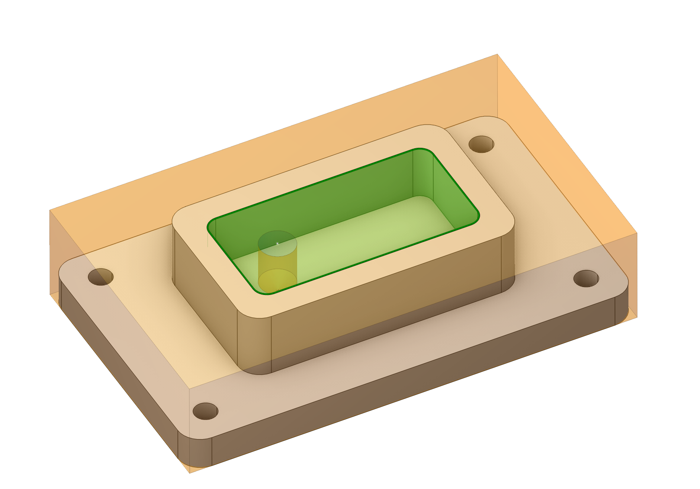
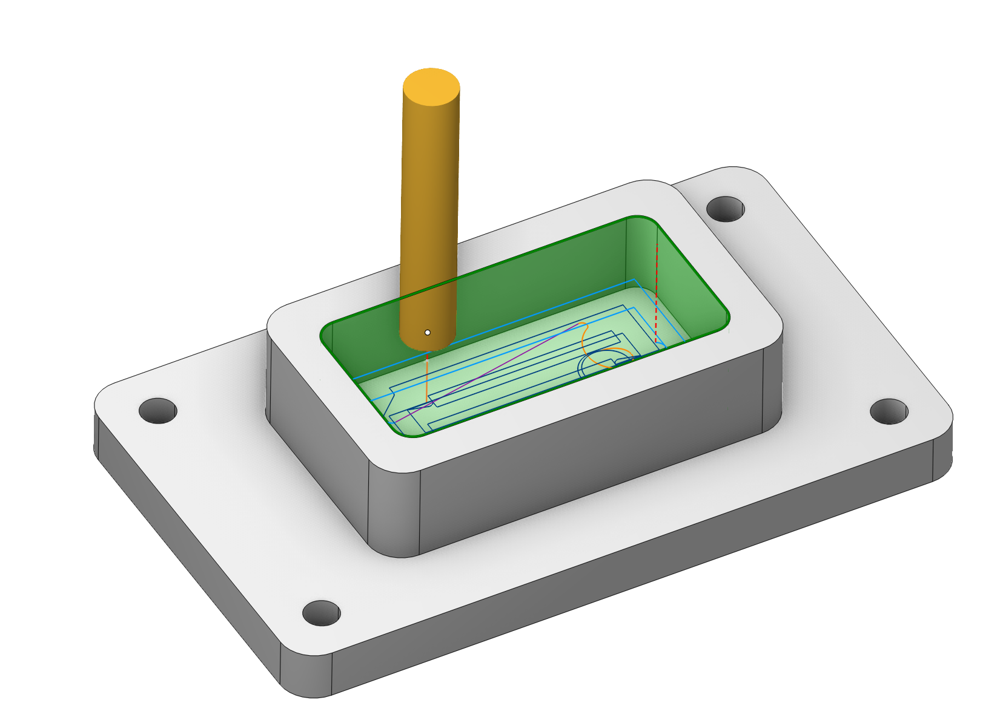
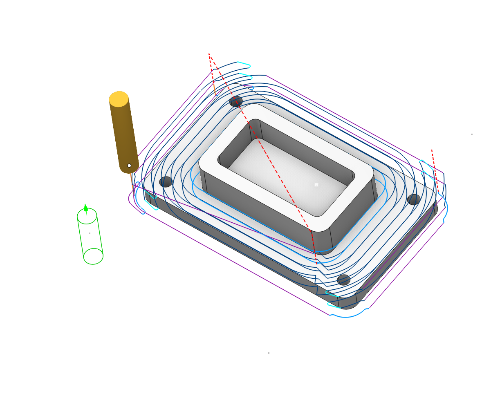
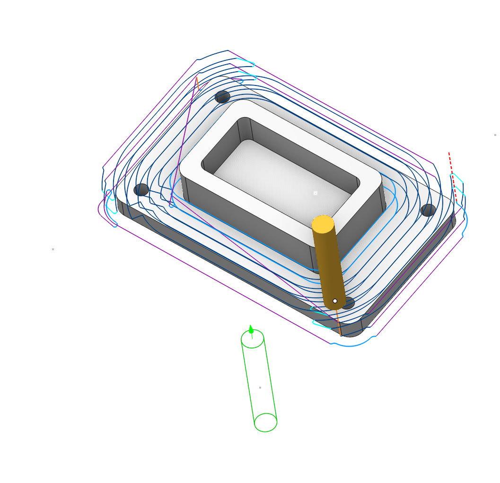

# Holes (Drill points)

 

## Application Area:

In the <strong>Roughing waterline</strong> ([Details](736.md)) and <strong>Pocketing</strong> ([Details](256.md)) operations, if it is impossible to approach the area being machined from outside, then the approach can be performed through a drill point with appropriate parameters. All drill points for a machining process are registered in a unified list. This list contains data on the point coordinates, hole depth and tool diameter. The user can add and remove points in the list.

## The method of defining the hole:

<strong>Center.</strong> Create hole by center point.

<strong>Create.</strong> Create hole by coordinates input. [Details](706.md)

<strong>Recognize.</strong> Automatically recognize holes in the part. [Details](406.md)

<strong>Pattern.</strong> Create holes array by pattern. [Details](407.md)

<strong>Properties.</strong> Displays the properties of an element. You can also call this menu by double clicking on an item in the list. [Details](706.md)

<strong>Sorting.</strong> Sorting using some parameters to sort holes list. [Details](10158.md)

<strong>Delete.</strong> Removes an item from the list.

When removing stock material from an isolated area (e.g., cavity, which cannot be approached from outside on the current level), the system first tries to select an appropriate point by coordinates, depth and diameter from the list. If there is no suitable point in the list, a new point will be automatically calculated and added to the current list.

<strong>For example:</strong>

The project uses one operation, <strong>Roughing waterline.</strong>

 

The project uses the following operations: <strong>Hole Machining</strong>, followed by <strong>Waterline Roughing</strong>.

 

<strong>Note</strong>: If accurately defined drill (plunge) points are required in the operation, then the parameters for the point(s) should be added to the list, before calculating the operation.

Points from the unified list can be defined as parameters for the hole machining operation.

If in the list of drill points, there are points that lie outside the workpiece borders, then in the waterline roughing and pocketing operations they will be perceived as the recommended tool lowering points outside the workpiece. If the area being machined can be approached from outside, then the system searches for the 'plunge' point in the list (coordinates, depth to which it is possible to sink, maximum distance to the area being machined, which corresponds to the diameter). If there are several such points, then the closest will be selected. If no suitable points are found, then the tool plunge will be performed at an arbitrary point.

 
