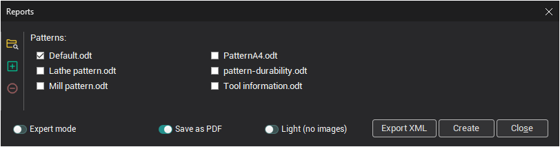
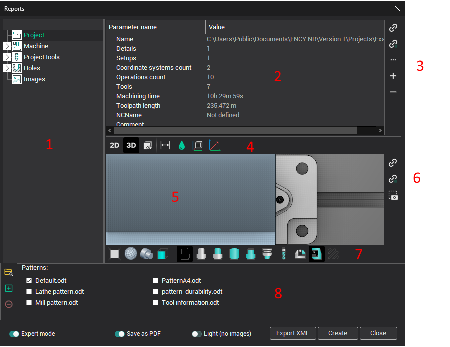
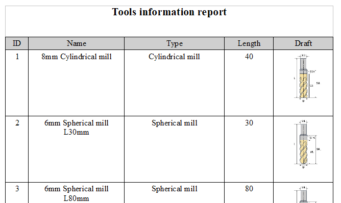
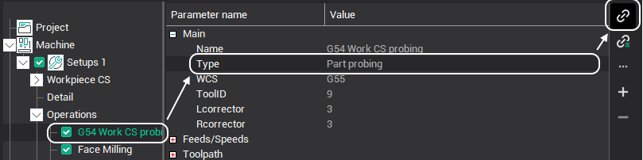
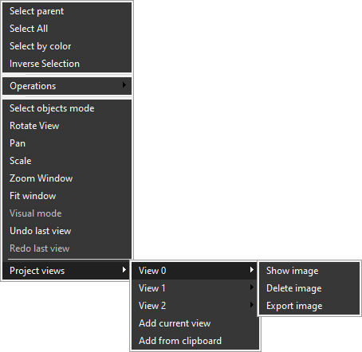

# Machining report

System is contain build in the machining report feature. The result machine report can be edited by the any text editor supported.odt format. The result report document can be saved in the <strong>ODT</strong> or <strong>PDF</strong> format (PDF need the internet connection). The application to open the result machining report is defined in the setup window.

Press the  button from the Machining bookmark to open the **Machining report** generation window.

As default the biggest part or the machining report window is occupied by list of patterns from the default folder. It is possible to select several patterns and generate reports by the one click.

At the right part of windows is placed the control buttons for add/remove additional patterns to list and change default pattern folder.

<strong>Save as PDF</strong> - Change output report format to PDF (Internet connection neccessary);

<strong>Expert mode</strong> - Expand window to the full mode used for report patterns creation/edit or tune some report params.

The full machining report window contain the next elements:

1 - Tree with the information from the project that can be used for reports;

2 - Selected item parameters list. This panel show parameters for the selected item which can be used for output in the report. (Used for pattern creation);

3 - The control buttons for a report pattern creation/modify;

-  - Make command to insert to the pattern simple parameter;

-  - Make command to insert to the pattern parameter to output as array;

-  - menu with additional command;

-  - add custom parameter;

-  - remove custom parameter;

4 - Control buttons for tune the output images for the report.

System automatically chooses the view and creates the dimensions. The dimensions can be shown in the top, bottom, left, right, front and back views only. Three distances to the origin and three overall dimensions are shown.

5 - The main graphic window showing the image for the selected item in the tree;

6 - The control buttons for report pattern creation/modify;

7 - Panel defines the drafts options. The draft can contain the workpiece, source model, tool path, origin, axes. These objects appear if press the corresponding buttons in panel;

8 - Pattern list.

Select patterns from the list and click  to create the machining reports. The application to open the result document is defined in the setup window (for ODT format).

<strong>Note</strong>: <em>If document will be used later it must be saved manually.</em>

Example of result document show below:

## Machining report creation/modifing.

Reports can be created using a variety of templates, offering flexibility in formatting and content.

Formation of the template is performed directly in editor supporting the ODT format.

Setting variables for substitution is done only in the notes object.

To insert a variable, specify the full path to it in the structure of the stcx file. You need to use for it the control buttons (part 3 and part 6 on the full window image).

For example, to display the values of an operation type in a report, create a note in the template (Ctrl + Shift + C) and make next action in the report window:

As a result of the command, the value "Roughing waterline" will be displayed in the report.

Similarly, any other values are output.

The reporting system allows you to add custom variables to reports using this syntax.

<strong>VAR</strong> (**Variable Name**, **Title**, **Default Value**).

Example:

<em>VAR (Detail, Detail, Case)</em>

When you select a template, a list of available variables is displayed in the RTK window.

A variable can be described in any part of the template. The format of the variable call:

${Variable name}

Example:

<em>$ {Detail}</em>

<em>All commands and variables should be found only in the notes objects.</em>

Separate commands have also been added to work with images.

<strong>Using example pictures</strong>

In this case, an arbitrary image whose properties and format can be fine-tuned is inserted into the document. When substituting, the image source is replaced, previously configured properties remain unchanged.

The command for displaying the image is set (using OpenOffice as an example) in the <strong>Name</strong> field on the <strong>Settings</strong> tab.

You can view images added to the project by right-clicking in the graphic window and choosing <strong>Project Views</strong> from the menu.

<strong>Add current view</strong> - Forms the image according to the current view and adds it to the list of project images

<strong>Add from clipboard</strong> - pastes the image from the clipboard and adds it to the list of project images.

Already added images can be viewed and deleted.

When deleting images, index shift does not occur.

For a better understanding of the principles of working with this type of template, it's recommended to review the provided examples within the software distribution and explore the included lessons on creating machining reports.
