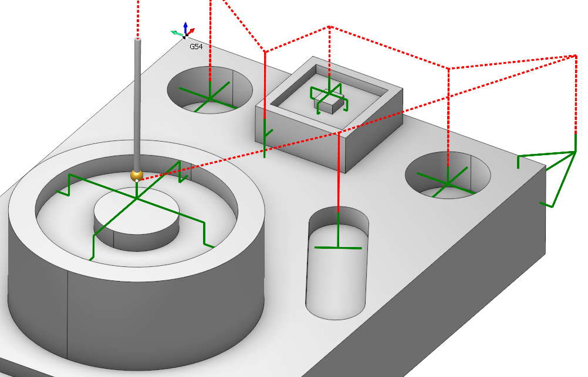
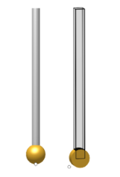

# Probing



Added a new group of operations - Probing. Measuring of parts and tools using special measuring equipment and canned cycles.

Measuring cycles can be used on lathe machines, milling machines and robots. Measuring cycles allow you to determine the integrity of the tool, dimensions of parts, angles and machining elements of part. Due to this, you can get more correct machining and avoid errors.

Usually you need special devices for measuring, such as probes, CMM (coordinate measuring machine).

The main purpose of these cycles are listed below:

- control of the dimensions of critical surfaces of parts with output to the report;
- measurement of a part to compensate for inaccuracies in the location of the part and the geometric dimensions of real parts;
- measurement to detect inaccuracies in tool sizes;
- tool breakage control.

The system has special operations for creating a toolpath based on measuring cycles:

- Mill part probing;
- Mill tool probing;
- Turn part probing;
- Turn tool probing.

```
These operations are practically the same. It only overrides the default values for some parameters depending on the purpose of the operation (for example, a tool).
```

New group of Probing tools added: one tool for the axial case (tooling point at the axis) another for the turn case (tooling points can be at side).


