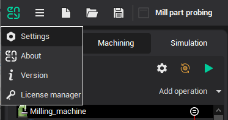
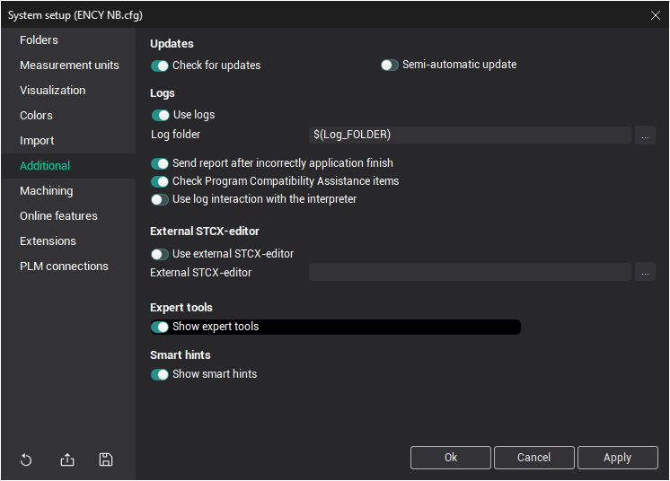
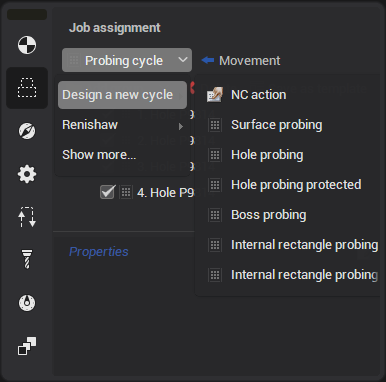
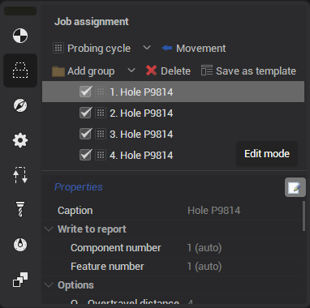
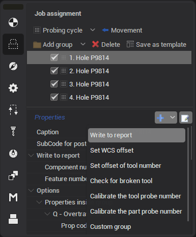
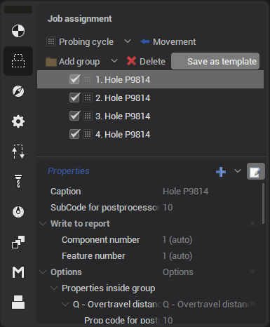
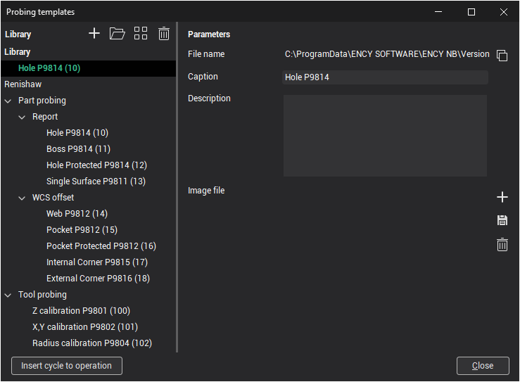

# Creating own probing cycles (templates)

You can create your own probing cycles with individual properties for future use. New probing cycles may be united in [library](1412.md) which is a separate file with the **scpbl** extension. This library can be shared with other users.

At first you need to activate experts rules. To do this, you need to open **Settings**. Then switch **Additional** tab and in the options that appear, enable **Show expert tools** and click on **Ok**. After that empty cycles will be available.

You can add one of empty cycles. Click **Probing cycles** in **Job assignment** tab of selected cycle. You find list of available cycles in **Design a new cycle** sub menu. There are 15 cycles and 1 additional element **NC action**. More information about this cycles is [here](1414.md).

A fter adding the required cycle it is not necessary to set its geometric parameters, since these parameters will need to be set when [using this cycle](1415.md) in the future. The main thing is to specify its properties that will be stored in the created template based on this cycle.

To add properties click on the **Edit** button with the pencil icon. After that the **SubCode for postprocessor** field and **Add custom property** button with the plus icon will be appeared. The **SubCode for postprocessor** field is t he unique cycle code. Used in the postprocessor to uniquely identify the cycle and parse its parameters. See also about it in postprocessor documentation "Probing cycle **WProbing**".

Click on **Add custom property** to add property from dropdown list. There are 8 properties with own parameters in list:

- **Write to report** - entering measured values in a report line. There are two parameters: **Component number** and **Feature number**. These parameters are auto-incrementing but you can also enter values manually;
- **Set WCS offset** - set workpiece CS to zero. It can be set in different ways (globally shift all CS, shift one of G54-G59, shift via parameters or via local CS). You can choose one of four options: **Global (all G54-G59)**, **One WCS (one of G54-G59 )**, **Parametrical offset (G10 L2 P1 XYZ)**, **Local CS offset (G52 XYZ)**. The **CS number** parameter available for **One WCS (one of G54-G59 )** and **Parametrical offset (G10 L2 P1 XYZ)**. Here you can specify the required CS;
- **Set offset of tool number** - set tool zero. You need the number of the tool and corrector in which to write the offsets;
- **Check for broken tool** - check the deviation of the tool dimensions from the reference ones and generate an error if it is greater than the limits. You also need the number of the tool and corrector where to get the dimensions for comparison;
- **Calibrate the tool probe number** - calibrate the tool probe. You need the number of the probe and its corrector;
- **Calibrate the part probe number** - c alibrate the part probe. You need the number of the probe and its corrector;
- **Custom group** - creates an element to group custom properties;
- **Custom property** - custom property to add an additional parameter. You can set: **Prop code for postprocessor**, **Property type** (double, integer, Boolean. string) and **Value**.

Access codes for parameters in CLData are described in postprocessor documentation "Probing cycle **WProbing** - Additional parameters".

А fter you have prepared the cycle template, you need to add it to the library. Click on **Save as template**.

The **Probing templates** window will open. A new template will be added to this window. If custom libraries were created earlier, then the template will be located in this library, otherwise a new library will be created. Changes in this window are saved when the window is closed. More information about working with The **Probing templates** window [here](1412.md).

