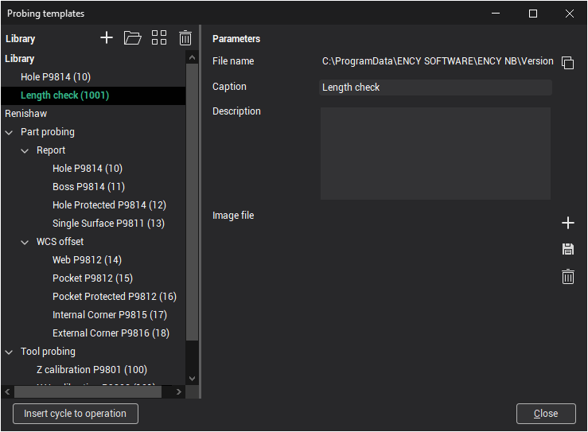
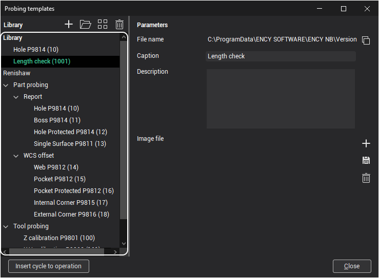
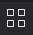
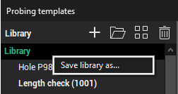
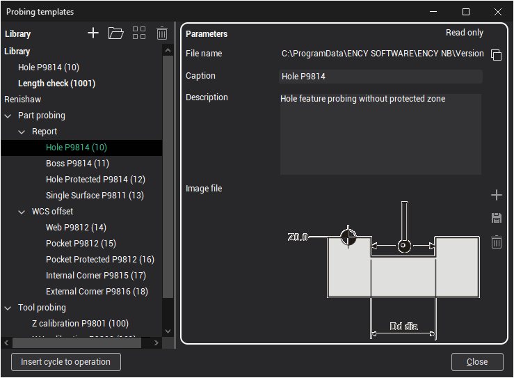
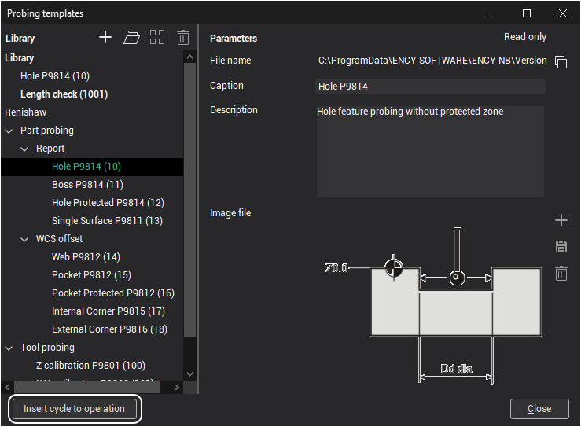

# Probing templates window

T he window displays libraries with [cycles ready for calculation](1411.md). Here you can add a description to the cycles, specify the display name of the cycle in the window, distribute them into groups and add them to the required library. Each library is saved locally and stored by default in the default folder of libraries ( $(Libraries_FOLDER) ) in subfolder " ProbingCycles ".

## Library tree

On the left part of the window there is a tree with a list of libraries and cycle templates. A ll previously created libraries and libraries from the **Examples** and **Suppliers** folders are displayed here. if the **Suppliers** folder does not exist, then you need to create it in the following path: default folder of libraries ( $(Libraries_FOLDER) ) in subfolder " ProbingCycles ".

Libraries are sorted as follows: first, created user libraries are located, followed by libraries from **Examples** and **Suppliers** folders.

Elements are moved using drag'n'drop. You can move like this:

- Libraries are moved between other libraries on the same level;
- Groups are moved between other groups at the same level, from one library to another, and also from one group to another;
- Cycle templates are moved between other groups at the same level, from one library to another, and also from one group to another;
- It is forbidden to move items to libraries from **Examples** and **Suppliers** folders.

The window can also display the [**SubCode for postprocessor**](1411.md) of each cycle template, which will be displayed in brackets after the name. To do this, you must enable the **Show expert tools** mode. How to do this is described [here](1411.md).

When you select an element in the tree, its parameters will be displayed in the right part of the window, which can be edited.

## Control elements

The tree element control panel is in the upper left part of the window. There are 4 controls on the panel:

1.  **Open library** is button to add existing local libraries. A fter clicking on the button, a dialog window will open with the choice of the location of existing library;
2.  **Create new library** is button to create new library on computer and add new library to window. After clicking on the button, a dialog window will open with the choice of the location of the new library;
3.  **New group** is button to create group for sorting and combining cycle templates. A group can only be created inside a library or inside another group;
4.  **Remove** is button to remove selected element from the window.

You can also make a copy of the library and save it to another location on your computer. To do this, select the required library and click the right mouse button. In the context menu that appears, click **Save library as**. A fter clicking on the button, a dialog box will open with the choice of the location of the copy library. After that the copy will be saved on the computer and added to the window.

Note: **New group** is disabled for libraries from **Examples** and **Suppliers** folders.

## Parameters panel

Parameters panel is on the right side of the window.

There is two general parameters for all elements:

- **File name** - location path of the library on the computer and file name of library;
- **Caption** - name of element in probing templates window.

Other parameters are not available for library and group elements including image control buttons.

Two additional parameters are available for cycle template elements:

- **Description** - the purpose of a certain cycle is indicated, as well as any other additional information;
- **Image file** - the image that displays current cycle.

Note: editing elements from libraries located in **Examples** and **Suppliers** folders is prohibited. This is indicated by the **Read only** inscription located in the upper right part of the window.

## Saving and using cycles

All the changes made (creating libraries, changing the position of elements, editing parameters, etc.) save when the window is closed.

In order to [use a cycle template](1415.md), you need to select the required template and click on the button **Insert cycle to operation**. After that the selected template will be inserted into the **Job assignment** of the probing operation.

