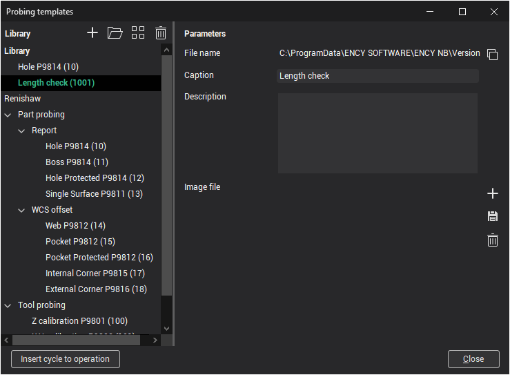
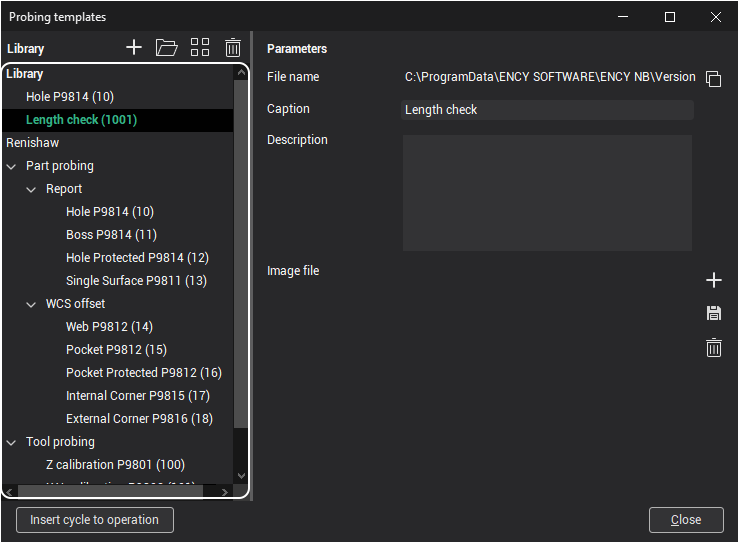
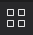
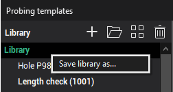
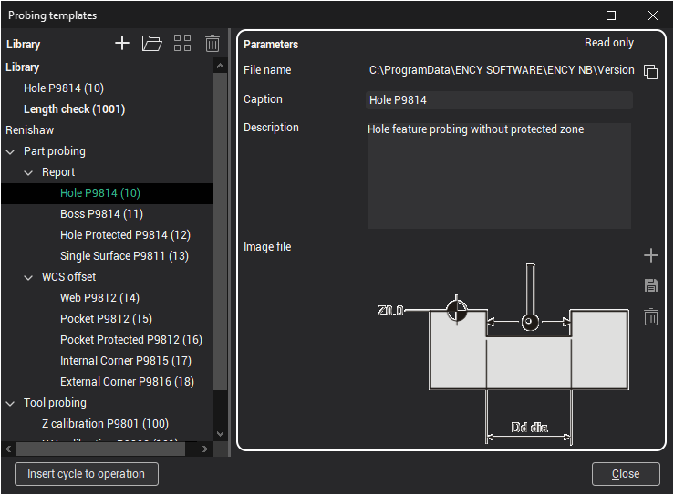
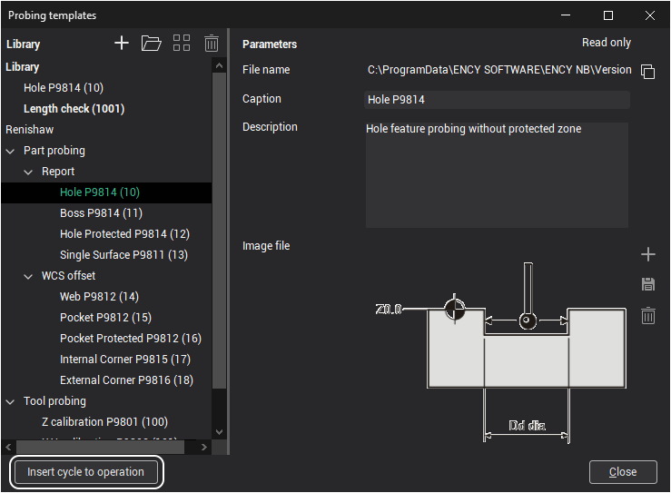

# プロービングテンプレートウィンドウ

このウィンドウには、[計算にすぐ使用できるサイクル](1411.md)のライブラリが表示されます。ここでは、各サイクルに説明を追加したり、ウィンドウ上での表示名を指定したり、グループ分けを行ったり、必要なライブラリに追加したりすることができます。各ライブラリはローカルに保存され、デフォルトではライブラリの既定フォルダ ( $(Libraries_FOLDER) ) 内の "ProbingCycles"サブフォルダに格納されます。

## ライブラリ ツリー

ウィンドウの左側には、ライブラリおよびサイクルテンプレートの一覧がツリー形式で表示されます。ここには、これまでに作成したすべてのライブラリと、<strong>Examples</strong>または<strong>Suppliers</strong>フォルダ内のライブラリが表示されます。<strong>Suppliers</strong>フォルダが存在しない場合は、ライブラリの既定フォルダ( $(Libraries_FOLDER) ) 内の "ProbingCycles"サブフォルダに作成する必要があります。

ライブラリは次の順序で並べられます。最初にユーザーが作成したライブラリが表示され、その後に<strong>Examples</strong>および<strong>Suppliers</strong>フォルダ内のライブラリが続いて表示されます。

要素の移動には、ドラッグ＆ドロップを使用します。移動方法は次のとおりです。

- ライブラリは、同じ階層内の他のライブラリ間で移動できます。
- グループは、同じ階層内の他のグループ間、別のライブラリ間、および別のグループ間で移動できます。
- サイクルテンプレートは、同じ階層内の他のグループ間、別のライブラリ間、および別のグループ間で移動できます。
- <strong>Examples</strong>および<strong>Suppliers</strong>フォルダ内のライブラリには、要素を移動することはできません。

また、このウィンドウでは、各サイクルテンプレートの[<strong>ポストプロセッサのSubCode</strong>](1411.md)を表示することもできます。このコードは、名前の後ろに括弧で囲まれて表示されます。表示するには、<strong>エキスパートツールを表示</strong> モードを有効にする必要があります。有効化の方法については、該当する説明を参照してください。 [詳細](1411.md)

ツリー内の要素を選択すると、そのパラメータがウィンドウ右側に表示され、編集することができます。

## コントロール要素

ツリー要素のコントロールパネルは、ウィンドウ左上にあります。このパネルには4つの操作要素があります。

1.  <strong>ライブラリを開く</strong> 既存のローカルライブラリを追加するためのボタンです。ボタンをクリックすると、ダイアログウィンドウが開き、既存のライブラリの保存場所を選択できます。
2.  <strong>新しいライブラリを作成</strong> コンピュータ上に新しいライブラリを作成し、ウィンドウに追加するためのボタンです。ボタンをクリックすると、ダイアログウィンドウが開き、新しいライブラリの保存場所を選択できます。
3.  <strong>新規グループ</strong> サイクルテンプレートを分類・統合するためのグループを作成するボタンです。グループは、ライブラリ内または他のグループ内にのみ作成できます。
4.  <strong>削除</strong> 選択した要素をウィンドウから削除するためのボタンです。

ライブラリのコピーを作成し、コンピュータ上の別の場所に保存することもできます。これを行うには、目的のライブラリを選択し、右クリックします。表示されたコンテキストメニューから<strong>ライブラリに名前をつけて保存</strong>をクリックします。クリックすると、コピーしたライブラリの保存場所を選択できます。その後、コピーがコンピュータに保存され、ウィンドウにも追加されます。

注記: <strong>Examples</strong>および<strong>Suppliers</strong>フォルダ内のライブラリでは、<strong>新規グループ</strong>機能は無効になります。

## パラメータパネル

パラメータパネルは、ウィンドウの右側にあります。

すべての要素に共通するパラメータが2つあります。

- <strong>ファイル名</strong> - コンピュータ上のライブラリの保存先パスとファイル名を指定します。
- <strong>キャプション</strong> - プロービングテンプレートウィンドウに表示する要素の名前を指定します。

ライブラリおよびグループの要素では、画像操作ボタンを含め、これら以外のパラメータは使用できません。

サイクルテンプレート要素では、さらに次の2つのパラメータを使用できます。

- <strong>説明</strong> - 特定のサイクルの用途や、その他の追加情報を示します。
- <strong>画像ファイル</strong> - 現在のサイクルを表示する画像です。

注記:<strong>Examples</strong>および<strong>Suppliers</strong> フォルダ内のライブラリに含まれる要素は編集できません。これは、ウィンドウ右上に表示される<strong>読み取り専用</strong>の表記で示されます。

## サイクルの保存と使用

ライブラリの作成、要素の配置変更、パラメータの編集など、行ったすべての変更は、ウィンドウを閉じる際に保存されます。

[サイクルテンプレートを使用](1415.md)するには、目的のテンプレートを選択し、 <strong>オペレーションにサイクルを組み込む</strong>ボタンをクリックします。すると、選択したテンプレートが、プロービングオペレーションの<strong>ジョブ割り当て</strong> に挿入されます。

