# Types of measuring cycles

```
There are several probing cycles with geometry:
```

- Surface probing;
- Hole probing;
- Hole protected probing;
- Boss probing;
- Internal rectangle probing;
- Internal rectangle probing protected;
- External rectangle probing;
- Web probing;
- Web probing (three points);
- Groove probing;
- Groove probing protected;
- Double wall internal corner probing;
- Double wall external corner probing;
- Triple wall internal corner probing;
- Triple wall external corner probing.

```
There are also additional elements of working with cycles:
```

- NC action;
- Movement;
- Elements to group: Component, Feature, Group.

## Cycles with geometry

All cycles with geometry have some common parameters:

- **Orientation** - setting start orientation of tool in cycle. After adding cycle the orientation is set by **Auto**. You can switch on **Manual** and set orientation manually;
- **Feed distance** - distance of approach to start position of cycle and return from last position of cycle;
- **Stock** - additional shift of the target point along the target vector;
- **Transition type** - setting an individual transition for current cycle. Transition values are described [here](1415.md);
- **Compensate dimensions** - toolpath shift with tool compensation. This parameter is used in cycles where tool compensation is possible

You can set name of selected cycle in **Caption** field f or every cycles.

Notes: there is an additional **Cycle variant** parameter for turn probing operations. **Cycle variant** has two values: **Spindle on** and **Spindle off**. If **Spindle on** is selected then the spindle rotate before each approach to the touch point. Notes: there is no **Cycle variant** in surface probing. Hole, hole protected and boss probing has own **Cycle variant**.

### Surface probing

Probing cycle using one surface surface.

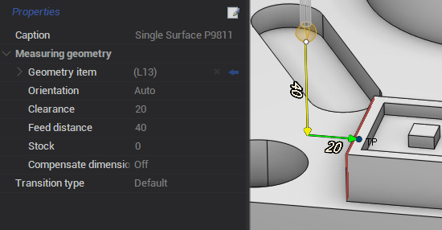

Parameters of surface probing:

- **Geometry item** - measured surface. You can edit position and vector of the point manually. You need to expand **Geometry item** and set values in the corresponding field s: **Target point**, **Target vector**;
- **Clearance** - distance between approach point and touch point.

A ccess codes for parameters in CLData are described in postprocessor documentation "Probing cycle **WProbing** - Surface probing parameters".

### Hole probing

Probing cycle designed for measuring bore.

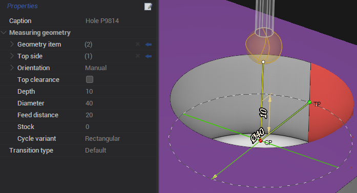

Parameters of hole probing:

- **Geometry item** - measured surface of hole. Y ou can edit position, vector and center of the point manually. Y ou need to expand **Geometry item** and set values in the corresponding fields: **Target point**, **Target vector**, **Center point**;
- **Top side** - determination of the top level from which we count the distance to the starting point of the cycle;
- **Top clearance** - i f the parameter is checked then you set the distance from **Top side** to the start point of the cycle. If the parameter is unchecked then the start point is located at the **Center point**;
- **Depth** - distance from **Top side** to **Target point** in the direction of the hole;
- **Diameter** - measuring hole diameter;
- **Cycle variant** - the parameter has two values: **Rectangular** and **Angular**.
  - **Rectangular** mode creates 4 touch points with an angle of 90 degrees. Bypassing the touch points is implemented as follows: the first touch point is specified in the **Target point**, the second touch point is the opposite from the first. The third touch point is a point rotated 90 degrees from the first. The fourth point is the opposite of the third point. Notes: The spindle turns before approaching the third point in turn probing operations;
  - **Angular** has own parameters. **Start angle** allow to rotate **Target point** to specified angle. **Angular step** is distance between touch points. **Step count** allows you to set count of touch points. Bypassing the touch points is implemented as follows: the first touch point is specified in the **Target point**, then the points are bypassed along the specified **Angular step**. Notes: T he spindle turns before approaching each touch point.

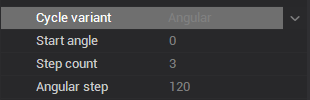

A ccess codes for parameters in CLData are described in postprocessor documentation "Probing cycle **WProbing** - Hole probing parameters".

### Hole probing protected

Probing cycle designed to measure bore inside which there is an obstacle.

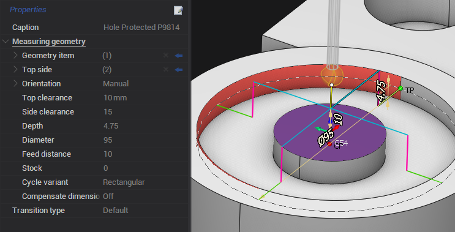

Parameters of hole probing protected:

- **Geometry item** - measured surface of hole with obstacle. Y ou can edit position, vector and center of the point manually. Y ou need to expand **Geometry item** and set values in the corresponding fields: **Target point**, **Target vector**, **Center point**;
- **Top side** - determination of the top level from which we count the distance to the starting point of the cycle;
- **Top clearance** - distance from **Top side** to the start point of the cycle;
- **Side clearance** - distance between approach point and touch point;
- **Depth** - distance from **Top side** to **Target point** in the direction of the hole;
- **Diameter** - measuring hole diameter;
- **Cycle variant** - exactly the same as cycle variant in hole probing.

A ccess codes for parameters in CLData are described in postprocessor documentation "Probing cycle **WProbing** - Hole probing protected parameters".

### Boss probing

Probing cycle for measuring cylindrical bosses.

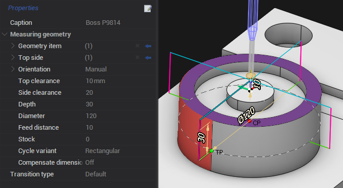

Parameters of boss probing are the same as in hole probing protected. T he only difference is that **Geometry item** is the boss, external surface.

A ccess codes for parameters in CLData are described in postprocessor documentation "Probing cycle **WProbing** - Boss probing parameters".

### Internal rectangle probing

Probing cycle for measuring grooves and other recesses on four sides.

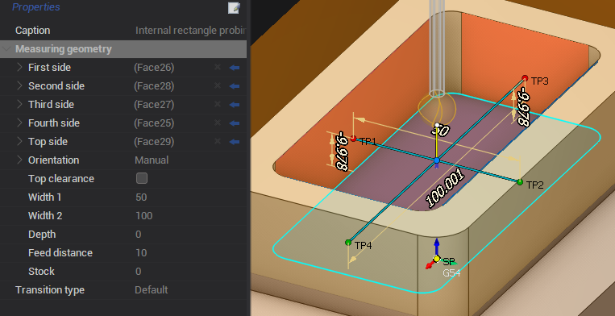

Parameters of internal rectangle probing:

- **First side** - the first touch point. Y ou can edit position and vector of the point manually. Y ou need to expand **First side** and set values in the corresponding fields: **Target point 1**, **Target vector 1**;
- **Second side** - the second touch point opposite the first point. Y ou can edit position and vector of the point manually. Y ou need to expand **Second** **side** and set values in the corresponding fields: **Target point 2**, **Target vector 2**;
- **Third side** - the third touch point. Y ou can edit position and vector of the point manually. Y ou need to expand **Third** **side** and set values in the corresponding fields: **Target point 1**, **Target vector 1**;
- **Fourth side** - the fourth touch point opposite the third point. Y ou can edit position and vector of the point manually. Y ou need to expand **Fourth** **side** and set values in the corresponding fields: **Target point 2**, **Target vector 2**;
- **Top side** - determination of the top level from which we count the distance to the starting point of the cycle;
- **Top clearance** - i f the parameter is checked then you set the distance from **Top side** to the start point of the cycle. If the parameter is unchecked then the start point is located at the intersection of four points;
- **Width 1** - distance between **First side** and **Second side**;
- **Width 2** - distance between **Third** **side** and **Fourth** **side**;
- **Depth** - distance from **Top side** to points position.

A ccess codes for parameters in CLData are described in postprocessor documentation "Probing cycle **WProbing** - Internal rectangle probing parameters".

### Internal rectangle probing protected

Probing cycle for measuring grooves and other recesses on four sides inside which there is an obstacle.

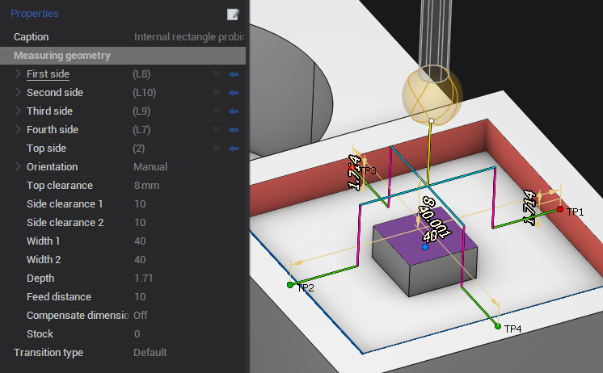

Parameters of this probing are the same as in internal rectangle probing. But it has two own parameters to avoid obstacles ( **Side clearance 1**, **Side clearance 2** ) and one parameter is changed ( **Top clearance** ):

- **Side clearance 1** - distance between approach point and **First side** and distance between approach point and **Second side**;
- **Side clearance 2** - distance between approach point and **Third** **side** and distance between approach point and **Fourth** **side**;
- **Top clearance** - distance from **Top side** to the start point of the cycle.

A ccess codes for parameters in CLData are described in postprocessor documentation "Probing cycle **WProbing** - Internal rectangle probing protected parameters".

### External rectangle probing

Probing cycle for measuring projections or dimensions on four sides.

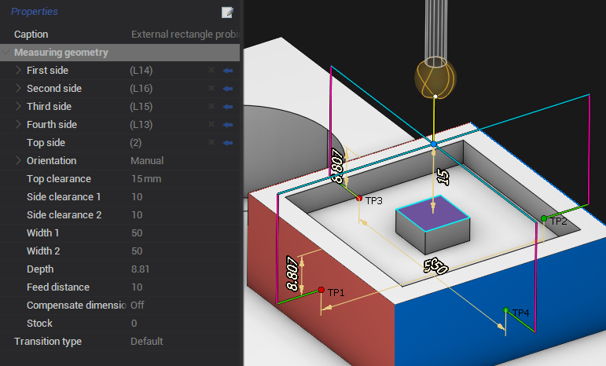

Parameters of extarnal rectangle probing are the same as in internal rectangle probing protected. T he only difference is that touch sides are external surfaces.

A ccess codes for parameters in CLData are described in postprocessor documentation "Probing cycle **WProbing** - External rectangle probing parameters".

### Web probing

Probing cycle for measuring projections or dimensions on two sides.

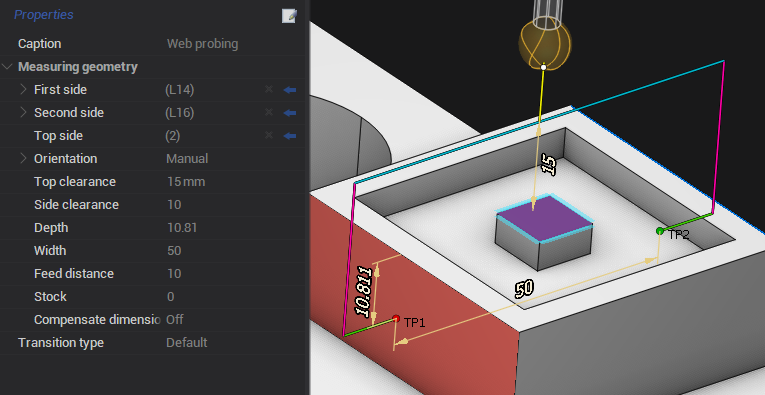

Parameters of web probing:

- **First side** - the first touch point. Y ou can edit position and vector of the point manually. Y ou need to expand **First side** and set values in the corresponding fields: **Target point 1**, **Target vector 1**;
- **Second side** - the second touch point opposite the first point. Y ou can edit position and vector of the point manually. Y ou need to expand **Second** **side** and set values in the corresponding fields: **Target point 2**, **Target vector 2**;
- **Top side** - determination of the top level from which we count the distance to the starting point of the cycle;
- **Top clearance** - distance from **Top side** to the start point of the cycle;
- **Side clearance** - distance between approach point and **First side** and distance between approach point and **Second side**;
- **Depth** - distance from **Top side** to points position;
- **Width** - distance between **First side** and **Second side**.

A ccess codes for parameters in CLData are described in postprocessor documentation "Probing cycle **WProbing** - Web probing parameters".

### Web probing (three points)

Probing cycle for measuring projections or dimensions on three sides. T he third side is between the first and second.

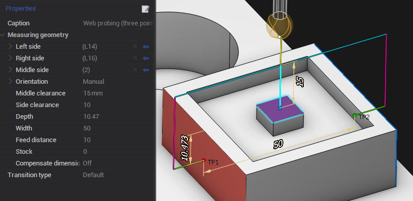

Parameters of web probing (three points):

- **Left side** - the first touch point. Y ou can edit position and vector of the point manually. Y ou need to expand **Left** **side** and set values in the corresponding fields: **Target point 1**, **Target vector 1**;
- **Right side** - the second touch point opposite the first point. Y ou can edit position and vector of the point manually. Y ou need to expand **Right** **side** and set values in the corresponding fields: **Target point 2**, **Target vector 2**;
- **Middle side** - the third touch point between the first point and the second point. Y ou can edit position and vector of the point manually. Y ou need to expand **Middle** **side** and set values in the corresponding fields: **Target point 3**, **Target vector 3**;
- **Middle clearance** - distance between approach point and **Middle** **side**;
- **Side clearance** - distance between approach point and **Left** **side** and distance between approach point and **Right** **side**;
- **Depth** - distance from **Middle** **side** to the first and the second touch points;
- **Width** - distance between **Left** **side** and **Right** **side**.

A ccess codes for parameters in CLData are described in postprocessor documentation "Probing cycle **WProbing** - Web probing (three points) parameters".

### Groove probing

Probing cycle for measuring grooves and other recesses on two sides.

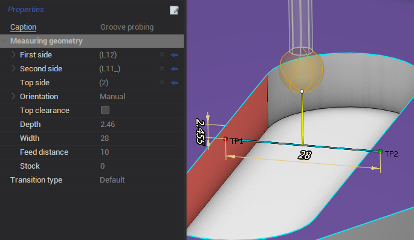

Parameters of groove probing:

- **First side** - the first touch point. Y ou can edit position and vector of the point manually. Y ou need to expand **First side** and set values in the corresponding fields: **Target point 1**, **Target vector 1**;
- **Second side** - the second touch point opposite the first point. Y ou can edit position and vector of the point manually. Y ou need to expand **Second** **side** and set values in the corresponding fields: **Target point 2**, **Target vector 2**;
- **Top side** - determination of the top level from which we count the distance to the starting point of the cycle;
- **Top clearance** - i f the parameter is checked then you set the distance from **Top side** to the start point of the cycle. If the parameter is unchecked then the start point is located at the intersection of four points;
- **Depth** - distance from **Top side** to points position;
- **Width** - distance between **First side** and **Second side**.

A ccess codes for parameters in CLData are described in postprocessor documentation "Probing cycle **WProbing** - Groove probing parameters".

### Groove probing protected

Probing cycle for measuring grooves and other recesses on two sides inside which there is an obstacle.

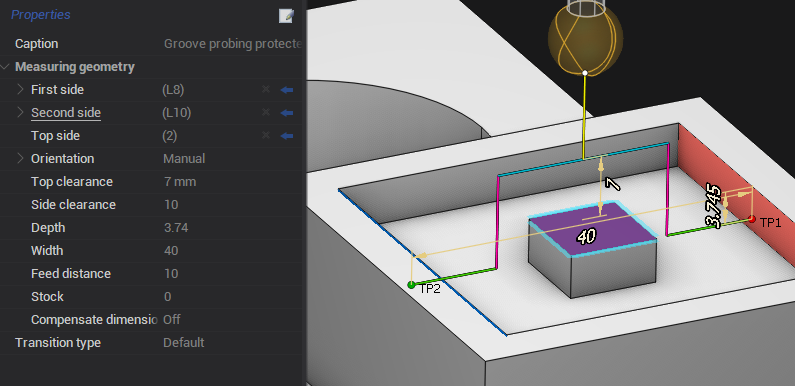

Parameters of this probing are the same as in groove probing. But it has one own parameters to avoid obstacles ( **Side clearance** ) and one parameter is changed ( **Top clearance** ):

- **Side clearance** - distance between approach point and **First side** and distance between approach point and **Second side**;
- **Top clearance** - distance from **Top side** to the start point of the cycle.

A ccess codes for parameters in CLData are described in postprocessor documentation "Probing cycle **WProbing** - Groove probing protected parameters".

### Double wall internal corner probing

Probing cycle for measuring the internal angle between two surfaces.

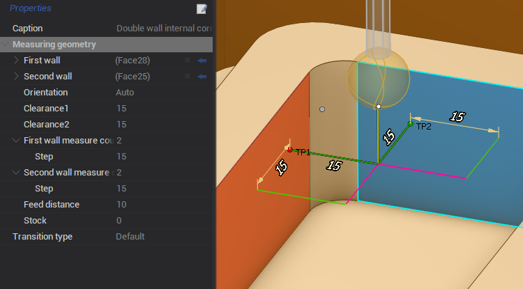

Parameters of double wall internal corner:

- **First wall** - the touch point of the first wall. Y ou can edit position and vector of the point manually. Y ou need to expand **First wall** and set values in the corresponding fields: **Target point**, **Target vector**;
- **Second wall** - the touch point of the second wall. Y ou can edit position and vector of the point manually. Y ou need to expand **Second** **wall** and set values in the corresponding fields: **Target point**, **Target vector**;
- **Clearance1** - distance between approach point and **First wall**;
- **Clearance2** - distance between approach point and **Second** **wall**;
- **First wall measure count** - count of touch points on the first wall. If count is more than one then you can set **Step**. **Step** is distance between touch points on the first wall;
- **Second wall measure count** - count of touch points on the second wall. If count is more than one then you can set **Step**. **Step** is distance between touch points on the second wall.

A ccess codes for parameters in CLData are described in postprocessor documentation "Probing cycle **WProbing** - Double wall internal corner probing parameters".

### Double wall external corner probing

Probing cycle for measuring the external angle between two surfaces.

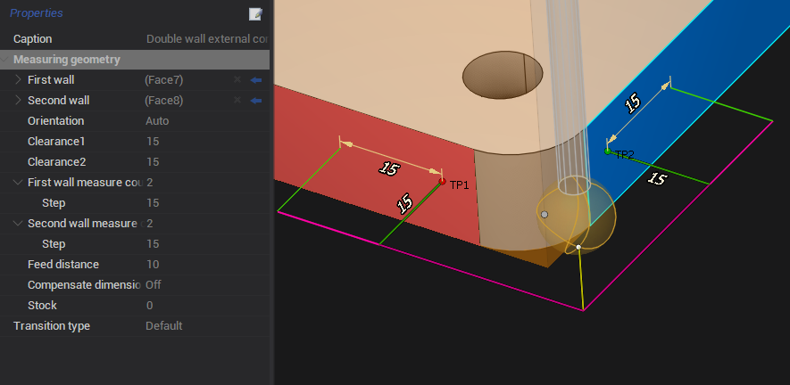

Parameters of this probing are the same as in double wall internal corner. T he only difference is that touch walls are external surfaces.

A ccess codes for parameters in CLData are described in postprocessor documentation "Probing cycle **WProbing** - Double wall external corner probing parameters".

### Triple wall internal corner probing

Probing cycle for measuring the internal angle between three surfaces.

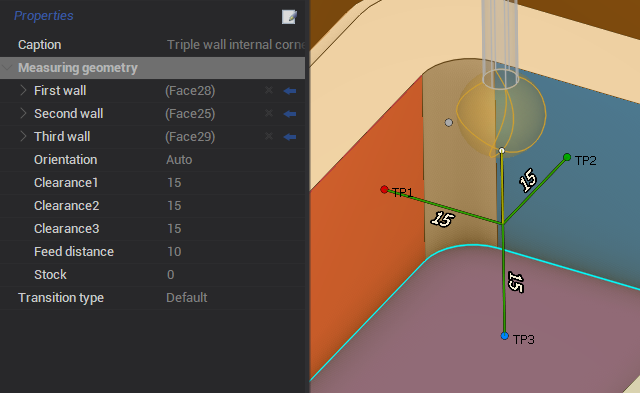

Parameters of triple wall internal corner:

- **First wall** - the touch point of the first wall. Y ou can edit position and vector of the point manually. Y ou need to expand **First wall** and set values in the corresponding fields: **Target point**, **Target vector**;
- **Second wall** - the touch point of the second wall. Y ou can edit position and vector of the point manually. Y ou need to expand **Second** **wall** and set values in the corresponding fields: **Target point**, **Target vector**;
- **Third wall** - the touch point of the third wall. Y ou can edit position and vector of the point manually. Y ou need to expand **Third** **wall** and set values in the corresponding fields: **Target point**, **Target vector**;
- **Clearance1** - distance between approach point and **First wall**;
- **Clearance2** - distance between approach point and **Second** **wall**;
- **Clearance3** - distance between approach point and **Third** **wall**.

A ccess codes for parameters in CLData are described in postprocessor documentation "Probing cycle **WProbing** - Triple wall internal corner probing parameters".

### Triple wall external corner probing

Probing cycle for measuring the external angle between three surfaces.

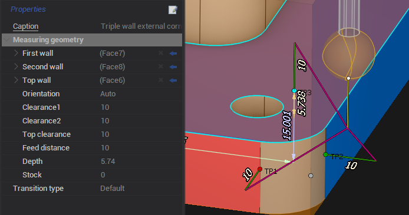

Parameters of triple wall external corner:

- **First wall** - the touch point of the first wall. Y ou can edit position and vector of the point manually. Y ou need to expand **First wall** and set values in the corresponding fields: **Target point**, **Target vector**;
- **Second wall** - the touch point of the second wall. Y ou can edit position and vector of the point manually. Y ou need to expand **Second** **wall** and set values in the corresponding fields: **Target point**, **Target vector**;
- **Top wall** - the touch point of the top wall. Y ou can edit position and vector of the point manually. Y ou need to expand **Top** **wall** and set values in the corresponding fields: **Target point**, **Target vector**;
- **Clearance1** - distance between approach point and **First wall**;
- **Clearance2** - distance between approach point and **Second** **wall**;
- **Top clearance** - distance between approach point and **Top** **wall**;
- **Depth** - distance from **Top wall** to the touch point of the first and the second wall.

A ccess codes for parameters in CLData are described in postprocessor documentation "Probing cycle **WProbing** - Triple wall external corner probing parameters".

## Additional elements

### NC action

The certain subroutine can be called after several successive measuring cycles. It performs additional actions or calculations based on the measurements just taken. These can be: calculation of average values, deviations, intersection points between several surfaces, recording these values in some rack variables.

It does not generate any movements. However, it can contain parameters that need to be either directly displayed in the NC using the Insert command or as a cycle with an array of numeric parameters. Through the mechanism of custom properties, you can add any parameters there. Based on these parameters in the postprocessor, it will be possible to form the necessary calls to subroutines and additional actions. Notes: In order to add custom properties, the **Show expert tools** mode must be enabled. **NC action** is located in **Probing cycle** - **Design a new cycle**.

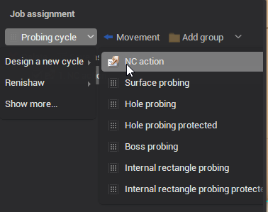

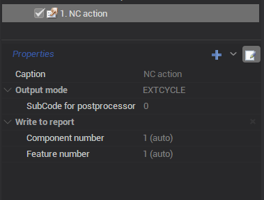

A ccess codes for parameters in CLData are described in postprocessor documentation "Probing cycle **WProbing** - Additional parameters".

### Movement

Element for additional movement, for example to avoid obstacles. It is necessary to set the **Target point** through which an additional movement will be created.

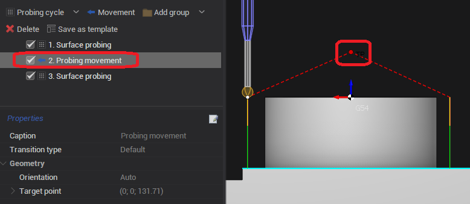

### Elements to group

Complex measuring cycles for the measurement of complex parts are usually performed not in isolation but in successive measurements connected with each other. For example, several measurements are performed and then the total result is calculated and written to the report under certain numbers which correspond to the hierarchy level of the measured element.

There are three types of group:

- **Group** - general grouping;
- **Component** - part to be measured;
- **Feature** - individual element or surface currently being measured.

The level below goes directly measuring cycles. In the properties of the groups, you can set the number manually but by default it is automatically incremented relative to the previous value within the group of the corresponding type. The type and number of the group determines its name.

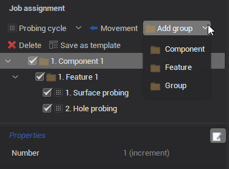
