# 測定サイクルの種類

```
形状を使用するプローブ（測定）サイクルには、以下のような種類があります。
```

- サーフェスプロービング
- 穴プロービング
- 穴プロービング保護
- ボスプロービング
- 内部長方形プロービング
- 内部長方形プロービングプロービング保護
- 外部長方形プロービング
- Webプロービング
- Webプロービング（3点）
- 溝プロービング
- 溝プロービング保護
- 二重壁内部コーナープロービング
- 二重壁の外部コーナープロービング
- 三重壁内部コーナープロービング
- 三重の壁の外部コーナープロービング

```
また、サイクルを操作するための追加要素も用意されています。
```

- NC動作
- 移動
- グループ化する要素：構成要素、フィーチャー、グループ

## 形状を使用するサイクル

形状を使用するすべてのサイクルには、次の共通パラメータがあります。

- `向き` - サイクル開始時の工具姿勢を設定します。サイクルを追加すると、工具姿勢は`自動`に設定されます。`手動` に切り替えると、手動で工具姿勢を設定できます。
- `送り距離`- サイクルの開始位置へのアプローチ、およびサイクルの最終位置からのリターンの距離を指定します。
- `ストック` - - ターゲットベクトルに沿ったターゲットポイントの追加オフセット量を指定します。
- `移行タイプ` - 現在のサイクルに対する個別の移行を設定します。移行値については、[こちら](1415.md)を参照してください。
- `寸法の補正`- 工具補正を使用してツールパスをシフトします。このパラメータは、工具補正が可能なサイクルで使用します。

`キャプション`-</strong> 各サイクルの`キャプション`</strong>フィールドでは、選択したサイクルの名前を設定できます。

注記: 旋盤プロービングオペレーションには、追加の`サイクルバリアント`パラメータがあります。

`サイクルバリアント`には、`主軸オン`と`主軸オフ`の2つの設定値があります。`主軸オン`を選択すると、各接触点へアプローチする前に主軸が回転します。

注記：サーフェスプロービングには、 `サイクルバリアント` はありません。また、穴プロービング、穴プロービング保護、およびボスプロービングには、それぞれ専用の`サイクルバリアント`があります。

### サーフェスプロービング

1つのサーフェスを使用するプロービングサイクルです。

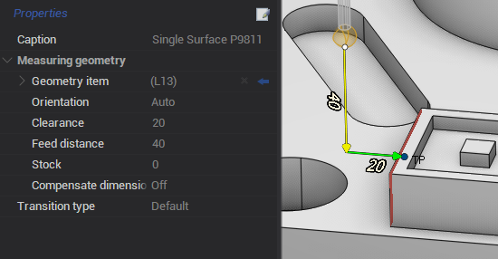

サーフェスプロービングのパラメータ：

- `図形アイテム`- 測定対象のサーフェスを指定します。点の位置とベクトルを手動で編集できます。 <strong>図形アイテム</strong>を展開し、対応するフィールド `ターゲットポイント`, `ターゲットベクトル` に値を設定します。
- `クリアランス`- アプローチ点と接触点の間の距離を指定します。

CLData内のパラメータに アクセスするためのコードについては、ポストプロセッサーのドキュメント "Probing cycle **WProbing** - Surface probing parameters" に記載されています。

### 穴プロービング

穴を測定するためのプロービングサイクルです。

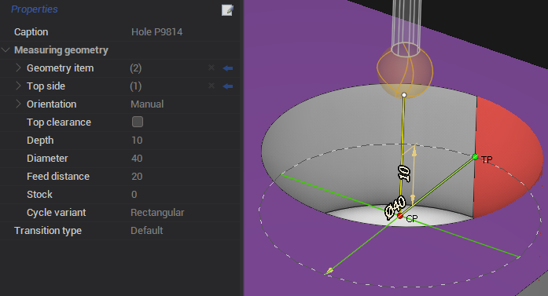

穴プロービングのパラメータ：

- `図形アイテム`- 測定対象となる穴のサーフェスを指定します。点の位置、 ベクトル、および中心は手動で編集できます。 <strong>図形アイテム</strong>を展開し、対応するフィールド `ターゲットポイント`, `ターゲットベクトル`, `中心点` に値を設定します。
- `上面`- サイクル開始点までの距離を測定する基準となる上部高さを指定します。
- `トップクリアランス` - このパラメータを有効にすると、 `上面` からサイクル開始点までの距離を設定します。 無効の場合、開始点は `中心点` に配置されます。
- `深さ` - 穴の方向に沿った、 `上面` から `ターゲットポイント` までの距離を指定します。
- `直径`- 測定対象の穴の直径を指定します。
- `サイクルバリアント` パラメータには、`長方形`と`角度`の2つの値があります。
  - `長方形` モードでは、90°間隔で 4 つの接触点を生成します。接触点の移動順序は次のとおりです。1つ目の接触点は `ターゲットポイント`で指定します。2つ目の接触点は、1つ目の接触点の反対側の点です。3つ目の接触点は、1つ目の接触点から90度回転した位置にある点です。4つ目の接触点は、3つ目の接触点の反対側の点です。 注意：旋盤用プロービングオペレーションでは、3 つ目の接触点にアプローチする前に主軸が回転します。
  - `角度` には独自のパラメーターがあります。 `開始角度`‐ `ターゲットポイント` を指定した角度だけ回転させます。 `角度ステップ`接触点間の距離を指定しますす。 `回数` 接触点の数を指定します。 接触点の経由は次のように実行されます。1つ目接触点は `ターゲットポイント` で指定します。その後、指定した `角度ステップ` に従って接触点を順番に移動します。 注意：各接触点にアプローチする前に、主軸が回転します。

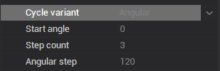

CLData 内のパラメータにアクセスするためのコードについては、ポストプロセッサードキュメント "Probing cycle **WProbing** - Hole probing parameters" に記載されています。

### 穴プロービング保護

内部に障害物が存在するボア（穴）を測定するためのプロービングサイクルです。

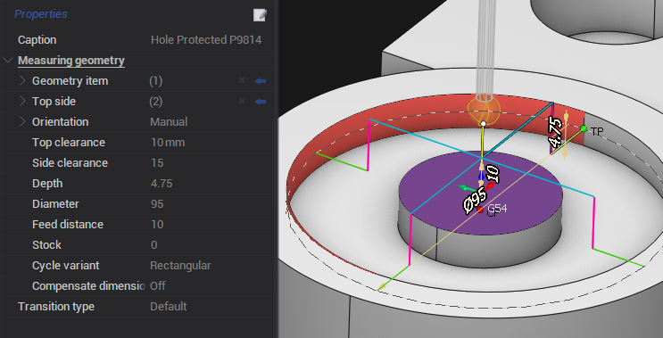

穴プロービング保護のパラメータ：

- `図形アイテム` - 障害物がある穴の測定対象サーフェスを指定します。 点の位置、ベクトル、および中心は手動で編集できます。 <strong>図形アイテム</strong>を展開し、対応するフィールド `ターゲットポイント`, `ターゲットベクトル`, `中心点` に値を設定します。
- `上面`- サイクル開始点までの距離を測定する基準となる上面高さを指定します。
- `トップクリアランス` - `上面` からサイクル開始点までの距離を指定します。
- `サイドクリアランス`- アプローチ点と接触点の間の距離を指定します。
- `深さ` - 穴の方向に沿った、 `上面` から `ターゲットポイント` までの距離を指定します。
- `直径` - 測定対象の穴の直径を指定します。
- `サイクルバリアント`- 穴プロービングの サイクルバリアントとまったく同じです。

CLData 内のパラメータにアクセスするためのコードについては、ポストプロセッサーのドキュメント "Probing cycle **WProbing** -Hole probing parameters" に記載されています。

### ボスプロービング

円筒形ボスを測定するためのプロービングサイクルです。

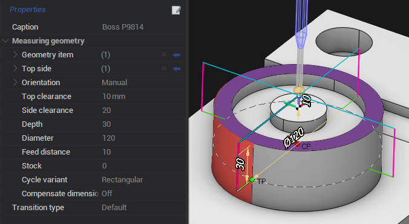

ボスプロービングのパラメータ は 保護された穴プロービング と同じです。 唯一の違いは、 `図形アイテム` がボス（外側形状／外周面）である点です。

CLData 内のパラメータにアクセスするためのコードについては、ポストプロセッサーのドキュメント "Probing cycle **WProbing** - Boss probing parameters" に記載されています。

### 内部長方形プロービング

溝やその他の凹部を、 4方向から 測定するためのプロービングサイクルです。

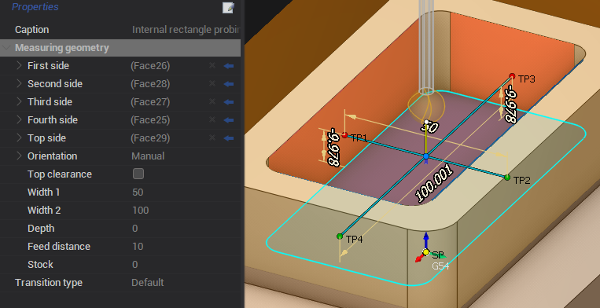

内部長方形プロービングのパラメータ

- `第1接触面`- 1つ目の接触点を指定します。 点の位置およびベクトルを手動で編集できます。 <strong>第1接触面</strong>を展開し、対応するフィールド `ターゲットポイント`, `ターゲットベクトル 1` に値を設定します。
- `第2接触面`- 1つ目の接触点 と反対側にある2つ目の接触点を指定します。 点の位置およびベクトルを手動で編集できます。 `第2接触面` を展開し、対応する フィールド `ターゲットポイント 2`, `ターゲットベクトル 2` に値を設定します。
- `第3接触面`-3つ目の接触点を指定します。 点の位置およびベクトルを手動で編集できます。 <strong>第3接触面</strong>を展開し、対応する フィールド `ターゲットポイント 1`, `ターゲットベクトル 1` に値を設定します。
- `第4接触面`- 3つ目の接触点 と反対側にある4つ目の接触点を指定します。 点の位置およびベクトルを手動で編集できます。 `第4接触面` を展開し、対応する フィールド `ターゲットポイント 2`, `ターゲットベクトル 2` に値を設定します。
- `上面`- サイクルの開始点までの距離を測定する基準となる上面の高さを指定します。
- `トップクリアランス` - このパラメータを有効にすると、 `上面` からサイクル開始点までの距離を設定します。 無効の場合、開始点は4つの点の交点に配置されます。
- `幅 1` - `第1接触面`から `第2接触面` までの幅（距離）を指定します。
- `幅 2` - `第3接触面`から `第4接触面` までの幅（距離）を指定します。
- `深さ` - `上面` から各点までの距離を指定します。

CLData 内のパラメータにアクセスするためのコードについては、ポストプロセッサーのドキュメント "Probing cycle **WProbing** - Internal rectangle probing parameters" に記載されています。

### 保護された内部長方形プロービング

内部に障害物が存在する溝やその他の凹部を、4方向から測定するためのプロービングサイクルです。

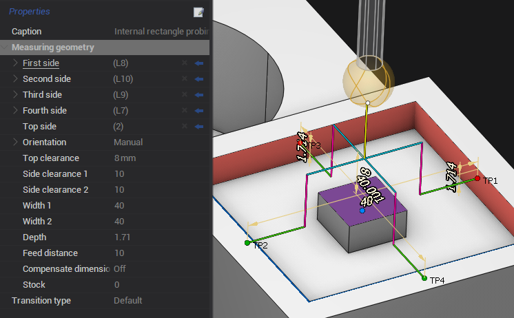

このプロービングのパラメータは、 内部長方形プロービングと同じです。ただし、障害物を回避するための 専用パラメータ ( `サイドクリアランス 1`, `サイドクリアランス 2` ) の2つが追加されており、さらに ( `トップクリアランス` )パラメータの設定内容 が変更されています。

- `サイドクリアランス 1` - アプローチ点と `第1接触面`の間の距離、およびアプローチ点と `第2接触面`の間の距離を指定します。
- `サイドクリアランス 2` - アプローチ点と `第3接触面` の間の距離、およびアプローチ点と `第4接触面`の間の距離を指定します。
- `トップクリアランス` - `上面` からサイクル開始点までの距離を指定します。

CLData 内のパラメータにアクセスするためのコードは、ポストプロセッサーのドキュメント "Probing cycle **WProbing** - Internal rectangle probing protected parameters" に記載されています。

### 外部長方形プロービング

突起部や外側4面の寸法を測定するためのプロービングサイクルです。

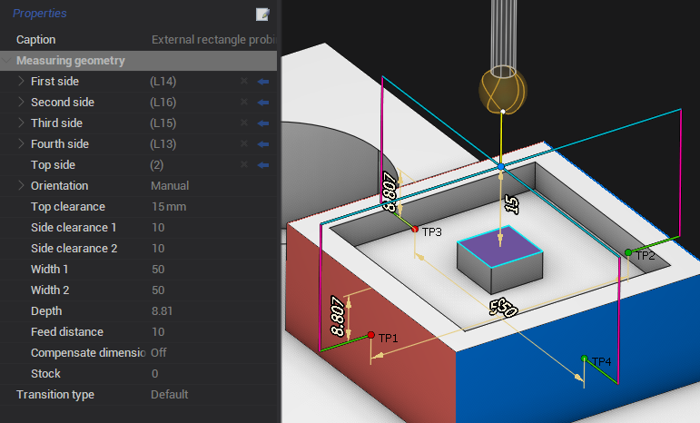

外部長方形プロービングプロービングのパラメータ は 保護された内部長方形プロービングと同じです。 唯一の違いは、接触する面が外側のサーフェスである点です。

CLData 内のパラメータにアクセスするためのコードは、ポストプロセッサーのドキュメント "Probing cycle **WProbing** - External rectangle probing parameters" に記載されています。

### Webプロービング

突起部や向かい合う2方向の外側面の寸法を測定するためのプロービングサイクルです。

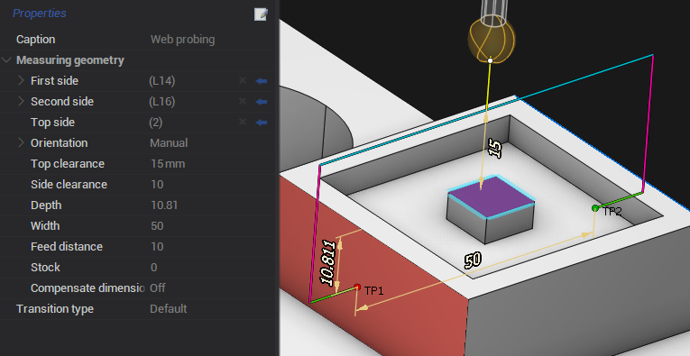

Webプロービングのパラメータ：

- `第1接触面`- 1つ目の接触点を指定します。点 の位置およびベクトルを手動で編集できます。 `第1接触面` を展開し、対応するフィールド `ターゲットポイント 1`, `ターゲットベクトル 1` に値を設定します。
- `第2接触面`- 1つ目の接触点の 反対側にある2つ目の接触点を指定します。 点の位置およびベクトルを手動で編集できます。 `第2接触面` を展開し、対応するフィールド `ターゲットポイント 2`, `ターゲットベクトル 2` に値を設定します。
- `上面`- サイクルの開始点までの距離を測定する基準となる上面の高さを指定します。
- `トップクリアランス` - `上面` からサイクル開始点までの距離を指定します。
- `サイドクリアランス 1` - アプローチ点と `第1接触面`の間の距離、およびアプローチ点と `第2接触面`の間の距離を指定します。
- `深さ` - `上面` から各点までの距離を指定します。
- `幅` - `第1接触面`と `第2接触面` の間の幅（距離）を指定します。

CLData 内のパラメータにアクセスするためのコードは、ポストプロセッサーのドキュメント "Probing cycle **WProbing** - Web probing parameters" に記載されています。

### Webプロービング（3点）

突起部や向かい合う2つの外側面および3つ目の面を測定するためのプロービングサイクルです。3つ目の面は、1つ目の面と2つ目の面の間に位置します。

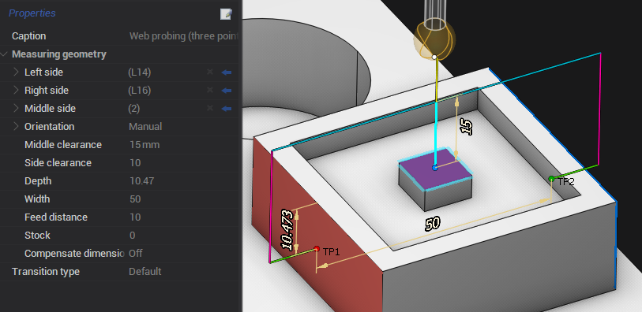

ウェブプロービング（3点）のパラメータ：

- `左接触面`- 1つ目の接触点を指定します。 点の位置およびベクトルを手動で編集できます。 `左接触面` を展開し、対応するフィールド `ターゲットポイント 1`, `ターゲットベクトル 1` に値を設定します。
- `右接触面`- 1つ目の接触点 と反対側にある2つ目の接触点を指定します。 点の位置およびベクトルを手動で編集できます。 `右接触面` を展開し、対応する フィールド `ターゲットポイント 2`, `ターゲットベクトル 2` に値を設定 します 。
- `中央接触面` - 1つ目の接触点 と2つ目の接触点の間に位置する3つ目の接触点を指定します。 点の位置およびベクトルを手動で編集できます。 `中央接触面` を展開し、対応する フィールド `ターゲットポイント 3`, `ターゲットベクトル 3` に値を設定 します 。
- `中央クリアランス` - アプローチ点 と `中央 接触面`の間の距離を指定します。
- `サイドクリアランス` - アプローチ点と `左接触面` および `右接触面`の間の距離を指定します。
- `深さ` - `中央 接触面` から1つ目の接触点および2つ目の接触点までの距離を指定します。
- `幅` - `左接触面`と `右接触面`の 間の距離を指定します。

CLData 内のパラメータにアクセスするためのコードは、ポストプロセッサーのドキュメント "Probing cycle **WProbing** -Web probing (three points) parameters" に記載されています。

### 溝プロービング

溝やその他凹部の両側を測定するためのプロービングサイクルです。

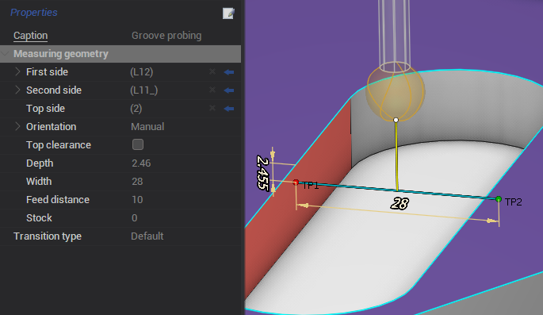

ウェブプロービングのパラメータ：

- `第1接触面`- 1つ目の接触点を指定します。 点の位置およびベクトルを手動で編集できます。`第1接触面`を展開し、対応するフィールド `ターゲットポイント 1`, `ターゲットベクトル 1` に値を設定します。
- `第2接触面`- 1つ目 の接触点と反対側にある2つ目の接触点を指定します。 点の位置およびベクトルを手動で編集できます。 `第2接触面` を展開し、対応する フィールド `ターゲットポイント 2`, `ターゲットベクトル 2` に値を設定 します 。
- `上面`- サイクルの開始点までの距離を測定する基準となる上面の高さを指定します。
- `トップクリアランス` - このパラメータを有効にすると、 `上面` からサイクル開始点までの距離を設定します。 無効の場合、開始点は4つの点の交点 に配置されます。
- `深さ` - `上面` から各点までの距離を指定します。
- `幅` - `第1接触面`から `第2接触面`の間の幅（距離）を指定します。

CLData 内のパラメータにアクセスするためのコードは、ポストプロセッサーのドキュメント "Probing cycle **WProbing** - Groove probing parameters"に記載されています。

### 溝プロービング保護

内部に障害物が存在する溝やその他の凹部を、両側から測定するためのプロービングサイクルです。

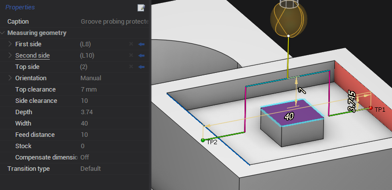

このプロービングのパラメータは、溝プロービングと同じです。ただし、障害物を回避するための専用パラメータ ( `サイドクリアランス` ) があり、また ( `トップクリアランス` ) パラメータ の設定内容 が変更されています。

- `サイドクリアランス` -アプローチ点と `第1接触面` の間の距離、およびアプローチ点と`第2接触面` の間の距離を指定します。
- `トップクリアランス` - `上面` からサイクル開始点までの距離を指定します。

CLData 内のパラメータにアクセスするためのコードは、ポストプロセッサーのドキュメント "Probing cycle **WProbing** - Groove probing protected parameters"に記載されています。

### 二重壁内部コーナープロービング

2つのサーフェス間の内角を測定するためのプロービングサイクルです。

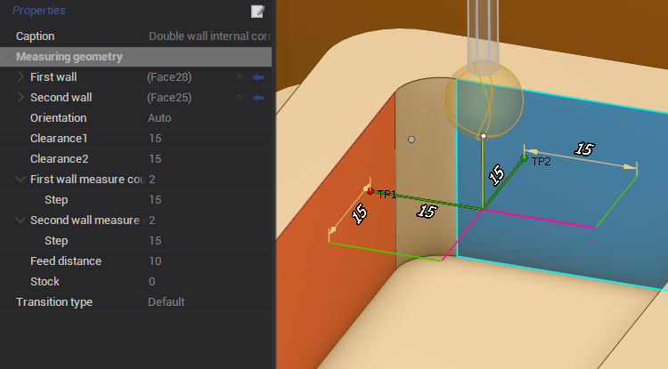

- `第1壁面` - 1つ目の壁面の接触点を指定します。点の位置とベクトルを手動で編集できます。 `第1壁面` を展開し、対応するフィールド `ターゲットポイント`、`ターゲットベクトル`に値を設定します。
- `第2壁面` - 2つ目の壁面の接触点を指定します。点の位置とベクトルを手動で編集できます。 `第2壁面` を展開し、対応するフィールド`ターゲットポイント`、`ターゲットベクトル`に値を設定します。
- `クリアランス1` - アプローチ点と`第1壁面`の間の距離を指定します。
- `クリアランス2` - アプローチ点と`第2壁面`の間の距離を指定します。
- `第1壁面の測定数` - 1つ目の壁面上の接触点の数を指定します。接触点の数が 2 以上の場合は、`ステップ`を設定できます。`ステップ` は、1つ目の壁面上の接触点間の距離です。
- `第2壁面の測定数` - 2つ目の壁面上の接触点の数を指定します。接触点の数が 2 以上の場合は、`ステップ`を設定できます。`ステップ` は、2つ目の壁面上の接触点間の距離です。

CLData 内のパラメータにアクセスするためのコードは、ポストプロセッサーのドキュメント"Probing cycle **WProbing** - Double wall internal corner probing parameters"に記載されています。

### 二重壁外部コーナープロービング

2つのサーフェスの間の外角を測定するためのプロービングサイクルです。

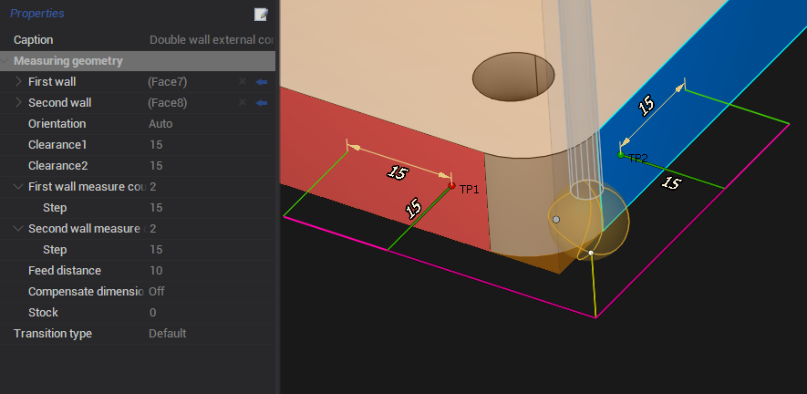

このプロービングのパラメータは、 二重壁内部コーナープロービングと同じです。唯一の違いは、接触する壁面が外側サーフェスであることです。

CLData 内のパラメータにアクセスするためのコードは、ポストプロセッサーのドキュメント "Probing cycle **WProbing** - Double wall external corner probing parameters"に記載されています。

### 三重壁内部コーナープロービング

3つのサーフェス間の内角を測定するためのプロービングサイクルです。

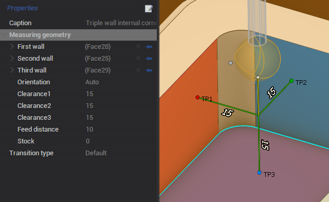

三重内部コーナーパラメータ：

- `第1壁面` -1つ目の壁面の接触点を指定します。点の位置とベクトルを手動で編集できます。 `第1壁面` を展開し、対応するフィールド `ターゲットポイント`, `ターゲットベクトル`に値を設定します。
- `第2壁面` - 2つ目の壁面の接触点を指定します。点の位置とベクトルを手動で編集できます。 `第2壁面` を展開し、対応するフィールド `ターゲットポイント`, `ターゲットベクトル`に値を設定 します 。
- `第3壁面` - 3つ目の壁面の接触点を指定します。点の位置とベクトルを手動で編集できます。 `第3壁面` を展開し、対応するフィールド `ターゲットポイント`, `ターゲットベクトル`に値を設定 します 。
- `クリアランス1` - アプローチ点と `第1壁面`の間の距離を指定します。
- `クリアランス2` - アプローチ点と`第2壁面`の間の距離を指定します。
- `クリアランス3` - アプローチ点と`第3壁面`の間の距離を指定します。

CLData 内のパラメータにアクセスするためのコードは、ポストプロセッサーのドキュメント "Probing cycle **WProbing** - Triple wall internal corner probing parameters"に記載されています。

### 三重壁外部コーナープロービング

三つのサーフェスの間の外角を測定するためのプロービングサイクルです。

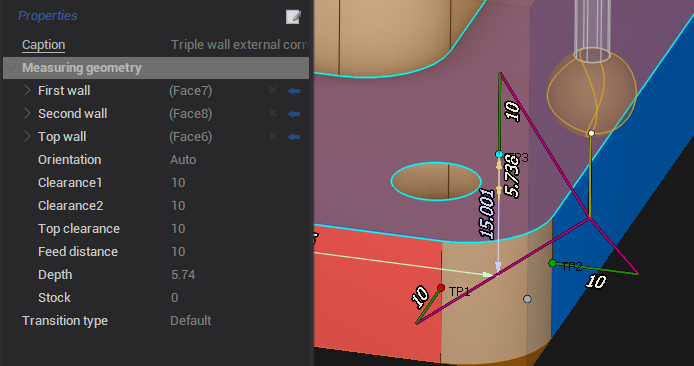

三重外部コーナーパラメータ：

- `第1壁面` - 1つ目の壁面の接触点を指定します。点の位置とベクトルを手動で編集できます。 `第1壁面` を展開し、対応するフィールド `ターゲットポイント`, `ターゲットベクトル`に値を設定します。
- `第2壁面` - 2つ目の壁面の接触点を指定します。点の位置とベクトルを手動で編集できます。 `第2壁面` を展開し、対応するフィールド `ターゲットポイント`, `ターゲットベクトル`に値を設定してください。
- `上部壁` - 上部壁面の接触点を指定します。点の位置とベクトルを手動で編集できます。 `上部壁` を展開し、対応するフィールド `ターゲットポイント`, `ターゲットベクトル`に値を設定します。
- `クリアランス1` - アプローチ点と `第1壁面`の間の距離を指定します。
- `クリアランス2` - アプローチ点と `第2壁面`の間の距離を指定します。
- `トップ クリアランス` - アプローチ点と `上部壁`の間の距離を指定します。
- `深さ` -`上部壁`から、第1壁面および第2壁面の接触点までの距離を指定します。

CLData 内のパラメータにアクセスするためのコードは、ポストプロセッサーのドキュメント "Probing cycle **WProbing** - Triple wall external corner probing parameters"に記載されています。

## 追加要素

### NC 動作

複数の測定サイクルを連続して実行した後に、特定のサブルーチンを呼び出すことができます。このサブルーチンは、直前に実行された測定結果に基づいて追加の処理や計算を行います。例えば、平均値や偏差の計算、複数のサーフェス間の交点の計算や、これらの値を特定のラック変数に記録する処理などがあります。

この機能自体は、移動動作を生成しません。 ただし、Insert コマンドを使用して NCプログラムに 直接出力する必要があるパラメータや、数値パラメータの配列を持つサイクルとして出力するパラメータを含めることができます。

カスタムプロパティの機能を使用すると、任意のパラメータを追加できます。 ポストプロセッサでは、これらのパラメータに基づいて、必要なサブルーチンの呼び出しや追加処理を生成できます。

注記：カスタムプロパティを追加するには、`エキスパートツールを表示` モードを有効にする必要があります。

`NC 動作`は `プロービングサイクル` - `新しいサイクルを追加`にあります。

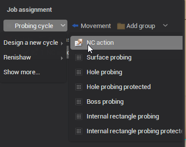

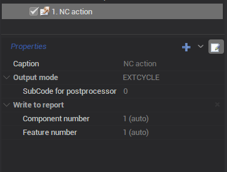

CLData 内のパラメータにアクセスするためのコードは、ポストプロセッサードキュメント "Probing cycle **WProbing** - Additional parameters"に記載されています。

### 動作

障害物を回避する際など、追加の移動を行うための要素です。追加の移動動作で通過する `ターゲットポイント` を設定する必要があります。

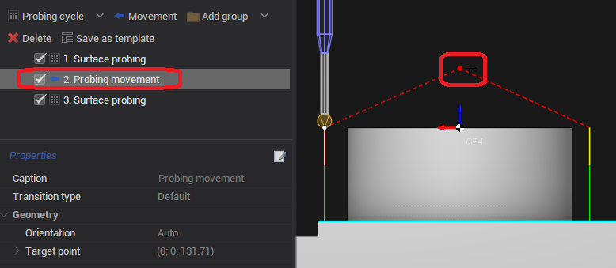

### （要素の）グループ追加

複雑なパーツを測定するための複合的な測定サイクルは、通常、個別に実行されるのではなく、互いに関連付けられた一連の測定として実行されます。

例えば、複数の測定を実行した後、総合的な結果を計算し、測定対象の要素の階層レベルに対応する特定の番号を付けてレポートに記録します。

グループには、次の3種類があります。

- `グループ` - 一般的なグループ化
- `コンポーネント` - 測定対象のパーツ
- `フィーチャー` - 現在測定している個別の要素またはサーフェス

それの下の階層には、測定サイクルが直接配置されます。グループのプロパティでは、番号を手動で設定できます。ただし、デフォルトでは、同じ種類のグループ内における直前の値に基づいて、番号が自動的に加算（インクリメント）されます。グループの種類と番号によって、その名称が決定されます。

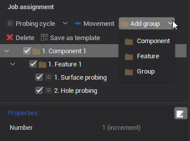
