# Use of prepared measuring cycles

Y ou need to create one of the available operations to start working with measuring cycles. Measuring operations are in a group **Probing**. **Mill part probing** and **Mill tool probing** operations are available for mill machines and robots. **Turn part probing** and **Turn tool probing** operations are available for lathe machines. All four operations can be used when choosing lathe-mill machine.

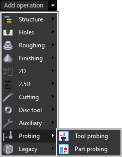

## Part probing

A dd an part probing operation from the list and switch to the **Job assignment** tab and add one of the existing cycles. Press to **Probing cycles** button to show context menu. **Show more** allows you to open [**Probing templates**](1412.md) window in which there are libraries with cycles ready for work with own properties. Also these libraries located in context menu of **Probing cycles** button.

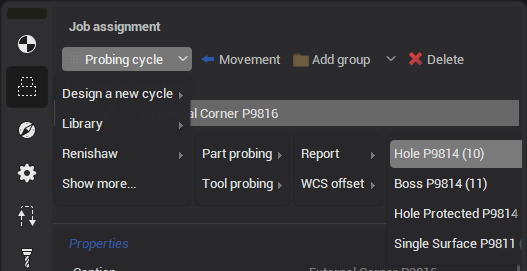

The example of working with cycles will be presented based on **Hole probing**.

Add new probing cycle **Hole P9814** from default library **Renishaw,** group **Report**.

Properties of the added cycle will appear at the bottom of the **Job assignment**.

Use **Measuring geometry** to set parameters for cycle calculation.

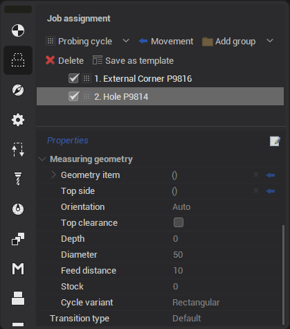

С lick on the arrow in the right part of the field and select a surface in the graphics window t o add **Geometry item** or **Top side**. The selected surface is automatically added to the current field.

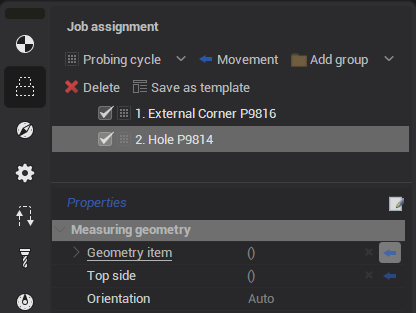

Other parameters are entered manually in the corresponding field. Some cycle parameters can be edited both in the inspector and in the graphics window.

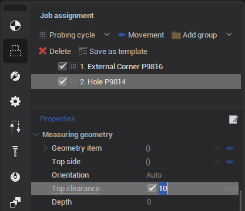

## Transitions

Go to the tab **Links** to set the parameters of transitions between probing cycles.

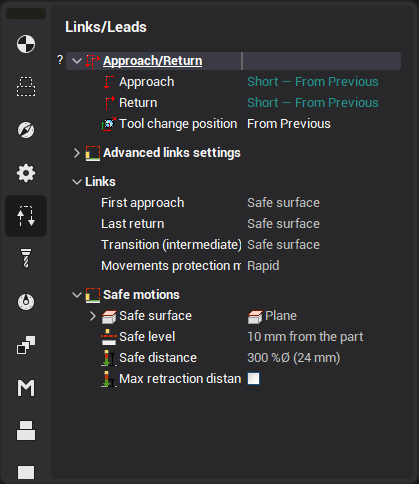

In addition to standard parameters in this tab, new parameters have been added for measuring operations:

- **First approach** - creating an approach to the beginning of the first cycle of the operation;
- **Last return** - creating a return from the last cycle of the operation;
- **Transition (intermediate)** - creating transitions between operation cycles;
- **Safe distance** - setting the distance for the approach and return of the cycle. There are 2 kinds of value settings: mm and percentage of tool diameter.

There are 3 common types of value for transitions listed above:

- **Short** - transition is created directly;
- **Safe distance** - transition is created by retreating to the distance specified in the **Safe distance** field;
- **Safe surface** - transition is created by retreating to the safe surface.

There is additional value for **Transition (intermediate)**: **Orthogonal** - i f the start and end points of the transition are located at the same level in Z then go directly. If the start point is lower then at first go to the level of the end point then go directly. If the end point is lower then go directly to a point raised above the end point to the level of the starting point then go directly.

You can also choose which feed to move (**Movements protection mode**):

- **Rapid** - moving at rapid feed;
- **Non protected** - moving at long link feed;
- **Protected** - moving at short link feed.

## Cycle format

You can choose one of the options for outputting cycles in CLData. To do this, go to the **Strategy** tab.

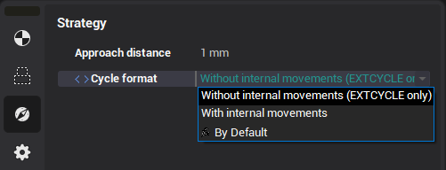

**Cycle format** has two values:

- **Without internal movements (EXTCYCLE only)** - cycle movements are output in a separate **EXTCYCLE** command with callsub. 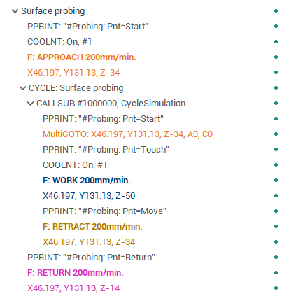
- **With internal movements** - cycle movements are output without a separate **EXTCYCLE** command. 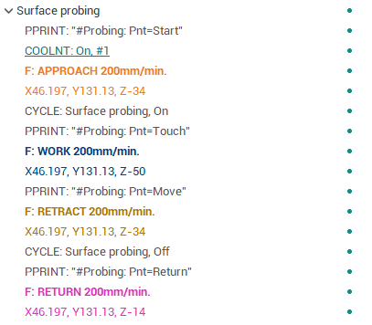

## Tool probing

Setting parameters and transitions of cycles for the tool probing is exactly the same as for the part probing.

The probe can be not only a tool, but also a part which fix in a special place on the table. About such a probe, the tool is usually measured for its initial calibration or to check its integrity.

You need to add the **Part** group f or correct work.

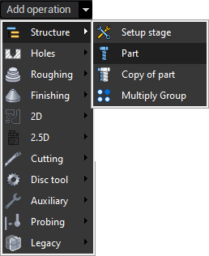

It is necessary to create separate measuring operations for each tool within this group.

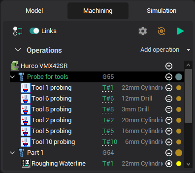

You need to switch to the **Setup** tab and set **Part number**. **Part number** can be used as probe ID.

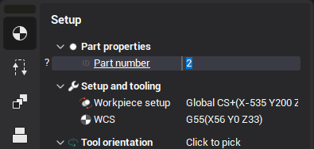

The example of creating and working with tool probing operation can be found in the distribution project "Tool probing" in "Probing" folder.
