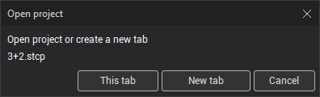
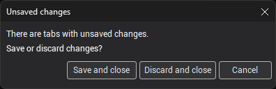
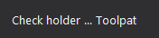

# Multiproject interface

<strong>Multiproject</strong> allows you to combine multiple windows as "tabs" for simultaneous work on multiple projects. You can use the <strong>multiproject</strong> interface to attach and create new projects in separate instances. However, you can still choose to work with <strong>only one window</strong>, without using the multi-project interface.

## Options for opening an additional window:

1. <strong>Opening an additional window from the current system window:</strong> <strong><strong>The workflow will look as follows</strong>:</strong>  + User Actions = 
  - With an open system window, click on the <strong>New Project in New Tab</strong> button. Hover over <strong>New Project</strong> and select <strong>New Project in New Tab</strong> from the drop-down list. A new tab will appear in the project list.
  - With an open system window, click on the <strong>New Project in New Tab</strong> button. Hover over <strong>Open Project</strong>  and select <strong>Open Project in New Tab</strong> from the drop-down list.
  - You can also open a project by hovering over a specific project in the <strong>Open Project</strong>  drop-down list and selecting <strong>Open Project in New Tab</strong> from the second drop-down list.
  - To open a project with machine setup, click the <strong>New Project with machine setup in a New Tab</strong> button. Hover your cursor over the <strong>New Project</strong>  and select <strong>New Project with machine setup in new tab </strong> from the drop-down list. A new window will appear in the project list.
2. <strong><strong><strong>Opening an additional window through external systems</strong>:</strong></strong>

- With the system window open, click on the <strong>Export from External CAD System</strong> option in the CAD system window.
- With the system window open, click on the <strong>Export from Machine Maker</strong> option.
- With the system window open, click on the <strong>Export from Project Library</strong> option.
- Launch a project by double-clicking the project icon or by using the <strong>drag-and-drop</strong> function.

<strong><strong>The workflow will look as follows</strong>:</strong>

 ----> = 

## Important points when opening an additional window through external systems:

1. If the window is <strong>empty</strong> (no operations, parts, etc.), imported files will load into this window.
2. If there are changes in the current window (and it's not empty), the system will prompt you to choose into which window the import should be performed.

Therefore, the user decides how they want to work, either in <strong>single-tab</strong> mode or with <strong>multiple tabs</strong> simultaneously (multi-project mode).

When <strong>exiting</strong> the system while working in multiple tabs with unsaved changes, the system will suggest saving them. It will initially prompt to save the project from the current tab, and this will continue until all projects in all tabs are closed or saved.

## Project Navigation:

<strong>Working with the project list:</strong>

- The <strong>project name panel</strong> displays the name of the project file open in the current tab 
- <strong>The number of tabs</strong> corresponds to the number of projects combined in the current system window.
- <strong>An animated loading progress bar</strong> appears when a new tab is created and added to the existing ones 
- If there are multiple tabs, <strong>the title of the active project</strong> is highlighted with a darker color compared to the others. Clicking on the title of an inactive project will make it <strong>the active one</strong>. Additionally, hovering over <strong>the project name panel</strong> of an inactive tab will reveal a close button. 
- If a <strong>calculation</strong> is running in a tab (e.g., toolpath calculation, machining simulation), a brief description is shown.

You can also copy operations between different tabs using <strong>[Ctrl+C]</strong> and <strong>[Ctrl+V]</strong> or the <strong>Copy</strong> and <strong>Paste</strong> commands.

<strong>In multiproject mode, it's not possible to open two windows with the same name. In such cases, the system will generate an error message.</strong>
