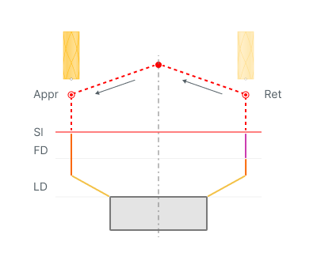
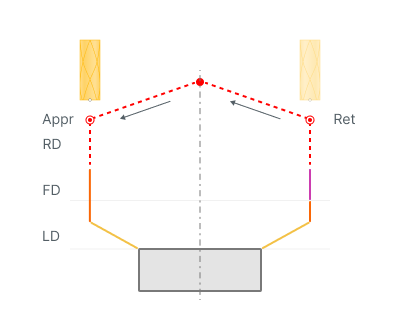
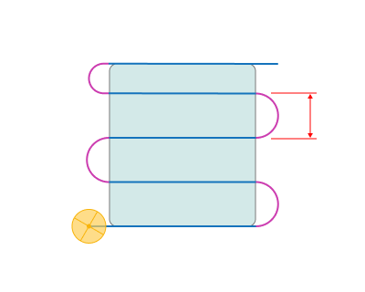
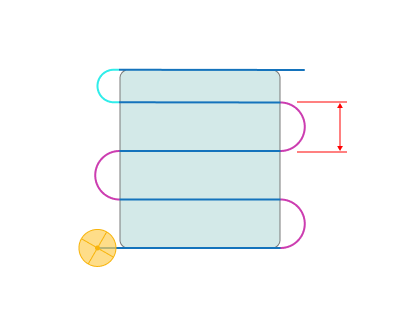
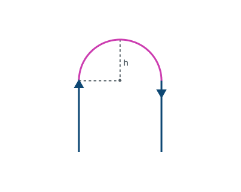

# Links in сladding operations

## 

## Application Area:

This group defines the settings for cutting in or transitions between areas.

<strong>First links /</strong> <strong>Last links.</strong> Defines the general rule of approach/return.

Click here to expand..

<strong>Straight.</strong>

With this rule, the approach to the part is carried out: 1. <strong>Tool change position</strong> 2.<strong>Appr</strong>- Approach 3. <strong>LD</strong> - Leads (If they are enabled) The returnl is carried out in the reverse order: 1. <strong>LD</strong> - Leads (If they are enabled) 2.<strong>Ret</strong> - Return 3. <strong>Tool change position</strong>

.png)

<strong>On Safe Surface.</strong>

With this rule, the approach to the part is carried out: 1. <strong>Tool change position</strong> 2.<strong>Appr</strong>- Approach 3.<strong>SL</strong> - Safe level 4. <strong>FD</strong> - Feed distance 5. <strong>LD</strong> - Leads (If they are enabled) The returnl is carried out in the reverse order: 1. <strong>LD</strong> - Leads (If they are enabled) 2. <strong>FD</strong> - Feed distance 3. <strong>SL</strong> - Safe level 4. <strong>Ret</strong> - Return 5. <strong>Tool change position</strong>

<strong>By Rapid Distance.</strong>

With this rule, the approach to the part is carried out: 1. <strong>Tool change position</strong> 2. <strong>Appr</strong>- Approach 3. <strong>RD</strong> - Rapid distance 4. <strong>FD</strong> - Feed distance 5. <strong>LD</strong> - Leads (If they are enabled) The returnl is carried out in the reverse order: 1. <strong>LD</strong> - Leads (If they are enabled) 2. <strong>FD</strong> - Feed distance 3. <strong>RD</strong> - Rapid distance 4. <strong>Ret</strong> - Return 5. <strong>Tool change position</strong>

<strong>Neighbor links.</strong>

Click here to expand..

<strong>Continuous.</strong>

Transitions between neighboring passes are made continuously along the part at the <strong>Short link feed</strong>, without retracting the tool. Combined with <strong>Effective feeds</strong> set to all non-rapid, this produces a continuous cladding bead. Applied only to transitions shorter than <strong>Neighbor link max distance</strong>.

> Note
>
> For <strong>Area cladding</strong> and <strong>Cladding 3D</strong> operations in the <strong>Parallel</strong> strategy the transition follows the equidistant of the outer contour; in the <strong>Offset</strong> strategy it is built as the shortest direct move.

<strong>As short link.</strong> Transitions between neighboring passes are executed as regular short links, according to the <strong>Short links</strong> setting.

<strong>Neighbor link max distance.</strong>

The maximum distance between the end points of two neighboring passes at which the transition is treated as a continuous neighbor link. If the distance is greater, the transition is built as a <strong>Short link</strong> or <strong>Long link</strong> instead.

> Note
>
> Short links operate in the gap between this value and the <strong>Short link max distance</strong>. If this value reaches the <strong>Short link max distance</strong>, that gap closes and every short transition becomes a neighbor link.

<strong>Short links / Long links.</strong>

Click here to expand..

<strong>Straight.</strong> Links are made by the shortest distance.

.png)

<strong>Smooth.</strong> Smooth Bezier spline transition between passes.

-1.png)

<strong>On Safe Surface.</strong>

The links made from from the <strong>Feed distance</strong> to the <strong>Safe level</strong>. <strong>FD</strong> - Feed distance <strong>SL</strong> - Safe level

_add.png)

<strong>By Rapid Distance.</strong>

The links made from from the <strong>Rapid distance</strong>. <strong>RD</strong> - Rapid distance

_add.png)

<strong>Short link max distance.</strong> Sets the maximum distance at which links are made by the short link type.

<strong>Smooth link height.</strong> Height of the link arc above the straight chord connecting two neighboring passes. The specified value is exact for the reference case — the ideal zigzag. In other configurations (Parallel forward/backward, Offset, etc.) the actual arc height may differ.

