# Extension Store

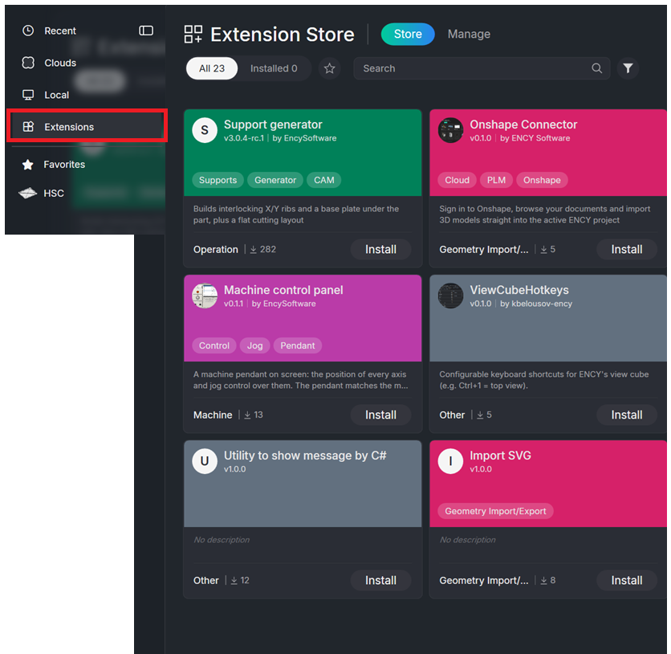

## Application area:

The <strong>Extension Store</strong> is the place where optional add-ons for the CAM system are discovered, installed, updated, and removed. It connects a web catalog with the CAM application: the web storefront lists extensions and can start an installation, while the in-application tab performs the actual download, registration, and removal on the local machine.

The store is used for the following scenarios:

- Browsing extensions by category, publisher, tag, or price.

- Installing free extensions directly into the CAM system.

- Starting a free 14-day trial for paid extensions.

- Updating installed extensions to newer versions.

- Removing extensions that are no longer needed.

- Managing extension sources and locally registered libraries.

> Note
>
> The <strong>Extension Store</strong> interface is displayed in <strong>English regardless of the language selected in the CAM system</strong>.

### Ways to Work with Extensions in the CAM Ecosystem:

- <strong>Web storefront - [https://apps.encycam.com/](https://apps.encycam.com/)</strong> ( Browsing the catalog, viewing extension details, publishing extensions, and starting installation from a browser. )

- <strong>In-application tab -</strong> Home page ([Details](10201021.md)) → <strong>Extension Store</strong>. ( Installing, updating, enabling, disabling, and removing extensions on the local machine. )

- <strong>ExtensionManagerCLI -</strong> Command-line utility next to the CAM application ( Packaging and local registration of extensions by authors and administrators. )

### Main components:

The Extension Store consists of two linked parts:

- <strong>Web storefront</strong>. The catalog is visible to any visitor. Signed-in users can add extensions to favorites, request trials, and publish extensions. Authors and administrators access moderation and configuration screens.

Click here to expand..

- <strong>In-application tab</strong>. Contains two pages: <strong>Store</strong> for the catalog and <strong>Manage</strong> for installed extensions and feeds. A link in the upper part of the tab opens the web storefront in the default browser.

Click here to expand..

The tab is opened from the <strong>Home page</strong>. It has two pages: <strong>Store</strong> ( Browses the extension catalog and installs or updates extensions ) and <strong>Manage</strong> ( Lists installed extensions, enables or disables them, installs from files, and configures feeds).

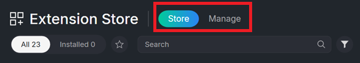

<strong>Store page toolbar.</strong>

<strong>Search field</strong>. Prompt text is <em>"Search"</em>.

<strong>Sort options.</strong> Recent, Name, Publisher, and Type. Default order follows the feeds.

<strong>Scope switch.</strong> <strong>All</strong> shows every extension offered by the feeds. <strong>Installed</strong> shows only extensions already on the machine.

<strong>Favorites.</strong> Star filter showing only starred extensions.

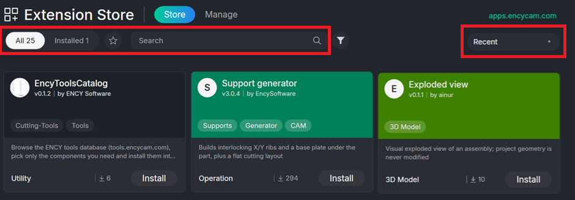

<strong>Filter button.</strong> Opens the filter panel. Sections are <strong>CATEGORY</strong>, <strong>PRICE</strong> (choices <strong>All, Free, Paid</strong>), <strong>PUBLISHER</strong> (default <strong>All publishers</strong>), and <strong>TAGS</strong> with the search prompt "Find a tag…"

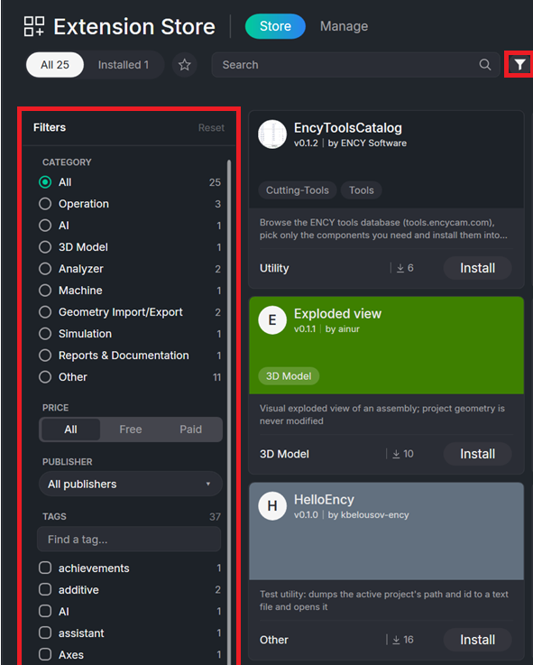

<strong>Extension card in the Store page.</strong>

The card shows a cover, icon, name, publisher, version, description or "No description", Paid badge, extension type, download count, and a favorite star. The action button changes according to state: Install, Update, Uninstall, View, or Installed.

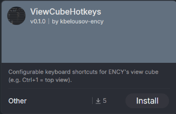

When you click on the card, you can read the extension description and how to use it.

Each card displays the following:

- <strong>Cover.</strong> A screenshot provided by the author, or a solid color derived from the category, or an entry-point icon when neither screenshot nor category is present.

- <strong> Name, version, and publisher.</strong>

- <strong> Description.</strong> If the author left it empty, the text <em>"No description"</em> appears in italics.

- <strong> Tags.</strong> Up to three tags are shown, followed by an indicator for additional tags. The tag that duplicates the category name is hidden.

- <strong> Paid badge.</strong> Appears when the extension requires a license.

- <strong> On moderation badge.</strong> Visible to the author for new extensions that are awaiting approval.

- <strong> Download count and category name.</strong>

- <strong> Favorite star.</strong> Visible only to signed-in users.

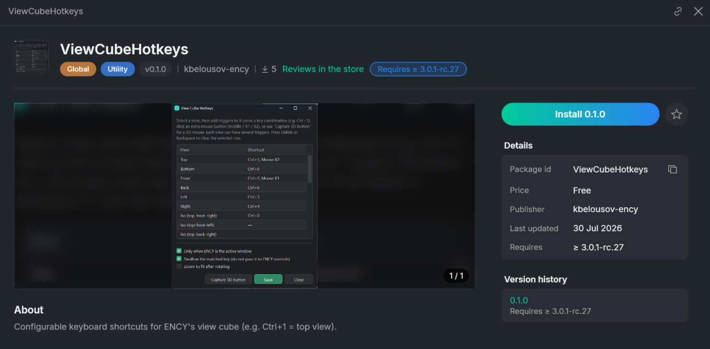

### Installing an extension.

There are three starting points for installation, all of which converge to the same in-application process.

Click here to expand..

<strong>From the web storefront.</strong> Press Install in CAM system (v **version**) on the extension page.

<strong>From the in-application catalog.</strong> Press Install on the card, or open the detail view and press Install **version**.

<strong>From a file.</strong> On the <strong>Manage page</strong>, press Install from file… or drag a <strong>.nupkg</strong> or <strong>.dext</strong> file onto the tab.

<strong>After installation starts</strong>, the button becomes a progress indicator and passes through the stages: "Looking in the store…", "Searching the feeds…", "Checking compatibility…", "Downloading…", "Reading package…", "Installing…", "Registering…".

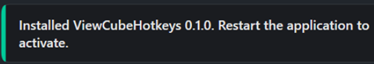

<strong>Location of Installed Extensions in the CAM System Interface.</strong>

The store copies files and registers the extension, but does not start it. Where the extension appears depends on its entry point, which is defined by the extension author.

Click here to expand..

<strong>Utility.</strong> Utilities palette, opened with the Utilities button on the top toolbar or the Ctrl+Shift+E shortcut.

<strong>Operation Popup.</strong> Right-click menu on an operation in the technology tree.

<strong>Geometry Node Popup.</strong> Right-click menu on a node in the geometric model tree.

<strong>Operation Solver.</strong> As an operation in the project. The extension computes the operation and its toolpath.

<strong>Global</strong>, <strong>CLData Converter</strong>, <strong>Utility Runner.</strong> No visible location. The code runs automatically on startup, during toolpath calculation, or when a utility is launched.

If an installed extension does not appear where expected, the library or its entry point may be disabled on the <strong>Manage</strong> page, or the CAM system may need a restart.

As an example, the <strong>Support Generator</strong> extension is installed. The card description provides instructions for invoking it.

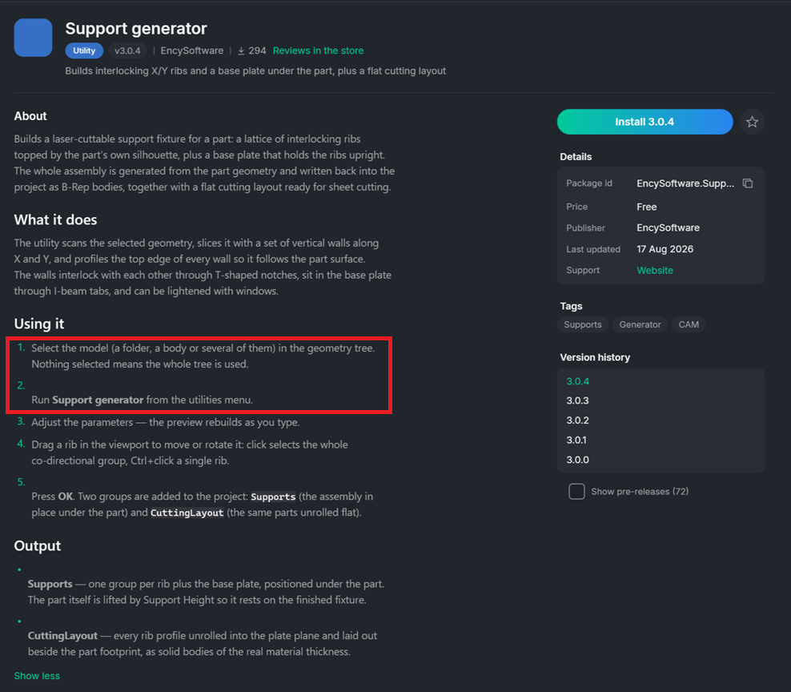

A notification will appear at the bottom of the screen indicating that the extension has been installed.

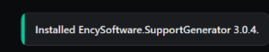

The project is opened from the <strong>Recognize Features</strong> project library.

On the <strong>Model</strong> tab, select the part geometry and <strong>generate the supports</strong>.

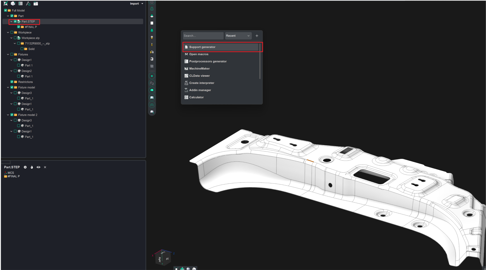

In the dialog box that appears, set the required parameters.

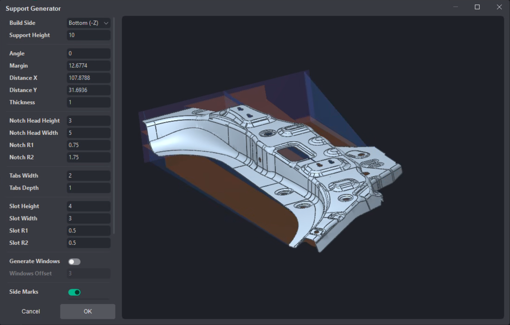

Once you close the dialog box, the necessary supports for the part will be created.

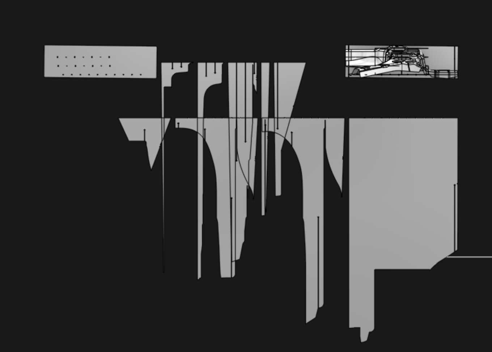

