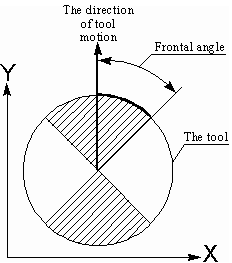
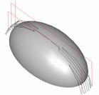
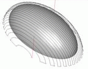
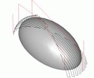
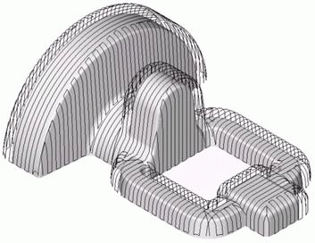

# Frontal angle

The height of the scallop between neighboring work passes during the plane machining of inclined surfaces depends mostly on the angle between the normal to the surface and the tool movement direction. In most cases the smaller the angle between projections onto the horizontal plane of the normal and the tool movement direction, the smaller the height of the scallop.

In order to obtain the optimal toolpath in plane finishing and drive operations, it is possible to define a limitation of the frontal angle. The frontal angle is the angle between projections onto the horizontal plane of the tool movement direction and the normal to the surface at the cutting point.

In the picture, there is a spherical mill – viewed from above. An area of the work pass will be included in the resulting toolpath only if the angle between projections onto the horizontal plane of the tool movement direction and the normal vector to the surface at the contact point is less than defined. For the spherical mill the following will also be true: any area of the pass will be included in the resulting toolpath only if the point of tool touching the surface lies inside the hatched sector.

|  |  |  |
|---|---|---|
| Frontal angle = 90° | Frontal angle = 45° | Frontal angle = 15° |

The result of machining by two mutually perpendicular plane operations with the frontal angle equal to 45 degrees is shown in the picture (below).

The frontal angle can be within the limits of 0 degrees (machine only perpendicular to the movement direction) to 90 degrees (without limitation). For two plane operations that are mutually perpendicular, the optimal value for the frontal angle will be equal to 45 degrees.

The frontal angle for the plane finishing and drive operations can be defined in the **Strategy** page.
