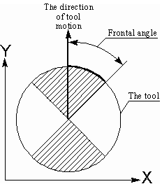
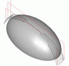
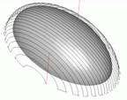
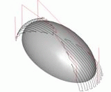
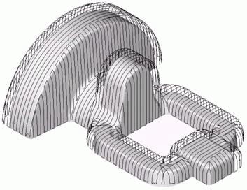

# フロント角

傾斜面の平面加工において、隣接する加工パス間のスキャロップ高さは、主に表面の法線と工具の移動方向とのなす角度に依存します。多くの場合、法線の水平面への投影と工具の移動方向との間の角度が小さいほど、スキャロップの高さも小さくなります。

平面仕上げ加工およびドライブ加工において最適なツールパスを得るために、フロント角の制限を設定することができます。フロント角とは、工具の移動方向と切削点におけるサーフェスの法線を、それぞれ水平面に投影した際のなす角度を指します。

図には、上方から見たボールエンドミルが示されています。加工パスの領域は、工具移動方向の水平面への投影と接触点における面の法線ベクトルとの間の角度が設定値より小さい場合にのみ、生成されるツールパスに含まれます。ボールエンドミルの場合、以下も成立します。加工パスの任意の領域は、工具が面に接触する点が斜線で示されたセクター内にある場合にのみ、生成されるツールパスに含まれます。

|  |  |  |
|---|---|---|
| 前面角＝90° | 前面角＝45° | 前面角＝15° |

前面角が45度に設定された、互いに直交する2つの平面加工による加工結果をが下図に示されています。

フロント角は、0度（移動方向に対して垂直な方向のみで加工）から90度（制限なし）までの範囲で設定できます。互いに直交する2つの平面加工においては、フロント角の最適値は45度となります。

平面仕上げ加工およびドライブ加工におけるフロント角は、`加工設定`ページで設定できます。
