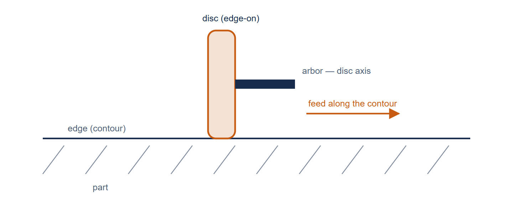
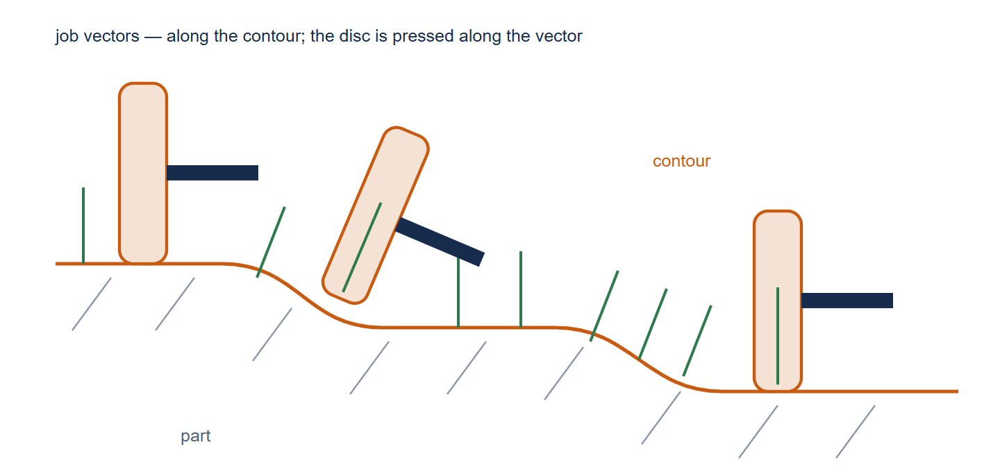
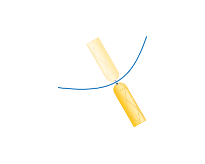

# Contour Polishing

## Application area:

The operation is designed for finishing the walls and edges of a part along specified contours using a disc tool. Contact is formed on the disc rim. The operation supports three-dimensional contours and undercut areas.

### Machining principle.

The disc is positioned across the machined edge. The feed follows the contour, while the tool rotation produces polishing motion across the edge. At each toolpath point, the position of the disc is determined by contact with the part.

Segments without contact, or where the part obstructs the disc, are trimmed from the working pass. The remaining passes are connected by links over the safety surface.

<em>Top view. The contour axis points towards the viewer. The disc contacts the edge with its rim; feed is directed along the contour and polishing motion is directed across the edge.</em>

### Setup:

The <strong>Setup</strong> tab is used to configure the primary parameters of the project. This can involve the positioning of the part on the equipment, the coordinate system of the part, and more. [Details](1022.md)

### Job assignment:

<strong>5D Curve.</strong> The system generates the 5-axis tool path as the projection of the arbitrary curves on the part surface. In this case the tool contact point will move in touch with the surface. The passes can be shifted from the curve by the stock or by the levels. The tool axis is located perpendicular to the surface. [Details](10131.md)

<strong>Properties.</strong> Displays the properties of an element. It is possible to add the stock. You can also call this menu by double clicking on an item in the list.

<strong>Delete.</strong> Removes an item from the list.

<strong>Restrictions.</strong> It allows you to restrict areas that should not be machined. [Details](101231.md)

<em>Top view. Job vectors are perpendicular to the contour axis and define the side from which the tool contacts the part. Reversing the vectors changes the machining side.</em>

### Strategy:

#### Contour axis.

Defines the reference direction perpendicular to the job vectors. In Roll mode, this direction also determines the fixed tool axis.

Click here to expand..

<strong>Direction.</strong> Selects X, Y, Z or Custom. The default direction is Z. Custom defines an arbitrary vector.

<strong>Origin.</strong> Defines the X, Y and Z coordinates of a point on the axis. The point is used to position the graphical representation of the axis.

<strong>Base CS.</strong> Defines the coordinate system in which the axis is specified: Global or WCS.

#### Tool contact point.

Tool Contact Point (TCP) is a specific location on a cutting tool that defines the primary interaction point between the tool and the workpiece surface or geometric entities during machining operations. The principal parameters of this function are the same as in the <strong>5D Surfacing operation</strong>. [Details.](10135.md)

#### Tool orientation

Controls tool axis orientation. The principal parameters of this function are the same as in the <strong>5D Surfacing operation</strong>. [Details.](10135.md)

<strong>Inverse tool axis direction.</strong> Alters the tool axis vector direction. Use this parameter if CAM system incorrectly attempts to machine surfaces from the opposite side to the desired one or if it fails to generate a toolpath.

 

### Parameters:

<strong>Parameters.</strong> Contains the main settings for controlling how the part, workpiece, fixtures, and other geometry affect the generated toolpath. [Details](100112.md)

### Links/Leads:

<strong>Links/Leads.</strong> Controls approach and return movements, transitions over the safe surface, and the distances used when approaching or retracting from the working path.

Click here to expand..

<strong>Consists of:</strong>

<strong>Approach/Return.</strong> Defines the <strong>Approach</strong> and <strong>Return</strong> rules and the <strong>Tool change position</strong>. These settings control tool movements to the beginning of the working path and away from its end. [Details](100116.md)

<strong>Safe motions.</strong> Defines the <strong>Safe surface</strong> and <strong>Safe level</strong> used for transitions between working passes and for approach and return movements. [Details](100117.md)

<strong>Distances.</strong> Provides <strong>Max retraction distance</strong> to control retraction along the tool axis and <strong>Feed distance</strong> to define the feed-switching distance along the tool axis. [Details](100140.md)

### Feeds/Speeds:

<strong>Feeds/Speeds.</strong> Defines the spindle speed, rapid feed, and feed rates for different parts of the toolpath. Spindle speed can be specified in revolutions per minute or as a cutting speed. The defining value is underlined; the other value is calculated from it using the tool diameter. [Details](100142.md)

### Transformations:

<strong>Transformations.</strong> Defines coordinate transformations applied to the toolpath calculated for the operation. [Details](10168.md)

### Part:

<strong>Part.</strong> Defines the geometry used to check the toolpath for gouges. [Details](330.md)

### Workpiece:

<strong>Workpiece.</strong> Defines the material to be machined in the operation. [Details](738.md)

### Fixtures:

<strong>Fixtures.</strong> Defines workholding devices, such as chucks, grips, and clamps, and other restricted geometry considered during toolpath calculation. [Details](10283.md)
