# Nesting

 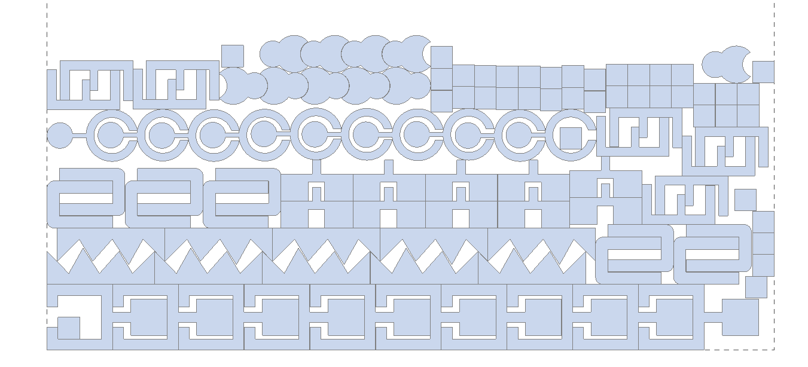

## Application area:

The Nesting tool is available from the <strong>Model tab</strong>. <strong>Right-click a sheet</strong> and select <strong>Create nesting</strong> to automatically arrange selected parts and optimize material usage.

The Nesting tool automatically arranges selected parts on a sheet to optimize material usage and reduce waste. Configure sheet dimensions, spacing, margins, part copies, rotation, mirroring, grain direction, and placement rules before generating the layout.

### Window layout.

Click here to expand..

<strong>1. Options tab.</strong> Contains settings that define the nesting calculation.

<strong>2. Parts tab.</strong> Displays nestable parts, calculated sheets, unnested parts, and ignored parts. It is used to define the quantity and individual placement rules for each part.

<strong>3. Run button.</strong> Starts the nesting calculation using the current settings. The arrow next to the button opens additional calculation commands.

<strong>4. Sheet navigation.</strong> Switches between sheets included in the nesting layout. The Add sheet command adds another sheet.

<strong>5. Sheet parameters.</strong> Define the length, width, gap, and margins of the current sheet.

<strong>6. Manual editing.</strong> Allows you to manually edit the nesting layout.

<strong>7. Settings button.</strong> Opens nesting settings.

<strong>8. Nesting layout.</strong> Displays the calculated arrangement of parts on the current sheet. The layout is generated according to the selected sheet parameters, material requirements, and placement rules.

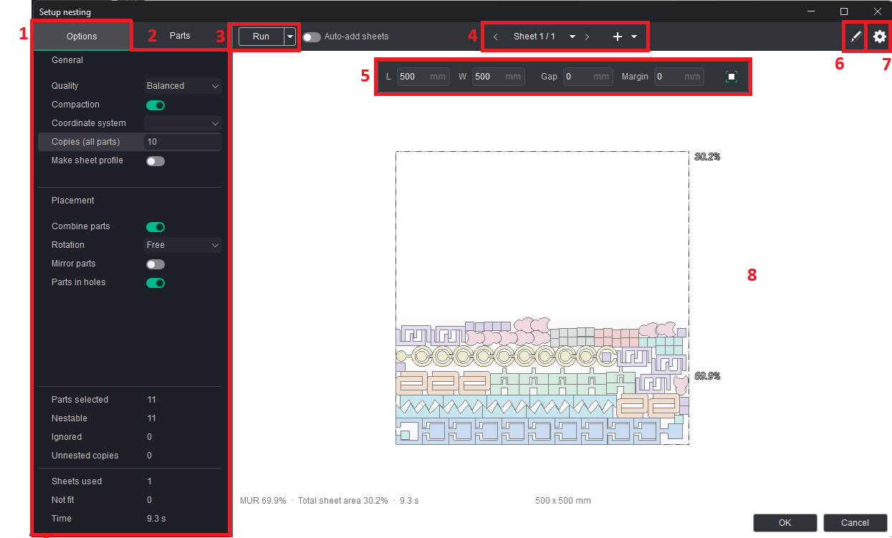

### Options tab.

Click here to expand..

<strong>General</strong>

<strong>Quality.</strong> Selects the balance between calculation speed and nesting quality.

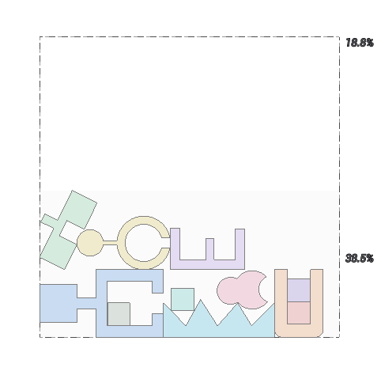 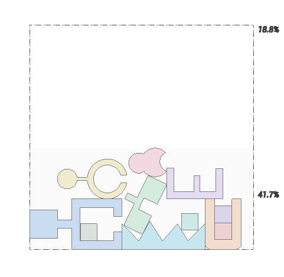 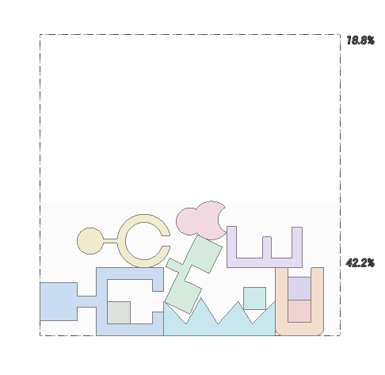

<strong>Compaction.</strong> When <strong>ON</strong>, reduces unused space between parts where possible.

<strong>Coordinate system.</strong> Selects the coordinate system used for the sheet layout.

<strong>Copies (all parts).</strong> Specifies a common number of copies for all selected parts.

 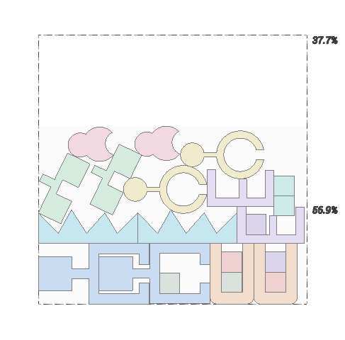

<strong>Make sheet profile.</strong> Keeps the sheet in the project after the nesting is created.

<strong>Placement.</strong>

<strong>Combine parts.</strong> When <strong>ON</strong>, allows compatible parts to be arranged together on the same sheet.

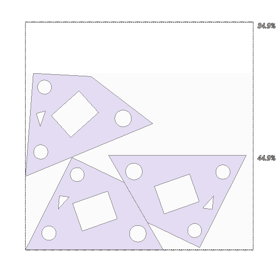 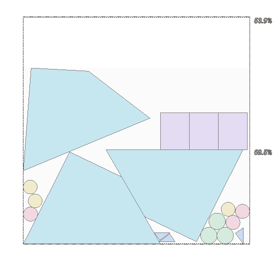

<strong>Rotation.</strong> Defines the permitted rotation of parts during nesting.

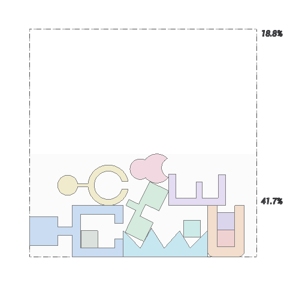 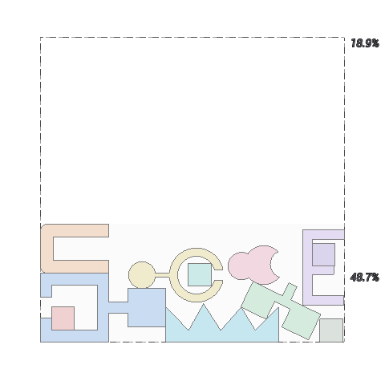 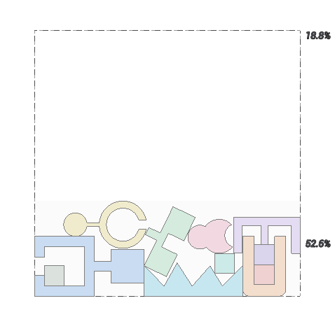 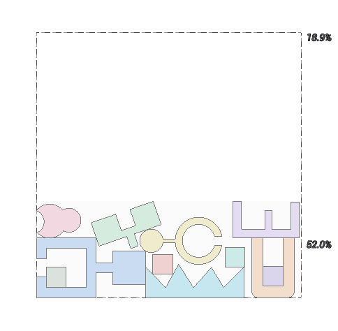 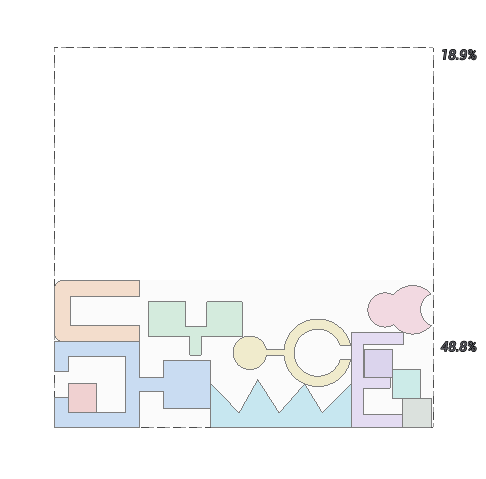

<strong>Mirror parts.</strong> When <strong>ON</strong>, allows mirrored copies of parts to be placed.

 

<strong>Parts in holes.</strong> When <strong>ON</strong>, allows parts to be placed inside suitable internal contours of other parts.

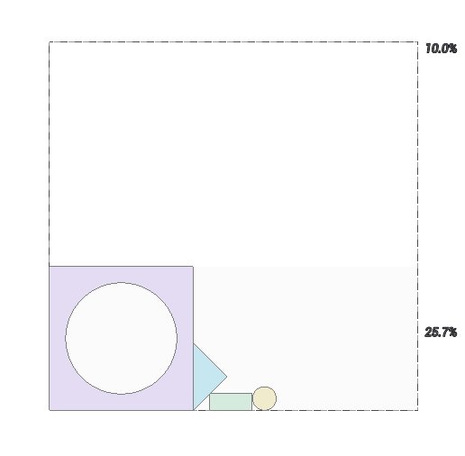 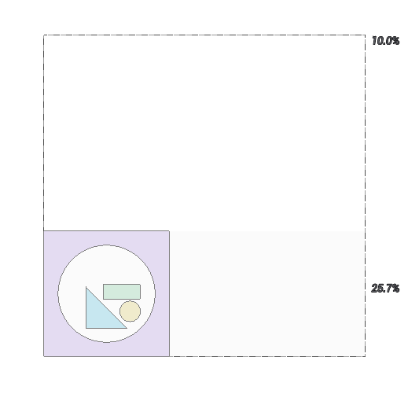

<strong>Nesting result.</strong>

<strong>Parts selected.</strong> Shows the number of parts selected for nesting.

<strong>Nestable.</strong> Shows the number of selected parts that meet the current nesting conditions.

<strong>Ignored.</strong> Shows the number of parts excluded from the calculation.

<strong>Unnested copies.</strong> Shows the number of requested part copies that could not be placed.

<strong>Sheets used.</strong> Shows the number of sheets required by the calculated layout.

<strong>Not fit.</strong> Shows the number of parts that do not fit on the available sheet format.

<strong>Time.</strong> Shows the time required to calculate the nesting result.

### Parts tab.

Click here to expand..

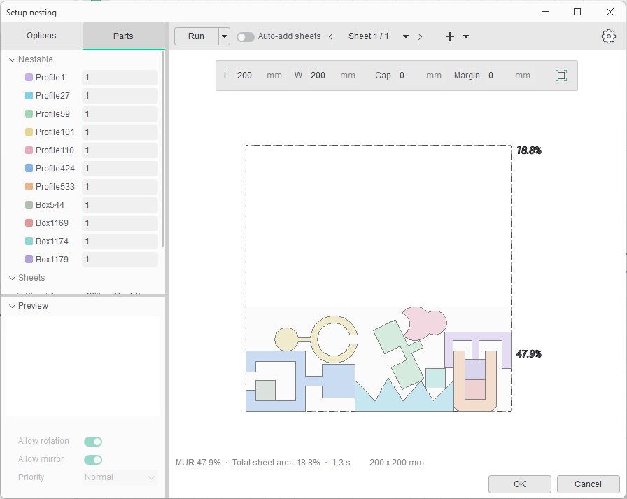

<strong>Nestable.</strong> Lists the parts that can be included in the nesting. The field next to each part defines its required quantity.

<strong>Sheets.</strong> Displays sheets produced by the calculation. The entry shows the material utilization, number of placed parts, and calculation time.

<strong>Unnested.</strong> Contains parts that could not be placed on the available sheets under the current conditions.

<strong>Ignored.</strong> Contains parts excluded from the calculation.

<strong>Preview.</strong> Displays a preview of the currently selected part.

<strong>Allow rotation.</strong> When <strong>ON</strong>, permits rotation of the selected part during nesting.

<strong>Allow mirror.</strong> When <strong>ON</strong>, permits a mirrored placement of the selected part.

<strong>Priority.</strong> Defines the placement priority of the selected part.

### Sheet parameters.

The controls above the preview define the dimensions and placement restrictions of the current sheet.

Click here to expand..

<strong>Length.</strong> Defines the length of the current sheet.

<strong>Width.</strong> Defines the width of the current sheet.

<strong>Gap.</strong> Defines the minimum distance between placed parts.

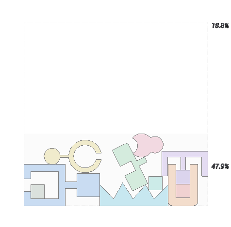 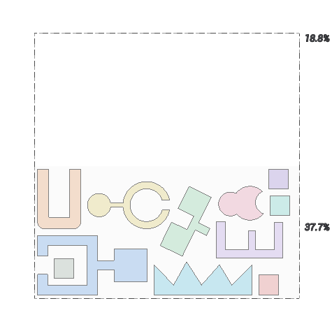

<strong>Margin.</strong> Defines the unused border area along the sheet edges.

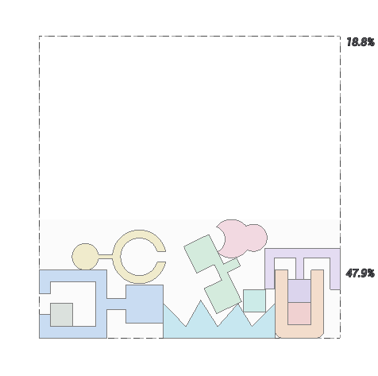 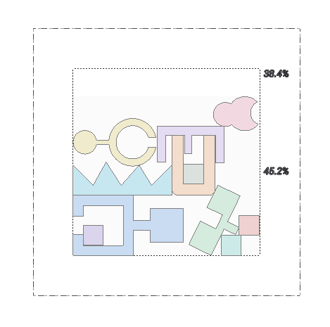

### Manual editing.

Use **Manual editing** to adjust the arrangement of parts on the current sheet.

Click here to expand..

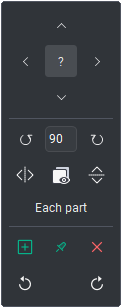

**Arrow buttons (←, →, ↑, ↓).** Move the selected part until it touches an adjacent contour or the edge of the sheet.

**?** Hides tooltips.

**Rotate.** Rotates the selected contour around its center by the specified angle increment.

Hold **R** and scroll the mouse wheel to rotate the selected contour around the cursor position. If multiple contours are selected, hold **E** and scroll the mouse wheel to rotate each selected contour around its own center. Each mouse wheel step rotates the contour by **5°** by default. Hold **Shift** for **1°** increments or **Alt** for **90°** increments.

**Angle like a sample.** Copies the rotation angle and mirroring from another contour. Select the contour you want to modify, press **A**, and then click the contour whose properties you want to copy.

**Mirror.** Mirrors the selected contours horizontally or vertically. If multiple contours are selected, enable **Each part** to mirror each part relative to its own center.

**Remove.** Removes the selected contours from the nesting layout and adds them to the **Unnested Copies** list.

**Add.** Adds the contours selected in the left panel from the **Unnested** or **Nestable** list to the current sheet.

**Placed by Hand.** Locks the selected contour in its current position on the sheet.

**Undo.** Reverses the last action.

**Redo.** Restores the last action that was undone.

**Editing behavior:**

- Hold **Ctrl** to perform these actions without collision or sheet boundary checks.
- A **red outline** indicates a copy that violates the required clearance from an adjacent part or the sheet edge.
- **Ctrl+Z** and **Ctrl+Y** work throughout the entire window. They can undo or redo manual edits, **Run**, **Remove Sheet**, and changes made to sheets.
- Removing a sheet or changing its size clears the **Placed by Hand** status.

### Settings button.

Click here to expand..

The <strong>New sheet defaults</strong> popup is opened from the gear icon in the top-right corner. It defines default parameters for sheets added to the nesting.

<strong>Stock format.</strong> Selects a predefined stock format or <strong>Custom</strong> for manually specified dimensions.

<strong>Length and width.</strong> Define the dimensions of every newly added sheet.

<strong>Tech gap.</strong> Defines the technical gap used when placing parts on a new sheet.

<strong>Margin.</strong> Define the unused top, bottom, left, and right areas of every newly added sheet.

### Creating the layout.

Click here to expand..

<strong>Open the Model Tab</strong>

In <strong>Ency</strong>, go to the <strong>Model</strong> tab.

<strong>Import the Model</strong>

Import the following model from the standard Ency library:

Milling_25D\3 curves.3dm

<strong>Create a Nesting Layout</strong>

Right-click on the contour and select <strong>Create Nesting</strong> from the context menu.

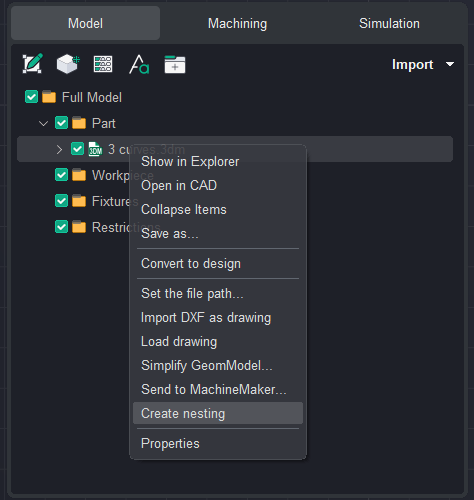

<strong>Open the Nesting Window</strong>

The <strong>Setup nesting</strong> window will open. This window contains the parameters used to configure the nesting layout.

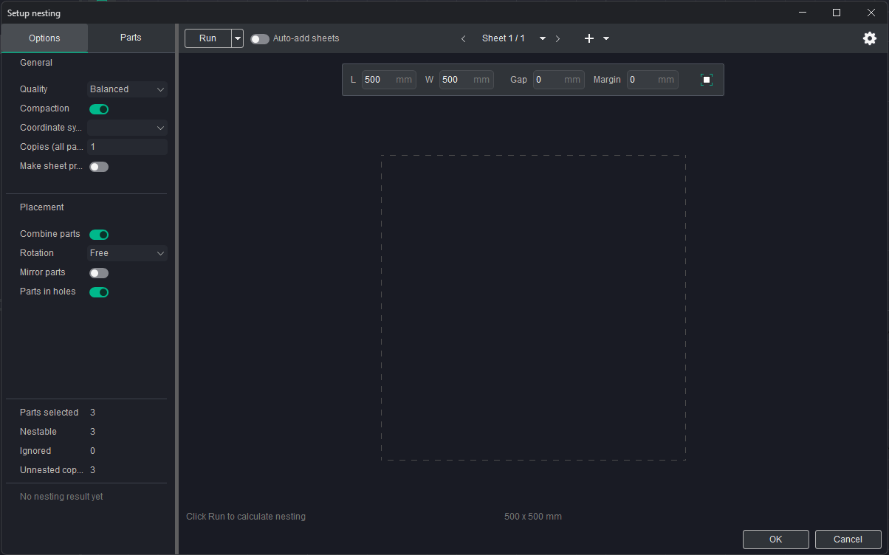

<strong>Set the Nesting Parameters</strong>

Set the following parameters:

- <strong>Copies</strong> — 3
- <strong>Rotation</strong> — Off
- <strong>Width</strong> — 100 mm
- <strong>Length</strong> — 100 mm
- <strong>Gap</strong> — 3 mm
- <strong>Frame</strong> — 10 mm

Make sure all parameters are entered correctly before proceeding.

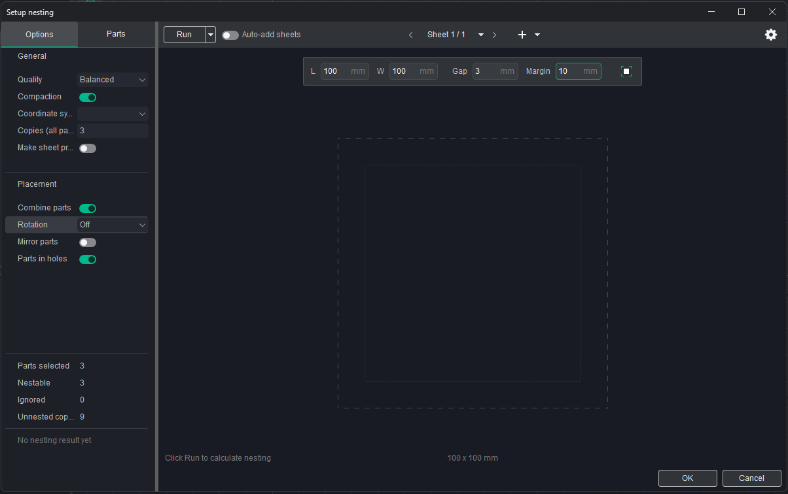

<strong>Run the Nesting Process</strong>

Click <strong>Run</strong> and wait for the nesting process to complete.

Once the layout has been generated, review the result. If you are satisfied with the arrangement of the parts, click <strong>OK</strong> to confirm it.

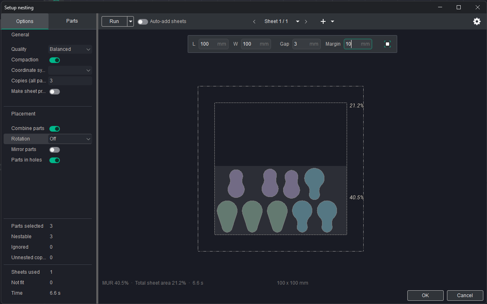

<strong>Review and Edit the Result</strong>

After confirming the nesting layout, a new folder containing the generated layout will be automatically created in the <strong>Parts</strong> folder.

If necessary, the generated nesting layout can be edited manually.

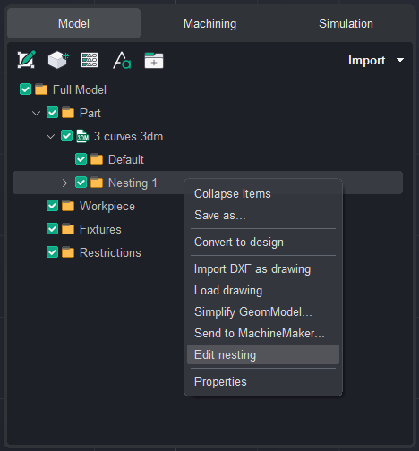

