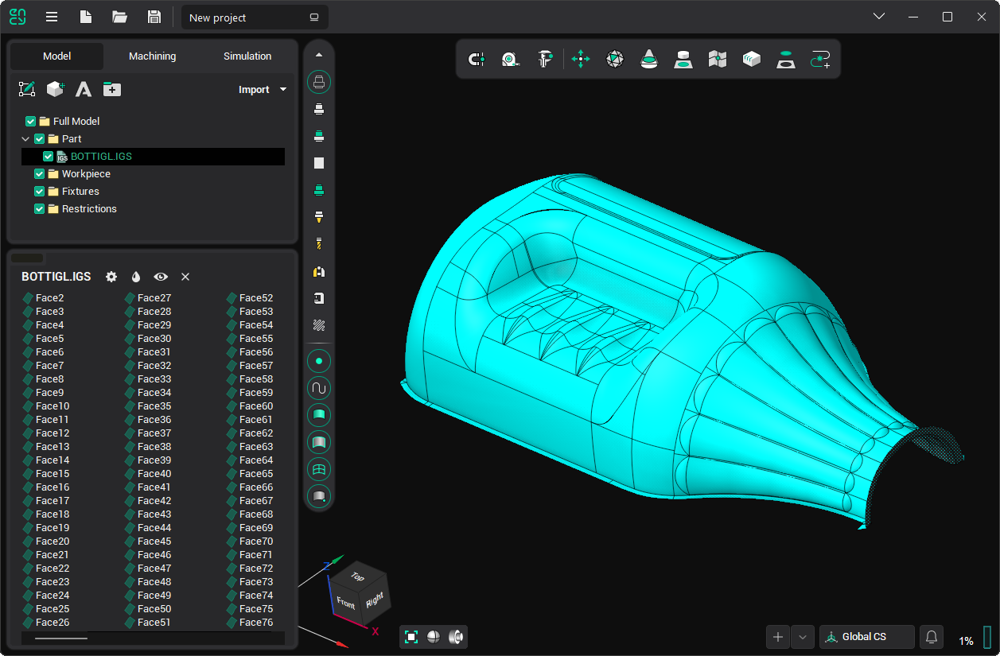
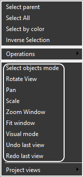
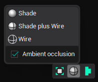
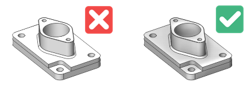
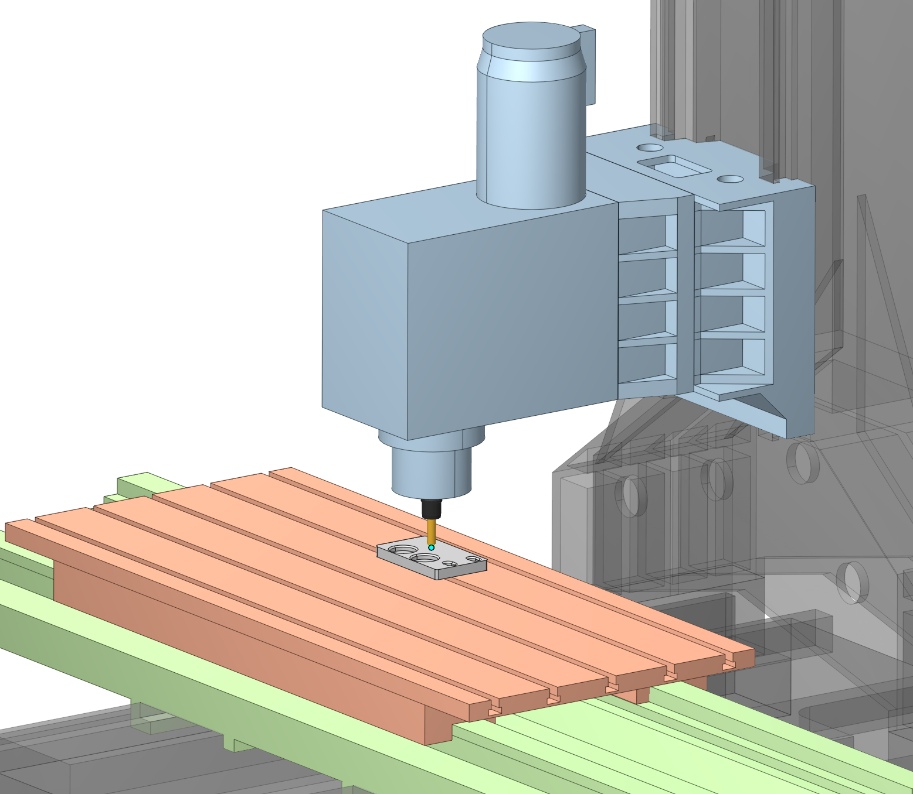
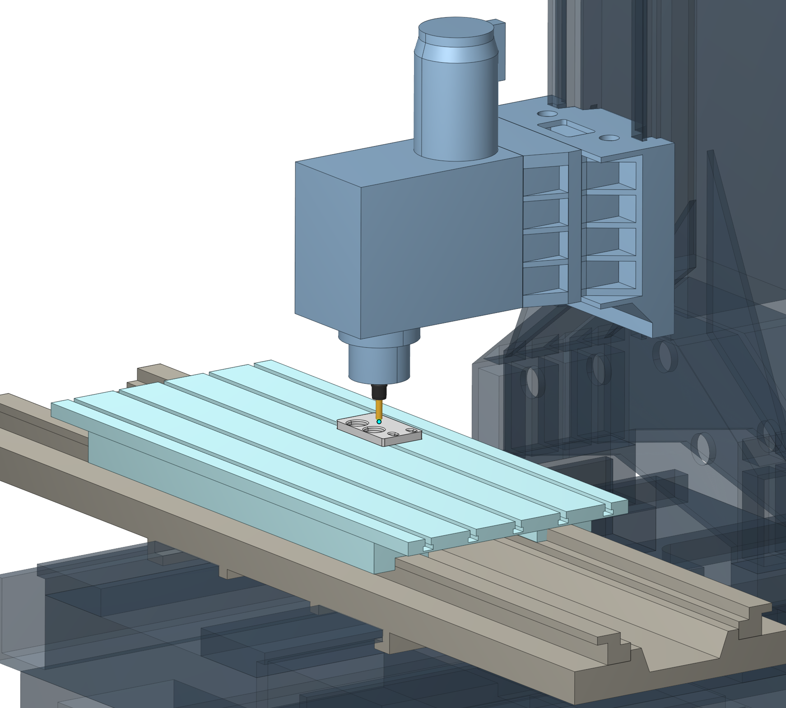
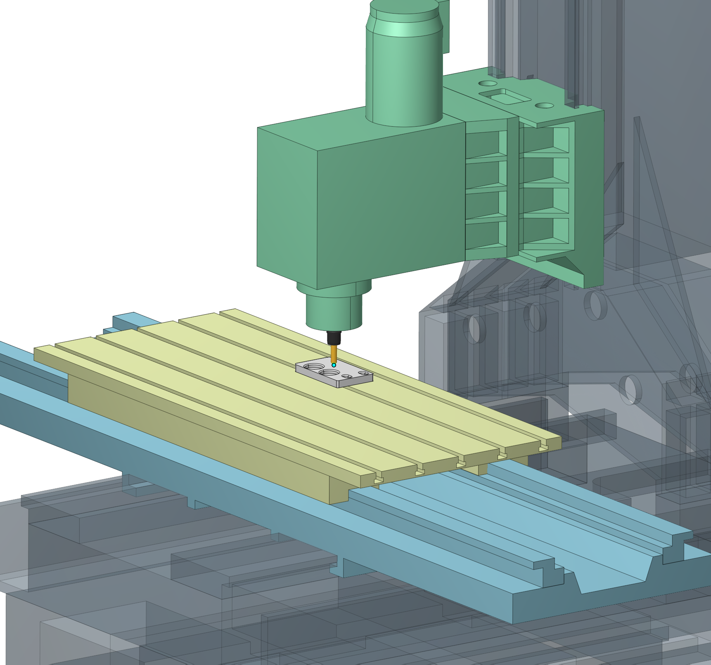
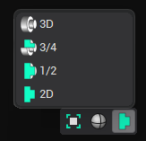

# Graphic window and visualization control

The main part of the screen is occupied by a <strong>graphic window</strong>. It can display objects such as geometric models, machines, workpieces, toolpaths, etc.

Some visualization control hotkeys can be changed in the [System settings](90.md) window on the [Visualization](24.md) tab.

Visualization parameters can be changed using the View Control toolbar on the left side of the main window or via the context menu of the graphic screen:

 

The first four elements switch the actions performed by the left mouse button:

- [Select objects mode](325.md): Left-click will select objects from the screen (this is the default state).
- [Rotate view](20.md): Moving the mouse while pressing the left button will rotate the view.
- [Pan](19.md): Moving the mouse while pressing the left button will shift the view.
- [Scale](855.md): Moving the mouse while pressing the left button will scale the view.

However, all these actions can be easily performed without changing the mode:

- To rotate the view, move the mouse with the right button pressed.
- To shift the view, move the mouse while pressing the middle button.
- Rotate the mouse wheel to zoom.

There are additional methods for changing the view using hotkeys. See the following topics: [Window zoom](11.md), [Interactive rotate](20.md), [Interactive pan](19.md),[Interactive zoom in-out](855.md), [Zoom extents](60.md).

For quick scaling to display all visible objects, use the  button or the [Fit window](60.md) menu item.

Several [standard views](728.md) can be switched using these buttons (the exact appearance of the button depends on the type of machine).

Use the [Undo](358.md)/ [Redo](332.md) menu items to quickly return to the previous or next view.

## Display mode settings:

The  button with the drop-down menu allows you to switch the display mode of three-dimensional objects:

- <strong>Shade</strong>: shaded without edges
- <strong>Shade plus Wire</strong>: shaded with edges
- <strong>Wire</strong>: edges only

Clicking on the button itself toggles these modes alternately.

<strong>Ambient occlusion</strong> is a shading and rendering technique used to calculate how exposed each point in a scene is to ambient lighting. See the example below.

**Ground plane.** Shows a reference plane that helps assess the orientation of the scene.

**Equipment color schemes.** Control the colors used to display the machine. Contrasting colors distinguish kinematic links, while static components remain neutral.

- **Project Colors.** Preserves the original model colors.
- **Gunmetal.** Applies an industrial color palette.
- **Restrained.** Applies an alternative industrial color palette.

*Robot manipulators retain their native manufacturer colors in every scheme.*

*Examples of equipment color schemes in the 3D view.*

Display settings for individual objects are available on the **Visibility panel**. [Details](359.md#common-display-settings)

## Turn mode:

The  button above defines a visualization mode for revolution bodies only:

- 3D
- 3D without a quarter
- Half of 3D
- 2D axis section.

## Interactive linear axis ruler:

The **interactive linear axis ruler** displays the current coordinate and travel limits when a machine node is dragged along a linear axis in the **3D view**. [Details](100167.md)
