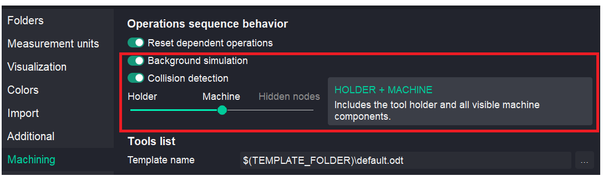
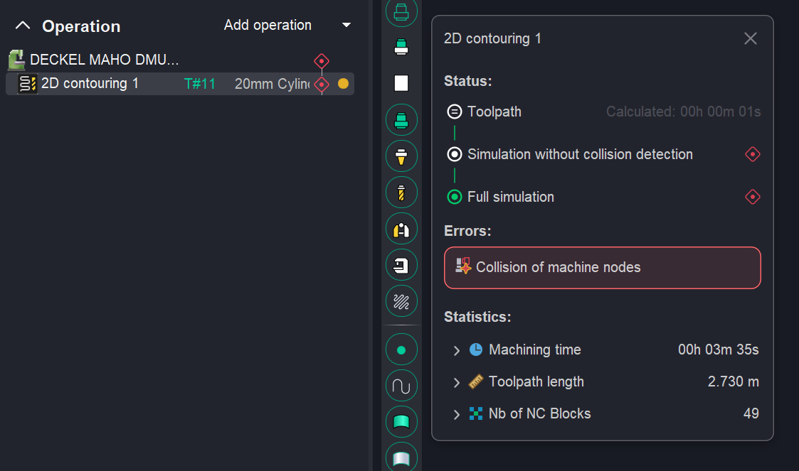
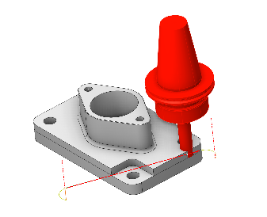
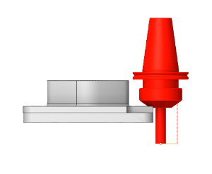
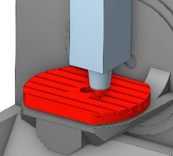
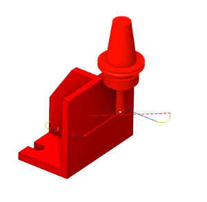
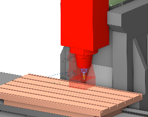

# Collision Detection in Background Simulation

 

## Application area:

The <strong>Collision Detection</strong> feature in <strong>Background Simulation</strong> automatically verifies toolpaths for physical interferences with the machine and workholding equipment without interrupting the user's workflow. After the trajectory calculation is complete, the <strong>Technology tab</strong> displays not only the calculated toolpath but also the workpiece model after machining. Additionally, the system generates alerts for any detected gouges or issues with machine components.

This functionality is particularly useful for simple projects or scenarios where fine finishing operations with small stepovers are not required. As a result, the user can continue designing the manufacturing process directly in the Technology tab without launching a separate machining simulation, enabling immediate assessment of the final result.

However, calculating the results of <strong>Background Simulation</strong> requires significant computational resources and time, consuming a substantial portion of the central processing unit (CPU) capacity and random‑access memory (RAM) volume. This leads to a noticeable increase in the time required for simulating machining results and trajectory monitoring when a large number of dependent operations need to be recalculated, multiple workpiece re‑setups are required, or fine finishing with a very small stepover is performed.

Firstly, you have the option to <strong>disable all Background Simulation calculations</strong>. If you do so, the CAM system will generate the toolpath based solely on the 3D model. You can then verify the processing results at a later stage in the <strong>Simulation tab</strong>. However, the CAM system includes certain automated

operations that require the results of the previous processing step. These operations include:

1. Roughing waterline;
2. Roughing plane;
3. Pocketing;
4. Hole machining;
5. All turning operations.

For these operations, the CAM system will automatically enable the calculation of the previous processing results when generating toolpaths — even if background calculations are otherwise disabled.

There are two switches in the settings on the <strong>Machining tab</strong> that control background simulation:

1. <strong>Background simulation</strong> is needed to calculate the intermediate workpiece. It will also indicate if the workpiece is being cut at non-cut feeds; however, it will not detect collisions with the arbor, fixtures, or machine tool. Error detection requires the configuration of appropriate filters.
2. To enable background collision detection, the <strong>Collision Detection</strong> option must be <strong>activated</strong> in the system settings. Once this option is enabled, a list of verification criteria becomes available. The user can select one of the following collision‑checking modes:

- <strong>Holder</strong> - Check collisions with the tool holder only. Fastest computation.

 

- <strong>Machine (Holder+Machine)</strong> - Includes the tool holder and all visible machine components

 

- <strong>Hidden nodes (Holder+Machine + Hidden nodes) -</strong> Full check: includes holder, machine, and hidden machine nodes default by the user.

The more elements included for verification, the longer the operation calculation will take. Upon completion of the check, the user is presented with the status of each operation. [Details](1118119.md)

In addition to <strong>Background Simulation</strong>, you can run step-by-step simulation on the <strong>Simulation tab</strong>. The key aspects of the interaction between <strong>Background Simulation</strong> and <strong>step-by-step simulation</strong> are covered in another chapter of the documentation. [Details](742.md)
