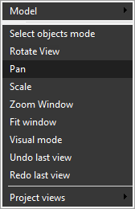

# Interactive pan

Press and hold the [<strong>Middle Mouse Button</strong>] (Mouse Wheel), then drag on the main visualization screen to move graphic objects to a new location.

Alternatively, use the [<strong>Left Mouse Button</strong>] with the <strong>Pan</strong> mode enabled, which can be activated from the pop-up menu of the graphic window.

