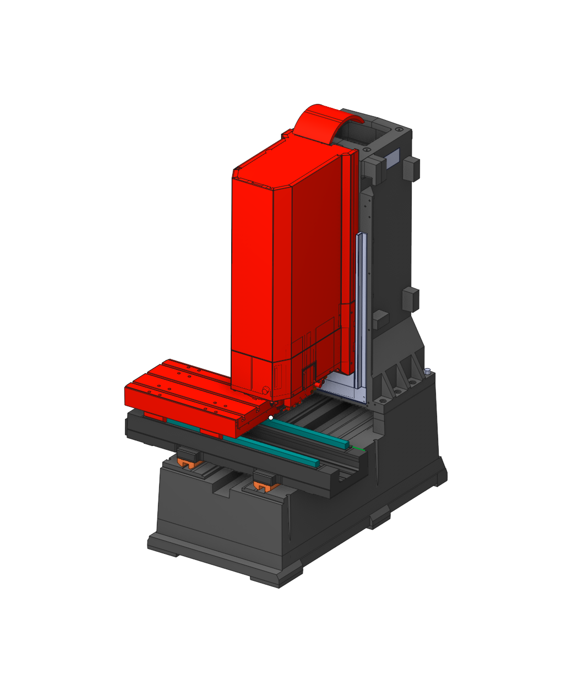
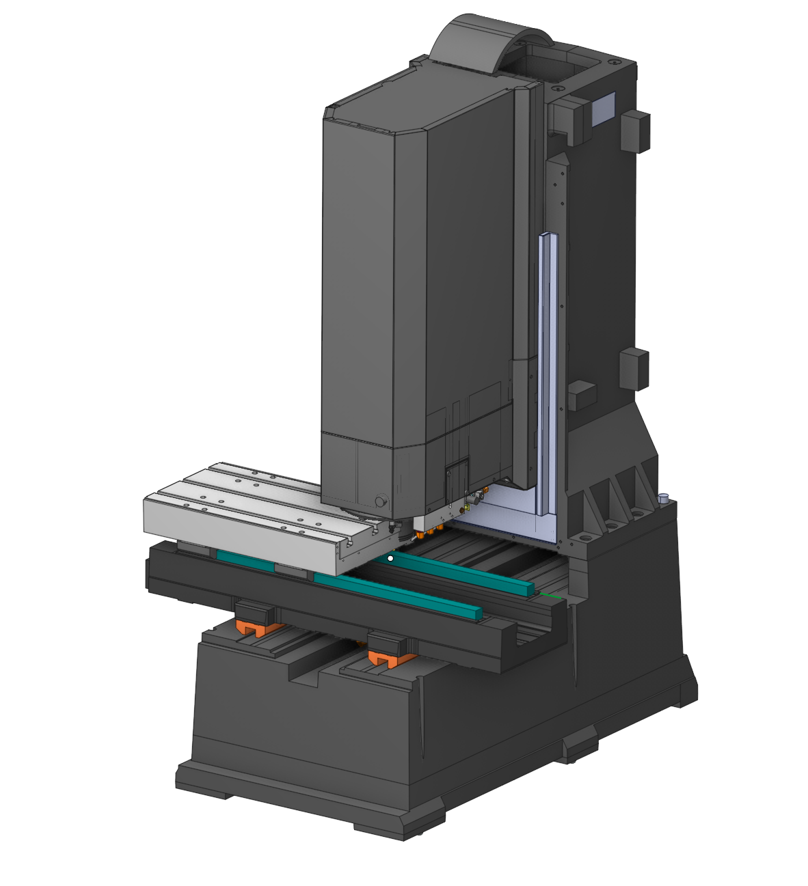
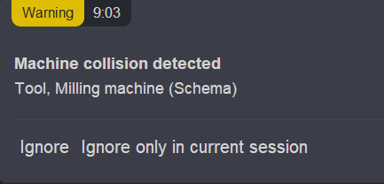
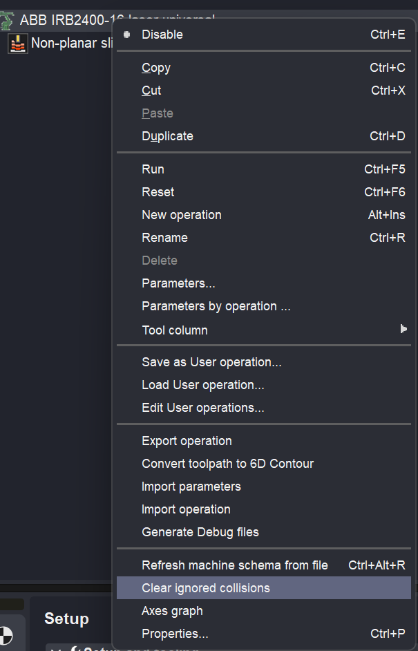

# Editing of the Collisions Ignore List

 

## Application area:

Implemented direct editing of the <strong>CDIgnoreList</strong> section in the machine scheme directly from CAM system. Previously, editing required manual data entry in Notepad or the use of MachineMaker.

When a collision occurs during simulation, a notification appears indicating that a collision between nodes has occurred. A <strong>Ignore</strong> or <strong>Ignore only in curent session</strong> button has been added to this notification.

### Functionality:

1. When a collision is detected during a simulation, a notification alerts the user, specifying the colliding nodes (e.g., node X and node Y). This notification includes an <strong>Ignore</strong> or <strong>Ignore only in curent session</strong> buttons. Pressing the "Ignore" button adds the identified node pair to the CDIgnoreList, effectively ignoring future collisions between those specific nodes.

<strong>In the first case</strong>, a file with the extension ".cdil" is created next to the machine kinematics file. If the file doesn't exist, it is created.

When creating a new CAM project, the system references a machine. If an ignore list file exists next to the machine file, it is loaded from there; otherwise, the data is loaded directly from the machine file.

<strong>In the second case</strong>, a file is not created. Everything only works within the current session.

2.The file can be cleared through the machine's popup menu (on the <strong>technology tab</strong>).

