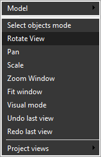

# Interactive rotate

Press and hold the [<strong>Right Mouse Button</strong>], then drag on the main visualization screen to rotate. Alternatively, use the <strong>Rotate View</strong> item from the pop-up menu of the graphic window to activate the rotate view mode.

Drag up and down to rotate around the horizontal axis; drag left and right to rotate around the vertical axis.

Press and hold the <strong>[X], [Y], or [Z]</strong> key, and drag the mouse to rotate around the X, Y, or Z axis of the active coordinate system.

Hold <strong>[Space]</strong> while rotating to loop the rotation and animate it continuously. Press the <strong>[Esc]</strong> key to exit the continuous rotation mode.

Changing the view vector is also possible via the [Standard views](728.md) button.

Clicking the [<strong>Middle Mouse Button</strong>] (Mouse Wheel) in the graphic window performs a complete rotation of the current view vector to the nearest standard view.

The software also supports various 3D mouse devices, such as the SpaceNavigator.
