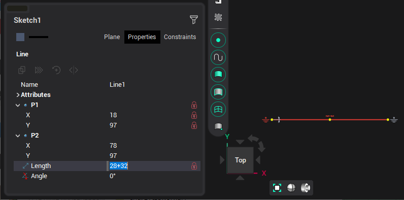
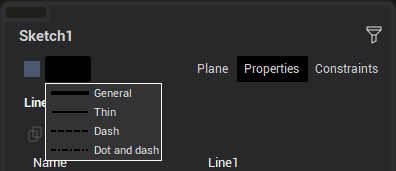
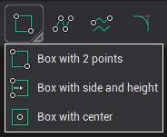

# Building and editing elements

Almost all elements are built according to a typical scenario: the first nod point of the object is indicated, then the next ones and subsequent ones. When the last point is built, the construction of the object ends and the construction of the next object of the same type begins. In order to stay in the element editing mode, you must press the <strong>[Shift]</strong> key and only then specify the last point.

An alternative way of building is to enter point coordinates or parameters in the <strong>Property inspector</strong>. Entering numerical values supports the calculation mode. It means, that you can enter a value in the form of a simple formula:

Pressing the <strong>[Esc]</strong> key at any time will cancel the element building. The same result is obtained by pressing the element building button again.

When building and editing an element, you can set its color and line type. These parameters are controlled by the buttons located above the inspector.

Also, the line type can be changed with a keyboard shortcuts <strong>[Alt+1]</strong>, <strong>[Alt+2]</strong>, <strong>[Alt+3]</strong>, <strong>[Alt+4]</strong>.

Some objects allow you to build them in different ways. To select an alternative method, you need to click on the triangle in the lower right corner of the button, or right-click and select the desired item in the drop-down menu.

Exceptions are such elements as: chamfers, fillets, dimensions and hatching, which will be indicated in the description of these elements.
