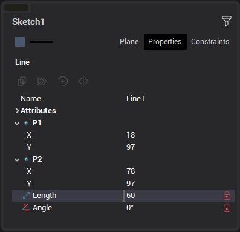
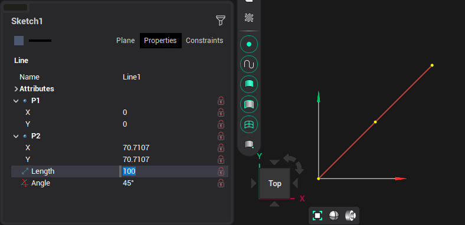
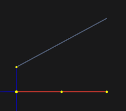
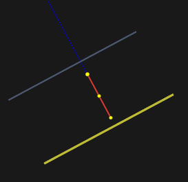
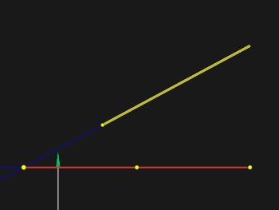
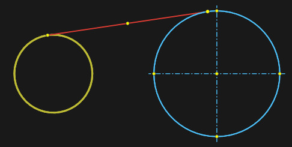

# Line

<strong>Line</strong> is built on two points and has a point lying on the line and divides it in half. The line is constructed by specifying the coordinates of the end points of the line in the <strong>Property inspector</strong>. Also, using the mouse, you can move the line beyond its midpoint without changing its length and rotation angle. When the cursor captures the end points of a line, it is possible to dynamically change its length and rotation angle. If you press the <strong>[Shift]</strong> key, the line is moved without changing its length and angle. Double-click on a circle or arc will create axis lines for that arc or circle.

Line parameters in the <strong>Property inspector</strong> window:

When editing a line, all these parameters can be fixed by clicking the "lock" symbol in the inspector, or the appropriate icon on the line itself.

When building and editing a line, it is possible to use the help of guide lines. By default, guides are offered at 0°, 45°, 90° and the angle at which the segment was previously created in edit mode.

In addition, you can create guides by hovering over a point on a previously created object:

If you press the <strong>[Ctrl]</strong> key while drawing a line and hold the cursor over a previously created line, then perpendicular and parallel guides to this line, as well as a line that is a continuation, will be additionally proposed.

If an arc or circle was specified with the <strong>[Ctrl]</strong> key pressed, then a line tangent to the given arc/circle will be constructed. This applies to both the first and second points of the line.

