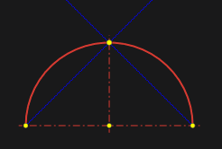
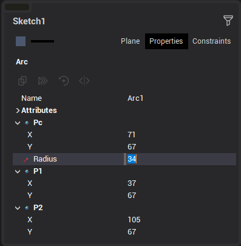
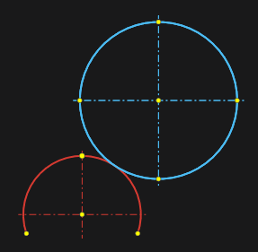

# Two points and radius

To construct an arc, you must sequentially specify the first, second, and midpoint of the arc.

Arc parameters in the <strong>Property inspector</strong> window:

When defining an arc, it is possible to use the help of guide lines. By default, guides are offered from the first or second point at angles of 0°, 45°, 90° and relative to the center and midpoint of the arc in editing mode.

In addition, you can create guides by holding the cursor over a point on a previously created object, like building or editing a line.

If during the construction in the last step a segment, arc or circle was specified with the <strong>[Ctrl]</strong> key pressed, then an arc tangent to this element will be constructed.

