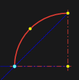

# Center, starting point and angle

To construct an arc, you must consistently specify the center, first and second points of the arc.

Arc parameters and their fixation are completely similar to the first construction method.

Guides are offered from the center (after specifying it), and then additionally from the first point of the arc.

