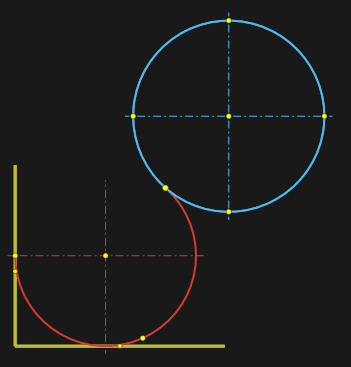
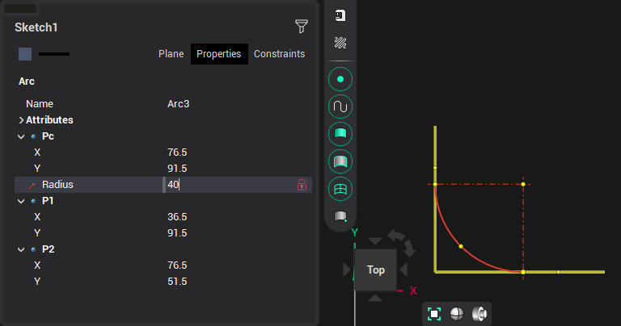

# By three tangents

To construct an arc, you must sequentially specify three objects to which the arc should be tangent, with the <strong>[Ctrl]</strong> key pressed

Or specify two objects and enter the radius of the arc:

