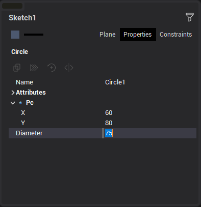
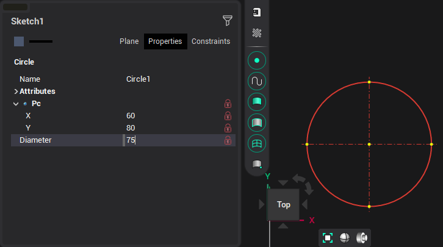
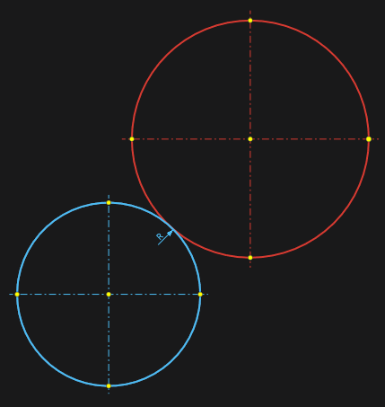

# Build Circle with Center and radius. Edit circle

To build a circle, you need to specify the center point with the cursor, or enter the coordinates in the inspector. Specify the radius, in the same way, interactively, or by entering the diameter value in the inspector. You can also press <strong>[R]</strong> to switch to radius input mode or <strong>[D]</strong> to switch back to diameter input mode.

When editing a circle you can modify it directly in graphical window by moving circle points or change circle properties in inspector panel. Axis lines for the circle can be added by selecting <strong>Line</strong> and double-clicking on the circle.

Circle parameters in <strong>Property inspector</strong>:

Circle parameter values can be fixed by clicking "lock" button in the editor field or by clicking constraint icon in the graphic window.

If it is necessary to construct a circle with a given center and a tangent to another object, then press the <strong>[Ctrl]</strong> key when specifying this object.

When defining or changing a circle, you can use the help of guide lines. By default, guides are offered at angles of 0°, 45°, 90° from the edited point.
