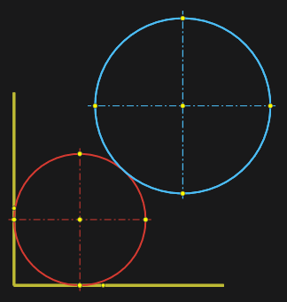
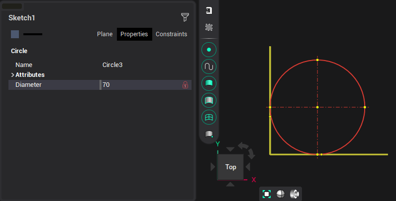

# Circle by three tangents

To construct a circle, you must sequentially specify three objects to which the circle must be tangent with the <strong>[Ctrl]</strong> key pressed.

Or specify two objects and enter the radius of the circle:

