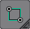
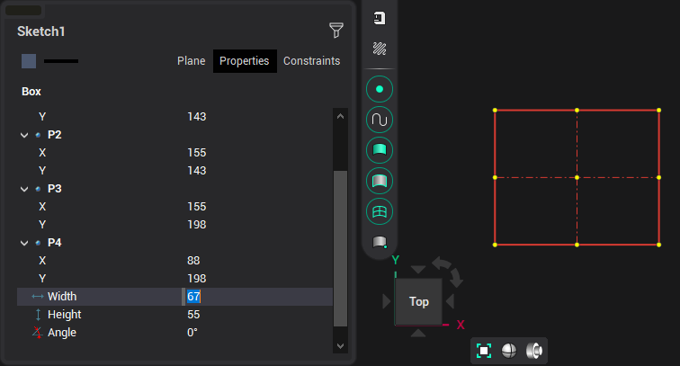

# By two points

The rectangle is built by specifying two diagonal points interactively, or by specifying the coordinates of the first point and the width/height of the rectangle in the inspector. You can rotate a rectangle only by changing the angle of rotation in the inspector.

Rectangle options in the <strong>Property inspector</strong> window:

When defining a rectangle, you can use the help of guide lines. By default, guides are offered from the point being edited and the opposite point at angles of 0°, 45°, 90° and along a straight line passing through these points.
