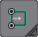
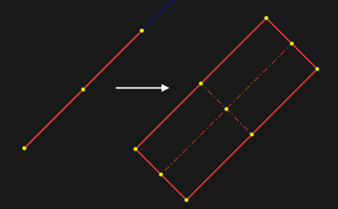
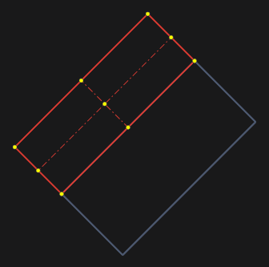

# By side and height

First, one side of the rectangle is specified, and then it is stretched in height. This allows you to build rectangles at the angle you need.

You can also specify an existing line and the side will be copied from this line.

