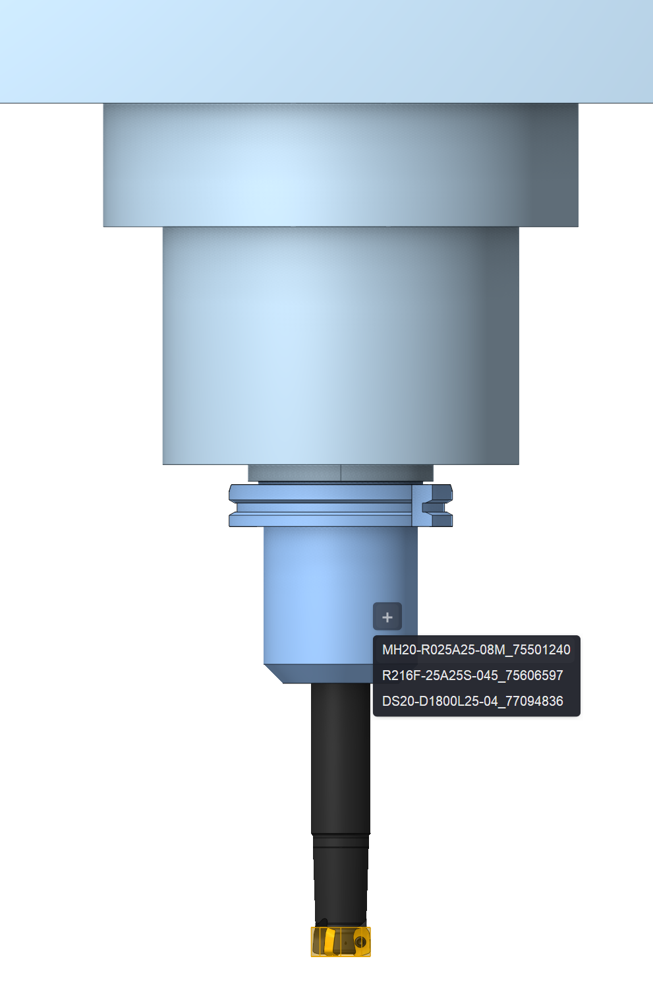
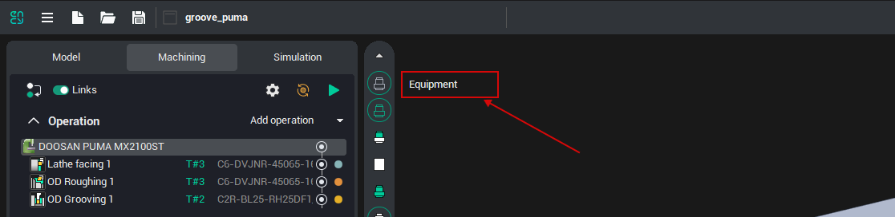

# Tool assemblies

  

## Application area:

Tool assemblies are the CAM system mechanism for describing tooling as a set of connected components — a cutting tool mounted into one or more adapters that plug into a machine magazine. The mechanism is designed to <strong>automate tool selection</strong>, which is an essential stage of process planning and a prerequisite for the automatic generation of a machining process.

Automatic process generation is not possible without solving the automatic tool selection task. For that task to be solvable, two conditions must hold:

- The tool must be present in the user database.

- An adapter must exist that ensures correct mounting of the tool into the machine magazine.

### Tool operation modes.

The CAM system supports two modes of working with tooling:

- <strong>Classic tools mode.</strong> The standard mode of working with tools.

- <strong>Advanced tools mode.</strong> The mode of working with tool assemblies. When the system is in advanced mode, the <strong>Equipment</strong> button is shown on the technology page.

