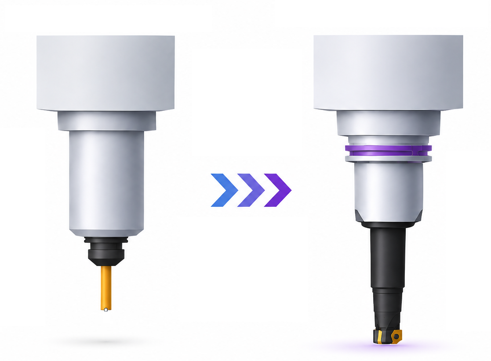
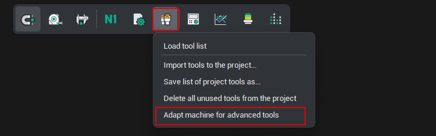
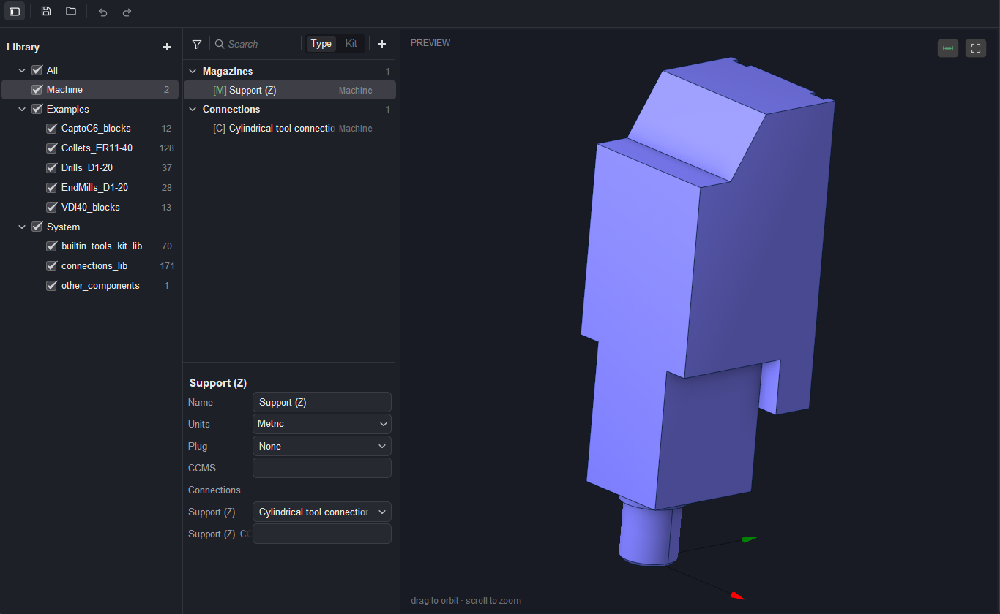
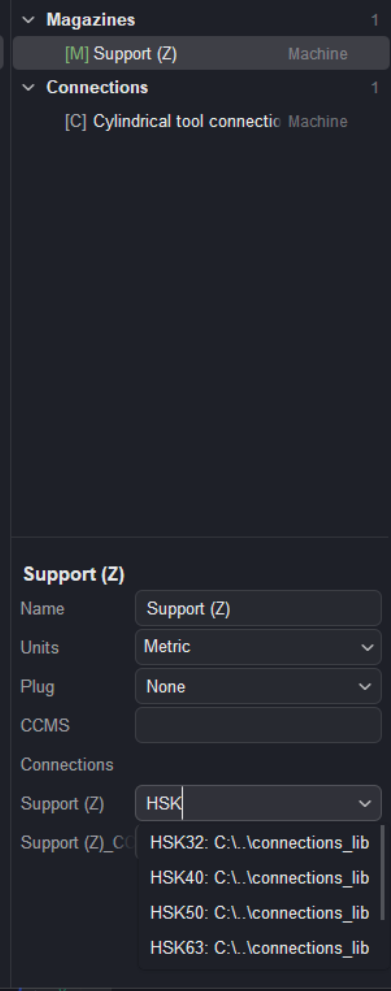
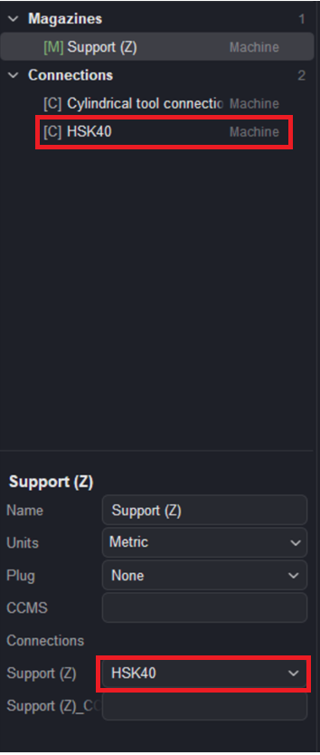
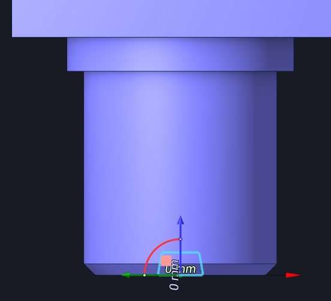

# Adapting a machine for advanced tools mode.

## Application area:

The ability to switch to advanced mode is determined by the machine scheme in use. A machine scheme in the old (classic) format cannot work with tool assemblies directly — it must first be adapted to the new format.

Adaptation is performed by the <strong>Adapt machine for advanced tools</strong> command, available in the tools menu when the active machine scheme has not yet been adapted. During adaptation, a machine <strong>library is formed (machine kit)</strong>. The <strong>machine kit</strong> file always resides next to the <strong>machine scheme</strong> file and contains a special component type — the magazine (a component that has sockets of a specified connection type and no plug).

After the machine has been adapted, the Component libraries window opens. It already contains the machine nodes (magazine components) that hold the mounting point for the tool assembly. Initially, a machine node carries a standard connection — in this case a Cylindrical tool connection, shown under Connections and assigned as the node's Support (Z) connection.

<strong>Assigning a connection.</strong> A connection does not have to be invoked from the menu via the + button. Its name can be typed directly into the connection field. The value can either be selected from the suggested options or defined as a new one. After a new name is entered in the field, a new connection type is created.

If a connection is selected from the library, all its dimensions are taken into account in accordance with the standard

  

> Note
>
> When the window is closed, an *<strong>.mKIT file</strong> — the setup file — is created next to the machine. This file contains all tools bound to that machine.

Returning to <strong>classic mode</strong> is performed from the same menu with the <strong>Activate classic tools</strong> mode command.
