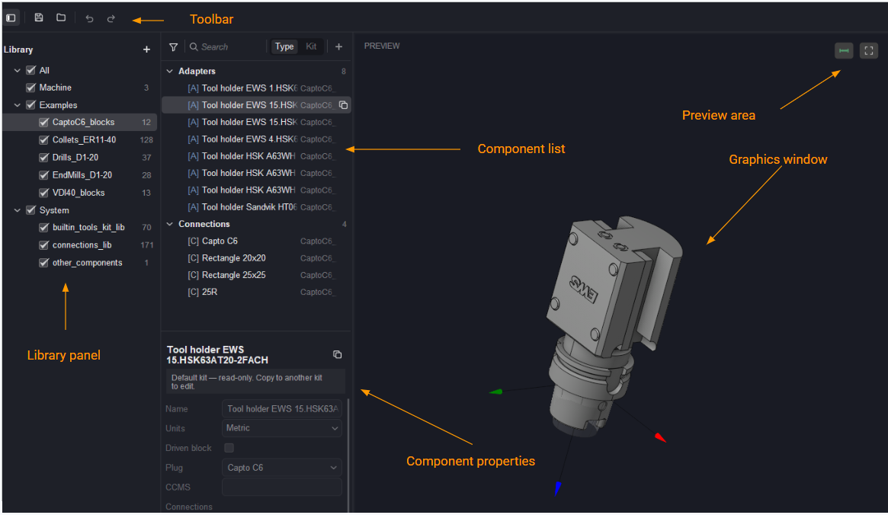

# Component libraries

## Application area:

The <strong>Component libraries</strong> window is the editor for component libraries — the storage where the building blocks of tool assemblies are kept: cutting tools, adapters, machine magazines, and the connections that join them. Each component has a visual representation, is defined by its dimensions, and carries a shank (<strong>Plug</strong>) and, for adapters and magazines, one or more seats (<strong>Sockets</strong>) of a specific connection type.

The window is used to prepare and maintain the tooling data that makes automatic tool selection and tool-assembly formation possible.

The component library window is opened by the corresponding toolbar button (in <strong>advanced mode</strong>).

### Component libraries consist of the following components:

<strong>Toolbar (top-left).</strong>

- <strong>Toggle panel.</strong> Shows or hides the left <strong>Library</strong> panel.

- <strong>Save.</strong> Saves changes to the library file on disk.

- <strong>Open.</strong> Opens a library file from disk.

- <strong>Undo.</strong> Cancels the last change.

- <strong>Redo.</strong> Repeats the previously cancelled change.

<strong>Library panel.</strong>

- <strong>Add (+).</strong> Adds a new (user) library to the panel.

- <strong>Category / library checkboxes.</strong> Toggle the visibility of a category (<strong>All</strong>, <strong>Machine</strong>, <strong>Examples</strong>, <strong>System</strong>) or an individual library in the component list.

A library is stored on disk as a file. Component libraries fall into the following categories:

- <strong>All.</strong> The top-level node that shows all libraries at once — every category and its libraries are displayed together.

- <strong>Machine.</strong> Formed during adaptation of a machine scheme for work in <strong>advanced tools mode.</strong> A machine library file always resides next to the <strong>machine scheme file</strong>. Such a library contains a special component type called a magazine. A machine magazine is a component that has sockets with a specified connection type and has no plug. When a machine scheme is activated, the library located next to it is activated automatically.

- <strong>Examples.</strong> Reference libraries supplied with the software.

- <strong>System.</strong> Libraries supplied and maintained by the CAM system.

<strong>Component list (central panel).</strong>

- <strong>Filter.</strong> Opens filtering options for the component list (funnel icon).
- <strong>Search.</strong> Filters the list by the entered component name.
- <strong>Type.</strong> Switches the list grouping to view by component type (Magazines, Connections, Tools, …).
- <strong>Kit.</strong> Switches the list grouping to view by kit (source library).
- <strong>Add (+).</strong> Creates a new component in the current library.

<strong>Component properties (lower panel):</strong> <em>(fields, not buttons)</em> <strong>Name</strong>, <strong>Units</strong>, <strong>Plug</strong>, <strong>CCMS</strong>, and the <strong>Connections</strong> list (<strong>Support (Z)</strong>, …).

<strong>Preview area.</strong>

<strong>Show dimensions.</strong> Toggles the display of component dimensions in the 3D preview.

<strong>Zoom to fit.</strong> The model is rotated by dragging and zoomed with the scroll wheel (<em>drag to orbit · scroll to zoom</em>).

### Forming libraries.

Filling a component library covers the following activities.

- <strong>Creating built-in parameterized components.</strong> The <strong>Plug</strong> and <strong>Sockets</strong> must be filled in, preferably with standard connections.

- <strong>Creating objects from 3D models.</strong> The fields used by filters must be filled in.

- <strong>Working with filters.</strong> Filter fields drive the search for suitable components.
