# Building a tool assembly

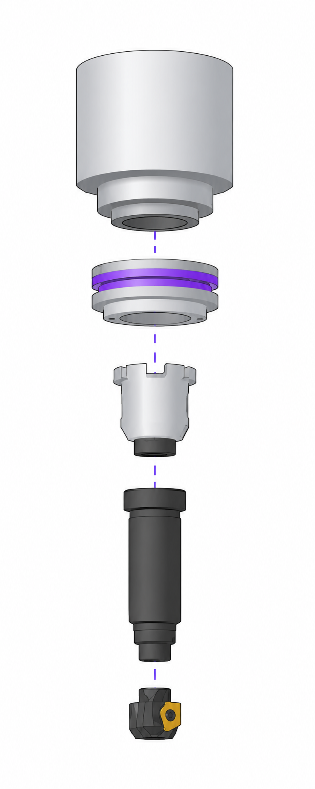

## Application area:

This example shows how a simple assembly is built in the <strong>Component libraries window</strong> — a milling tool joined to an adapter that plugs into the machine magazine. The assembly is created bottom-up, from the cutting tool to the machine mounting.

### Add the component and check recognition.

A component is added from a 3D model. The system <strong>automatically tries to recognize</strong> what has been loaded — whether it is a tool or an adapter (holder), and, for a tool, its type. The recognition result can be corrected by the user with the <strong>Adapter / Turn tool / Mill tool</strong> tabs, and the tool type is refined in the <strong>Tool type field.</strong> The component and its dimensions are shown in the Preview.

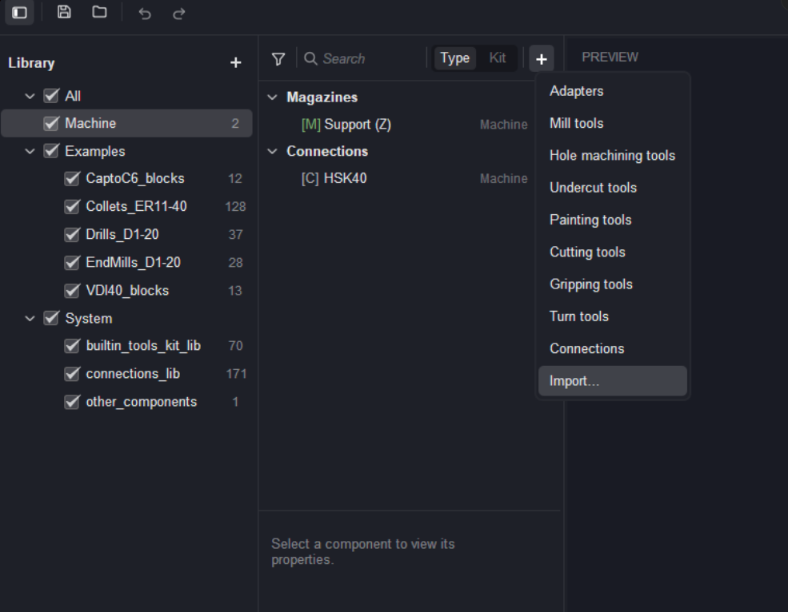 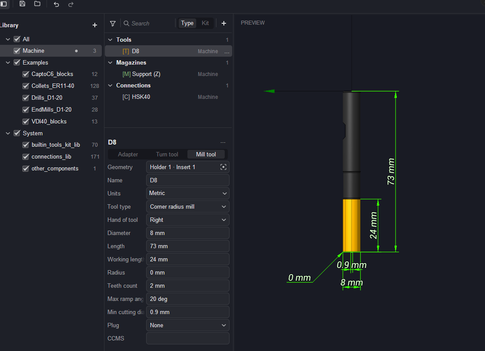

### Assign the tool plug

The tool needs a shank so it can be inserted into an adapter. The connection name is entered in the <strong>Plug field</strong> — either selected from the suggested options or defined as a new one (here, D8). If the connection is selected from the library, all its dimensions are taken according to the standard.

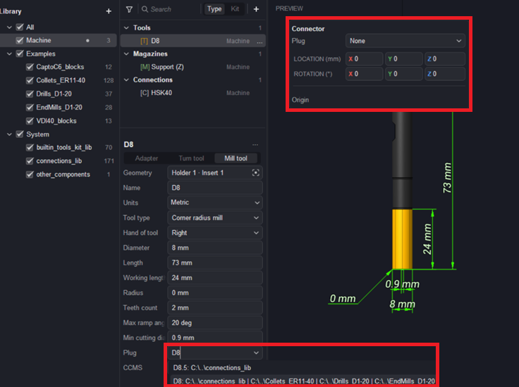

### Check and position the plug connection.

With the <strong>plug</strong> assigned, the <strong>Connector panel</strong> becomes available. It shows the <strong>connection Plug</strong>, its <strong>LOCATION</strong> and <strong>ROTATION</strong>, and the <strong>Origin controls</strong>, together with the connection's own properties: Type (Cylinder), Height (20 mm), Diameter (8 mm), and Axis (Z). The plug is highlighted on the model in the Preview. Using <strong>Origin</strong>, the connector must be positioned correctly relative to the component. This is done with the <strong>+Z / −Z controls (as well as Top / Bottom)</strong>, or simply by dragging the <strong>coordinate system</strong> in the Preview.

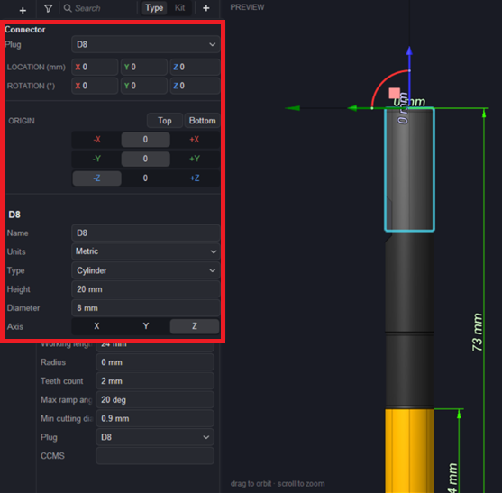

### Create the adapter.

The Add (+) button is pressed again and <strong>Adapters</strong> is chosen. A new adapter is added to the Adapters group.

### Set the adapter's plug and add a socket

The adapter needs two connections: a <strong>plug</strong> to mount it into the machine and a <strong>socket</strong> to receive the tool. In the adapter properties the Plug field is set to the connection that mounts the adapter into the machine magazine — here HSK40 — and in the Connections section the Socket 1 is set to the connection D8, the same type as the tool's plug. In this case both the Plug and the Socket are chosen from the list.

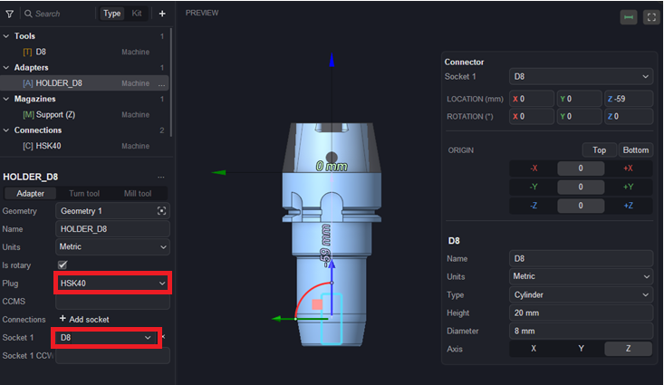

### Automatic assembly in the operation.

When the components are available in the libraries, the system automatically attempts to build a tool assembly for the operation from the existing components. In the operation's <strong>Tool assembly panel</strong> the assembly is composed and shown: the Tool (D8), the Adapter (HOLDER_D8), the magazine Position, and the Corrector (Auto). The assembled tool is mounted on the machine and displayed in the graphics area.

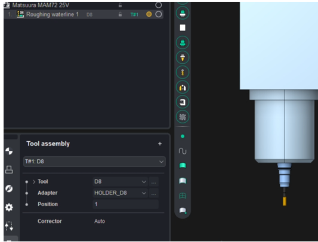

### Result.

The assembly is complete and used by the operation: the D8 tool plugs into the HOLDER_D8 adapter through the shared D8 connection, the adapter plugs into the machine magazine through its HSK40 connection, and the system assembles the whole chain automatically from the components found in the active libraries.

### Manual assembly through the tool window.

A tool assembly can also be created manually. In the operation's Tool assembly panel the <strong>+</strong> button opens the <strong>Add new panel</strong>, where the assembly is composed. For the given operation the system proposes a set of matching assemblies, each shown with its Name, Diameter, Working length, and source Library (for example, 8mm End mill — Examples, D8 — Machine, 7mm End mill — Examples). The selected assembly is mounted on the machine and displayed in the graphics area.

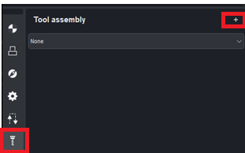 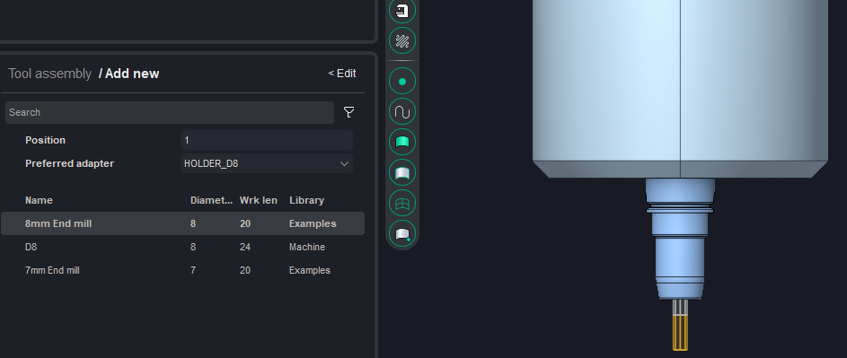

### Building directly from the machine.

An assembly can also be created directly in the graphics area, from the machine to the tool. Free sockets are shown on the machine; clicking a free socket displays a + button, and pressing it opens the list of components that match the socket by connection type. First an adapter is added to the machine socket (here HOLDER_D8), then the + button on the adapter's free socket is pressed and a tool is chosen from the offered types (Mill tools, Hole machining tools) and models (D8, 7mm End mill, 8mm End mill). Once built, the assembly becomes available in the operation's Tool assembly list (for example, T#1 8mm End mill, T#2 D8), where it can be selected for the operation.

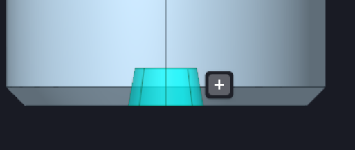 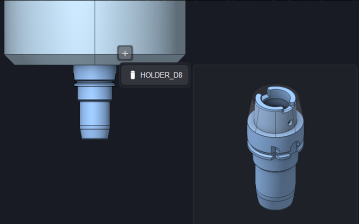 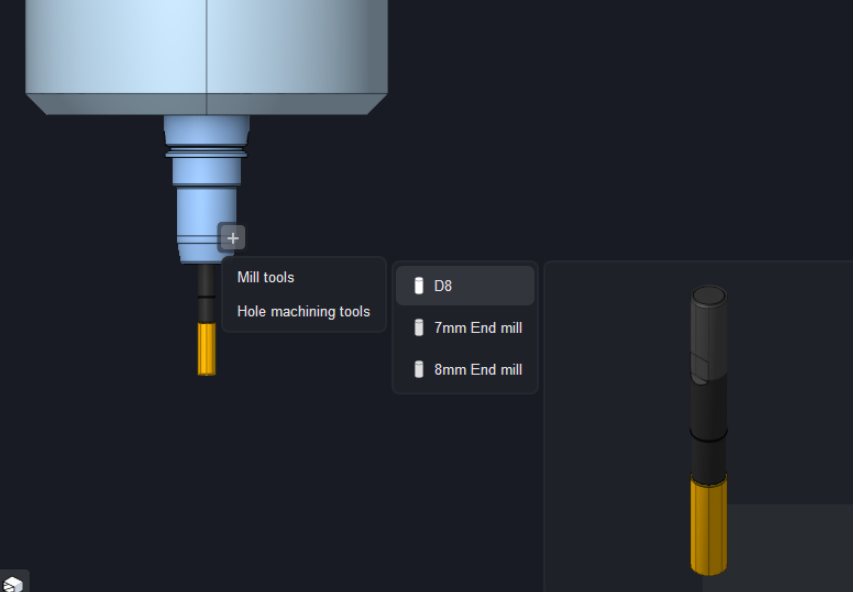 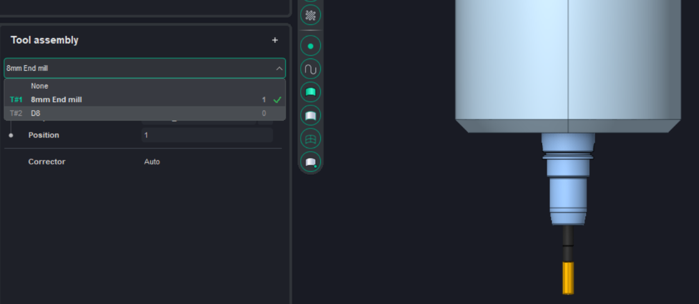
