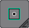
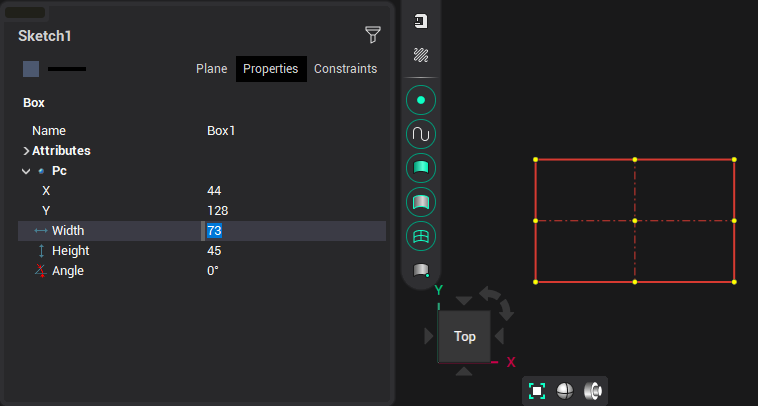

# By center and point

In this method, the center of the rectangle is specified first, and then one of the points of the rectangle.

The inspector displays this center, as well as the width, height, and rotation of the rectangle.
