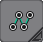
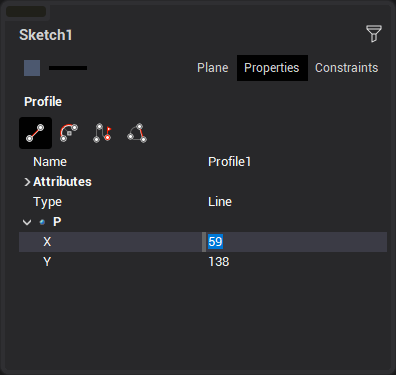
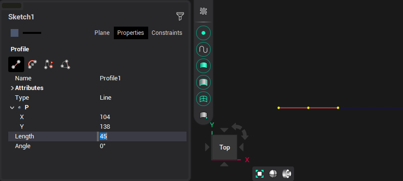
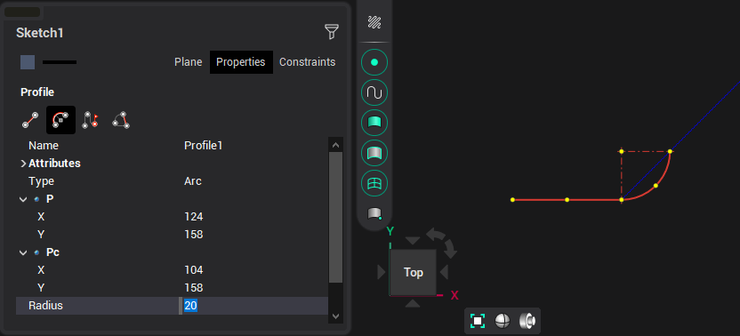
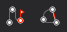

# Build by elements

The building is carried out by successive construction of lines/arcs by specifying points interactively or through the inspector.

At the first step, you need to specify the starting point of the contour, or enter its coordinates in the inspector.

Next, you also need to specify the next point, or enter the length and angle of the line.

Or specify an arc. The coordinates of the next point and the center point of the arc, its radius and angle to the tangent to the previous element will be available in the inspector.

To switch between a segment and an arc (and vice versa), press the appropriate button:

Or by pressing <strong>[Ctrl+Space]</strong>.

Complete defining contour by double-clicking at final point or click one of the buttons:

 ends the contour by the last confirmed element,  creates a closed contour by connecting last confirmed point to first with current selected element type.

You can also end the construction by double-clicking the mouse button when building the last element
